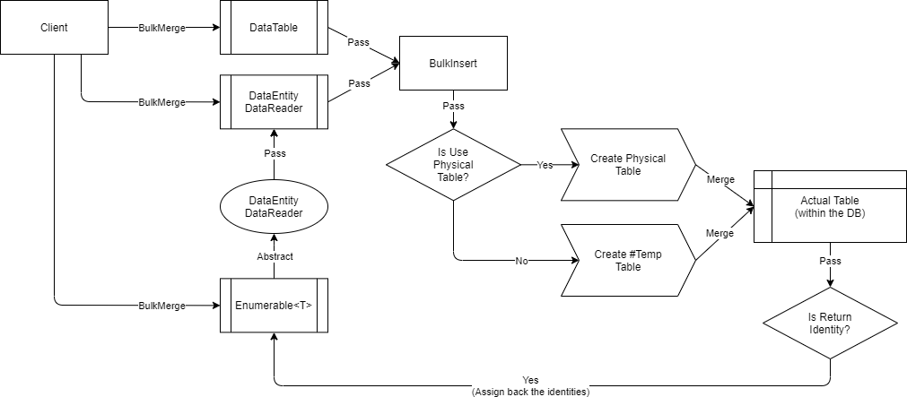

# Bulk Operations

A bulk operation is a process of bringing all the data from the application into the database server at once, and at the same time, ignoring some database specific activities (i.e.: Logging, Audits, Data-Type Checks, Constraints, etc) behind the scene. Thus gives you maximum performance during the operation.

Basically, we normally do the [Delete](/operation/delete), [Insert](/operation/insert), [Merge](/operation/merge) and [Update](/operation/update) operations when interacting with the database. Through this, the data is being processed in an atomic way. If we do call the [batch operations](/feature/batchoperations), the multiple single operations are just being batched and are being executed at the same time. There are round-trips between your application and the database. Thus does not give you the maximum performance when doing the CRUD operations.


With the bulk operations, all data is brought from the client application to the database via [BulkInsert](/operation/bulkinsert) process (underneath is `SqlBulkCopy` class). It ignores the audit, logs, constraints and any other database special handling. Then, the data is being processed together within the database (server).

The bulk operations can improve the performance by more than 90% when processing a large datasets.

> This feature only supports the [SQL Server](https://www.nuget.org/packages/RepoDb.SqlServer.BulkOperations) RDBMS data provider.

#### How does it works?

It is leveraging the ADO.NET `SqlBulkCopy` class of the both `System.Data.SqlClient` and the `Microsoft.Data.SqlClient` namespaces.

For [BulkInsert](/operation/bulkinsert) operation, it simply calls the `WriteToServer()` method to bring all the data into the database. No additional logic is implied.

For [BulkDelete](/operation/bulkdelete), [BulkMerge](/operation/bulkmerge) and [BulkUpdate](/operation/bulkupdate) operations, an implied logic and technique has been utilized.



Basically, a pseudo-temporary table will be created in the database under the transaction context. It then uses the [BulkInsert](/operation/bulkinsert) operation to target that pseudo-temporary table and process the data afterwards. Through this technique, we brought all the data together from the client application into the database server (at one-go) and process them together at the same time.

You can maximize the execution by targetting your underlying table `indexes` via qualifiers, simply pass a list of [Field](/class/field) objects. The library will then create a `clustered index` on the pseudo-temporary table using your qualifiers and do the actual `join statements` using that `clustered index`.

> If you have not passed any qualifiers, the `PrimaryKey` will be used by default. If the `PrimaryKey` is not present, it will use the `Identity` field instead.

###### Supported Objects

- `System.DataTable`
- `System.Data.Common.DbDataReader`
- `IEnumerable<T>`

#### Operation SQL Statements

Once all the data is in the database pseudo-temporary table, the correct SQL statement will be used to cascade the changes towards the original table.

###### For BulkDelete

```csharp
> DELETE T
> FROM [dbo].[OriginalTable] T
> INNER JOIN [PseudoTempTable] TMP ON TMP.QualiferField1 = T.Field1 AND TMP.QualifierField2 = T.Field2;
```

###### For BulkMerge

```csharp
> MERGE [dbo].[OriginalTable] T
> USING [PseudoTempTable] S ON S.QualiferField1 = T.Field1 AND S.QualifierField2 = T.Field2
> WHEN NOT MATCHED THEN
>    INSERT (...) VALUES (...)
> WHEN MATCHED THEN
>    UPDATE
>    SET (...);
```

###### For BulkUpdate

```csharp
> UPDATE T
> SET T.Field3 = TMP.Field3
>     , T.Field4 = TMP.Field4
>     , ...
> FROM [OriginalTable] T
> INNER JOIN [PseudoTempTable] TMP ON TMP.QualiferField1 = T.Field1 AND TMP.QualifierField2 = T.Field2;
```

#### Special Arguments

The arguments `qualifiers`, `isReturnIdentity` and `usePhysicalPseudoTempTable` is provided either at [BulkDelete](/operation/bulkdelete), [BulkMerge](/operation/bulkmerge) and [BulkUpdate](/operation/bulkupdate) operations.

The argument `qualifiers` is used to define the qualifier fields to be used in the operation. It usually refers to the `WHERE` expression of SQL statements. If not given, the primary key (or identity) field will be used.

The argument `isReturnIdentity` is used to define the behaviour of the execution whether the newly generated identity will be set-back to the data entities. By default, it is disabled.

The argument `usePhysicalPseudoTempTable` is used to define whether a physical pseudo-table will be created during the operation. By default, a temporary table (i.e.: `#TableName`) is used.

#### Caveats

The library is automatically setting the value of options argument to `SqlBulkCopyOptions.KeepIdentity` when calling the [BulkDelete](/operation/bulkdelete), [BulkMerge](/operation/bulkmerge) and [BulkUpdate](/operation/bulkupdate) if you have not passed any qualifiers and if your table has an `IDENTITY` primary key column. The same logic will apply if there is no primary key but has an `IDENTITY` column defined in the table.

In addition, when calling the [BulkDelete](/operation/bulkdelete), [BulkMerge](/operation/bulkmerge) and [BulkUpdate](/operation/bulkupdate) operations, the library is creating a pseudo-temporary table behind the scene. It requires your user to have the correct (`CREATE`) privilege to create a table in the database, otherwise a `SqlException` will be thrown.

#### Calling the Operations

Below are the ways on how to call the operations.

###### For BulkDelete

The code snippets below only showcasing the [BulkDelete](/operation/bulkdelete) via `IEnumerable<T>`.

```csharp
using (var connection = new SqlConnection(connectionString).EnsureOpen())
{
    var customers = GetCustomers();
    var rows = connection.BulkDelete<Customer>(customers);
}
```

Or with qualifiers.

```csharp
using (var connection = new SqlConnection(connectionString).EnsureOpen())
{
    var customers = GetCustomers();
    var qualifiers = Field.From(nameof(Customer.LastName), nameof(Customer.BirthDate));
    var rows = connection.BulkDelete<Customer>(customers, qualifiers: qualifiers);
}
```

Or via primary keys.

```csharp
using (var connection = new SqlConnection(connectionString).EnsureOpen())
{
    var keys = new object[] { 10045, ..., 11211 }
    var rows = connection.BulkDelete<Customer>(keys);
}
```

You can also target via table-name.

```csharp
using (var connection = new SqlConnection(connectionString).EnsureOpen())
{
    var customers = GetCustomers();
    var rows = connection.BulkDelete("[dbo].[Customer]", customers);
}
```

###### For BulkInsert

The code snippets below only showcasing the [BulkInsert](/operation/bulkinsert) via `IEnumerable<T>`.

```csharp
using (var connection = new SqlConnection(connectionString).EnsureOpen())
{
    var customers = GetCustomers();
    var rows = connection.BulkInsert<Customer>(customers);
}
```

Or via table-name.

```csharp
using (var connection = new SqlConnection(connectionString).EnsureOpen())
{
    var customers = GetCustomers();
    var rows = connection.BulkInsert("[dbo].[Customer]", customers);
}
```

###### For BulkMerge

The code snippets below only showcasing the [BulkMerge](/operation/bulkmerge) via `IEnumerable<T>`.

```csharp
using (var connection = new SqlConnection(connectionString).EnsureOpen())
{
    var customers = GetCustomers();
    var rows = connection.BulkMerge<Customer>(customers);
}
```

Or with qualifiers.

```csharp
using (var connection = new SqlConnection(connectionString).EnsureOpen())
{
    var customers = GetCustomers();
    var qualifiers = Field.From(nameof(Customer.LastName), nameof(Customer.BirthDate));
    var rows = connection.BulkMerge<Customer>(customers, qualifiers: qualifiers);
}
```

You can also target via table-name.

```csharp
using (var connection = new SqlConnection(connectionString).EnsureOpen())
{
    var customers = GetCustomers();
    var rows = connection.BulkMerge("[dbo].[Customer]", customers);
}
```

###### For BulkUpdate

The code snippets below only showcasing the [BulkUpdate](/operation/bulkupdate) via `IEnumerable<T>`.

```csharp
using (var connection = new SqlConnection(connectionString).EnsureOpen())
{
    var customers = GetCustomers();
    var rows = connection.BulkUpdate<Customer>(customers);
}
```

Or with qualifiers.

```csharp
using (var connection = new SqlConnection(connectionString).EnsureOpen())
{
    var customers = GetCustomers();
    var qualifiers = Field.From(nameof(Customer.LastName), nameof(Customer.BirthDate));
    var rows = connection.BulkUpdate<Customer>(customers, qualifiers: qualifiers);
}
```

You can also target via table-name.

```csharp
using (var connection = new SqlConnection(connectionString).EnsureOpen())
{
    var customers = GetCustomers();
    var rows = connection.BulkUpdate("[dbo].[Customer]", customers);
}
```

###### When to use the Batch and Bulk Operations?

There is no standard of when to use what. It all depends on your situation (i.e.: Network Latency, Data, No of Columns, etc).

The pros of using bulk operation is the maximum performance. However, there are also cons of usually using it. One of it is, it keeps blocking the target table while being under the bulk operations transaction. It can however trigger (or also solve) a deadlock if not handled properly by the developers.

> We highly recommend to use the batch operations if the number of rows you are working is less than or equal 1000. Beyond than that, we recommend to use the bulk operations instead.