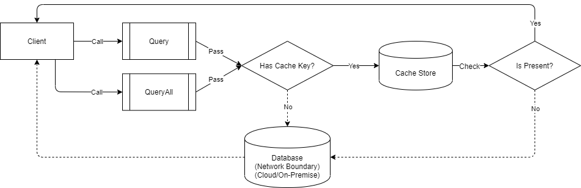

# Caching

In general terms, a cache is a component that stores an object (or its states) in any form of temporary storage that is accessible for future used. The object that is being stored can be a result of computational, operational, inputs/outputs or analytical operations and calculations.

Usually, it is implemented as a 2nd-layer data storage to provide fast accessibility to the requestor of the data. It is by design to prevent the frequent calls towards the underlying data-store, thus helps improve the underlying performance of the application.



In this library, the cache is implemented as a storage in the computer memory by default. It is a simple dictionary object that holds a key that represents as pointer to the actual data in the cache storage. It is persisting the data in the cache storage for 180 minutes, but the user can manually set the time of the persistency during the calls.

> The database tables that are not frequently changing but is mostly in used in the application are the candidate for caching.

#### How to use the Cache?

Simply pass a value to the `cacheKey` argument when calling the operation. The direct usage of the connection object requires an instance of [ICache](/interface/icache) to be explicitly passed into the `cache` argument.

```csharp
var cache = CacheFactory.GetMemoryCache();
using (var connection = new SqlConnection(connectionString))
{
    var products = connection.QueryAll<Product>(cacheKey: "products", cache: cache);
}
```

Below is the code if the [BaseRepository](/class/baserepository) and [DbRepository](/class/dbrepository) is used.

```csharp
using (var repository = new DbRepository<Product, SqlConnection>(connectionString))
{
    var products = repository.QueryAll(cacheKey: "products");
}
```

> It is highly recommended to use the [BaseRepository](/class/baserepository) and [DbRepository](/class/dbrepository) objects if you tend to skip managing the cache object.

#### Selecting the Proper Cache Key

Each cache key should preferably be unique to the query executed, so that different methods do not ended up unintentionally sharing the same data.

Constructing a unique key is left to the developer, but a good best practice is to adopt a convention for generating the cache keys, such as
`ClassName-MethodName-QueryArgument1-QueryArgument2` or `EntityName-Argument1Name-Argument2Name--Argument1Value-Argument2Value` etc.

Following this naming convention makes it easy to examine keys at run-time and establish the source and guarantees uniqueness.

```csharp
// An example of the second cache key convention:
var cache = CacheFactory.GetMemoryCache();
using (var connection = new SqlConnection(connectionString))
{
    var productId = 5;
    var product = connection.Query<Product>(product => product.Id == productId,
        cacheKey: $"Product-Id-{productId}", cache: cache);
}
```

As mentioned, by default the cache is placed in the computer memory via [MemoryCache](/class/memorycache) object. It is a simple dictionary object (key/value pairs).

#### Setting the Cache Expiration

Simply pass a value to the `cacheItemExpiration` argument when calling the operation, however, this value will be ignored if the `cacheKey` is not provided.

```csharp
var cache = CacheFactory.GetMemoryCache();
using (var connection = new SqlConnection(connectionString))
{
    var expirationInMinutes = 60 * 24; // 1 day
    var products = connection.QueryAll<Product>(cacheKey: "products",
        cacheItemExpiration: expirationInMinutes, cache: cache);
}
```

#### Removing the Cache Item

To remove the cache item, use the `Remove()` method of the [ICache](/interface/icache) interface.

```csharp
var cache = CacheFactory.GetMemoryCache();
using (var connection = new SqlConnection(connectionString))
{
    var products = connection.QueryAll<Product>(cacheKey: "products", cache: cache);
    cache.Remove("products");
}
```

Alternatively, the `Expiration` property can be used to force the expiration.

```csharp
var cache = CacheFactory.GetMemoryCache();
using (var connection = new SqlConnection(connectionString))
{
    var products = connection.QueryAll<Product>(cacheKey: "products", cache: cache);
    var item = cache.Get<Product>("products");
    item.Expiration = DateTime.UtcNow.AddSecond(-1);
}
```

When using the [BaseRepository](/class/baserepository) and [DbRepository](/class/dbrepository) objects, the `Cache` property can be used directly.

```csharp
using (var repository = new DbRepository<Product, SqlConnection>(connectionString))
{
    var products = repository.QueryAll(cacheKey: "products");
    repository.Cache.Remove("products");
}
```

#### Create a Customize Cache Class

Create a class that implements the [ICache](/interface/icache) interface.

```csharp
public class JsonCache : ICache
{
    public JsonCache(string path,
    string extension)
    {
        Path = path;
        Extension = extension;
    }

    /*** Properties ***/

    public string Extension { get; }
    public string Path { get; }


    /*** Methods ***/

    public void Add<T>(string key,
        T value,
        int expiration = 180,
        bool throwException = true)
    {
        ...
    }

    public void Add<T>(CacheItem<T> item,
        bool throwException = true)
    {
        ...
    }

    public void Clear()
    {
        ...
    }

    ...
}
```

> You have to implement all the interface methods and manually handle each of them.

#### Injecting the Cache in the Repository

Simply inject it in the contructor. Below is a sample code for [BaseRepository](/class/baserepository) class.

```csharp
// Repository
public class CustomerRepository : BaseRepository<Customer, SqlConnection>
{
    public CustomerRepository(IOptions<AppSettings> settings)
        : base(settings.ConnectionString, new JsonCache())
    { }

    ...
}

// Use it like this (or via DI)
using (var repository = new CustomerRepository(settings))
{
    ...
}
```

And below is for [DbRepository](/class/dbrepository) class.

```csharp
// Repository
public class NorthwindRepository : DbRepository<SqlConnection>
{
    public NorthwindRepository(IOptions<AppSettings> settings)
        : base(settings.ConnectionString, new JsonCache())
    { }

    ...
}

// Use it like this (or via DI)
using (var repository = new NorthwindRepository(settings))
{
    ...
}
```

Or via direct class instantiation.

```csharp
// Direct class instantiation of DbRepository
using (var repository = new DbRepository<SqlConnection>(settings.ConnectionString, new JsonCache()))
{
    ...
}
```

#### Dependency Injection Implementation

Create a custom interface that implements the [ICache](/interface/icache) interface.

```csharp
public interface IJsonCache : ICache
{
    // More custom methods
}
```

Then implement it in the cache class.

```csharp
public class JsonCache : IJsonCache
{
    ...
}
```

Lastly, register in the services collection.

```csharp
public void ConfigureServices(IServiceCollection services)
{
    services.AddControllers();

    // Registration
    services.AddSingleton<IJsonCache, JsonCache>();
}
```

Below is the code on how to inject it in the repositories.

```csharp
public class NorthwindRepository : DbRepository<SqlConnection>
{
    public NorthwindRepository(IOptions<AppSettings> settings,
        IJsonCache cache) // Injected
        : base(settings.ConnectionString, cache)
    { }

    ...
}
```

#### Create a Cache Factory

If you do not prefer injecting a cache object, creating a simple cache factory class is good to ensure a single instance of cache object is being managed.

The code below ensures that only a single instance of cache object is being used all throughout the application.

```csharp
public static class CacheFactory
{
    private readonly static object syncLock;
    private static ICache jsonCache = null;

    static CacheFactory()
    {
        syncLock = new object();
    }

    public static ICache GetJsonCache()
    {
        if (jsonCache == null)
        {
            lock (syncLock)
            {
                if (jsonCache == null)
                {
                    jsonCache = new JsonCache();
                }
            }
        }
        return jsonCache;
    }
}
```

And use it in the connection object like below.

```csharp
using (var connection = new SqlConnection(connectionString))
{
    var products = connection.QueryAll<Product>cacheKey: "AllProducts", cache: CacheFactory.GetJsonCache());
}
```

Or via repositories.

```csharp
public class NorthwindRepository : DbRepository<SqlConnection>
{
    public NorthwindRepository(IOptions<AppSettings> settings)
        : base(settings.ConnectionString, CacheFactory.GetJsonCache())
    { }

    ...
}
```
