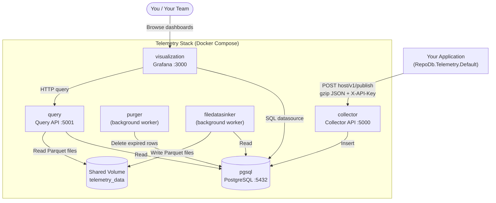

# Telemetry

---

This feature captures execution telemetry for every database operation ([Insert](/operation/insert), [Query](/operation/query), [Update](/operation/update), [Delete](/operation/delete), etc.) and publishes it to an insights collector for monitoring and diagnostics.

It is built on top of the [Tracing](/feature/tracing) feature — the [TelemetryTrace](/class/telemetrytrace) class implements [ITrace](/interface/itrace) to hook into the `BeforeExecution()`/`AfterExecution()` pipeline, capture a [TelemetryItem](/class/telemetryitem) per operation, and flush the buffer to a collector on an interval.

There are two Nuget packages that compose this feature:

| Package | Purpose |
|:--------|:--------|
| [`RepoDb.Telemetry.Core`](https://www.nuget.org/packages/RepoDb.Telemetry.Core) | Defines the contracts and reusable pieces ([TelemetryOption](/class/telemetryoption), [TelemetryItem](/class/telemetryitem), [TelemetryTrace](/class/telemetrytrace), [IPublisherRepository](/interface/ipublisherrepository)). Use this directly only to customize how telemetry is captured or published. |
| [`RepoDb.Telemetry.Default`](https://www.nuget.org/packages/RepoDb.Telemetry.Default) | A ready-to-use implementation. Wires up a default tracer and publishes to an HTTP collector — no custom `ITrace` implementation required. |

And few Docker images.

| Service | Port | Purpose |
|---|---|---|
| [`pgsql`](https://hub.docker.com/r/repodb/insights-postgres) | `5432` | Database |
| [`collector`](https://hub.docker.com/r/repodb/telemetry-default-collector) | `5000` | Telemetry Collector API |
| [`query`](https://hub.docker.com/r/repodb/telemetry-default-query) | `5001` | Telemetry Query API |
| [`filedatasinker`](https://hub.docker.com/r/repodb/telemetry-default-filedatasinker) | — | Archives old telemetry to Parquet (no exposed port) |
| [`purger`](https://hub.docker.com/r/repodb/telemetry-default-purger) | — | Deletes expired telemetry (no exposed port) |
| [`visualization`](https://hub.docker.com/r/repodb/insights-visualization) | `3000` | Grafana dashboards |

## High-Level Architecture

Your application never talks to Postgres or Grafana directly — it only ever POSTs to the `collector`. Everything downstream (storage, archival, cleanup, querying, and visualization) is handled by the rest of the stack, defined in `docker-compose.yml`.



- **Application** — buffers a [TelemetryItem](/class/telemetryitem) per operation in memory and flushes on `Frequency` (5 seconds by default), gzip-compressing and POSTing the batch to the `collector`, tagged with the `X-API-Key` header.
- **collector** — validates the API key and writes each incoming batch into the `pgsql` database (`repodb_insights`). This is the only write path into Postgres.
- **pgsql** — the Postgres database backing the entire stack; every other service reads from (or, for `purger`, deletes from) it.
- **purger** — a background worker that periodically deletes telemetry rows older than a configured retention window (7 days by default), keeping the database from growing unbounded.
- **filedatasinker** — a background worker that periodically archives older telemetry rows out of Postgres into Parquet files on a shared volume, so `query` can serve historical data without hitting the database directly.
- **query** — the read API behind the dashboard. It reads recent data from Postgres and archived data from the shared volume.
- **visualization (Grafana)** — connects to Postgres directly as a SQL data source for live dashboards, and calls the `query` API (with the shared API key) for anything backed by archived Parquet files.

{: .note }
> All inter-service communication happens over the `repodb` Docker network — services reach each other by container name (`pgsql`, `collector`, etc.), not by their externally published ports.

## How It Works

- Each operation's execution is captured as a [TelemetryItem](/class/telemetryitem) (application, group, operation name, statement, elapsed time, client machine, source assembly, etc.) via `BeforeExecution()`/`AfterExecution()`.
- Items are buffered in memory and flushed on an interval (`Frequency`, default 5 seconds).
- On flush, the batch is JSON-serialized, gzip-compressed, and POSTed to the configured collector host via [IPublisherRepository](/interface/ipublisherrepository).
- Publish failures never throw — they're routed to an optional `errorCallback` and `logger`.

## What Gets Captured

Every captured operation is represented as a [DefaultTelemetryItem](/class/defaulttelemetryitem) — application, group, session id, operation name, start time, statement, elapsed time, cancellation flag, client machine, source assembly, and version. See [TelemetryItem](/class/telemetryitem) for the full property list.

Items are buffered in memory and flushed on the configured `Frequency`, then JSON-serialized, gzip-compressed, and POSTed to your collector. Publish failures never throw — they are routed to the optional `errorCallback` and `logger`.

## Enabling Telemetry

For most applications, [RepoDb.Telemetry.Default](https://www.nuget.org/packages/RepoDb.Telemetry.Default) is the fastest path — see the [Get Started](/tutorial/get-started-telemetry) page.

```csharp
GlobalConfiguration
    .Setup(new GlobalConfigurationOptions { UseRegisteredGlobalTraces = true })
    .UseDefaultTelemetry(new DefaultTelemetryOption("<YOUR_APPLICATION_NAME>")
        {
            Host = "https://your-collector-host",
            ApiKey = "YOUR_API_KEY",
            Group = "<YOUR_APPLICATION_GROUP>",
            Frequency = TimeSpan.FromSeconds(1)
        });
```

{: .note }
> `UseRegisteredGlobalTraces = true` is required. It tells the library to run every globally registered tracer (this one included) for every operation, without passing a `trace` argument to each call.

## Why not OpenTelemetry (OTel)?

This is a deliberate tradeoff, not an oversight. The telemetry pipeline hooks directly into the library's own before/after execution events and serializes a lightweight payload straight to HTTP — skipping OTel's `Span`/`Activity` machinery, resource/attribute mapping, and collector protocol overhead in the hot path. For a library whose value proposition is being a thin, fast layer over ADO.NET, that overhead matters, and the capture shape mirrors the library's own operation model rather than a generalized industry-wide schema.

{: .note }
> An OTel-based collector is planned as a separate, opt-in package for enterprise-grade scenarios (distributed tracing across services, vendor-neutral export to existing observability stacks). Until then, [RepoDb.Telemetry.Default](https://www.nuget.org/packages/RepoDb.Telemetry.Default) is the fast, zero-fuss path to seeing what your operations are doing.

## Next Steps

- Read the [Telemetry](/feature/telemetry) feature page for how the pipeline fits together.
- Implement [IPublisherRepository](/interface/ipublisherrepository) to publish somewhere other than the default HTTP collector.
