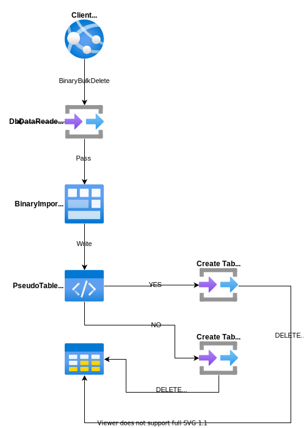

# BinaryBulkDelete

---

This method is used to delete the target rows from the database by bulk. This operation only supports the [PostgreSQL](https://www.nuget.org/packages/RepoDb.PostgreSql.BulkOperations) RDBMS.

### Call Flow Diagram

The diagram below shows the flow when calling this operation.



### Use Case

This method is very useful if you are deleting multiple rows in the database. It is high-performant in nature as it is using the real bulk operation natively from Npgsql library (via `NpgsqlBinaryImporter` class).

If you are working to delete a range of rows from 1000 or beyond, then use this method over the [DeleteAll](/operation/deleteall) operation.

### Special Arguments

The `qualifiers`, `keepIdentity` and `pseudoTableType` arguments were provided on this operation.

The `qualifiers` is used to define the qualifier fields to be used in the operation. It usually refers to the WHERE expression of the SQL Statement. If not given, the primary column will be used.

The `keepIdentity` is used to signify a value whether the identity property of the entity/model will be kept during the operation. 

The `pseudoTableType` is used to define whether a physical pseudo-table will be created during the operation. By default, a temporary table is used.

> Please be noted that it is highly recommended to use the [BulkImportPseudoTableType.Temporary](/enumerations/bulkimportpseudotabletype#temporary) value in the `pseudoTableType` argument when working with parallelism.

### How to call?

Let us say you are retrieving all the inactive people from the database.

```csharp
using (var connection = new NpgsqlConnection(connectionString))
{
    var people = connection.Query<Person>(e => e.IsActive == false);
}
```

Then, below is the code that bulk-deletes all those inactive rows from the `[Person]` table.

```csharp
using (var connection = new NpgsqlConnection(connectionString))
{
    var deletedRows = connection.BinaryBulkDelete<Person>(people);
}
```

And below if you would like to specify the batch size.

```csharp
using (var connection = new NpgsqlConnection(connectionString))
{
    var deletedRows = connection.BinaryBulkDelete<Person>(people, batchSize: 100);
}
```

> If the `batchSize` argument is not set, then all the items from the collection will be sent and used.

#### PrimaryKeys

Below is the sample code to bulk-delete by primary keys.

```csharp
using (var connection = new NpgsqlConnection(connectionString))
{
    var primaryKeys = people.Select(e => e.Id);
    var deletedRows = connection.BinaryBulkDeleteByKey(primaryKeys);
}
```

#### DataTable

Below is the sample code to bulk-delete via data table.

```csharp
using (var connection = new NpgsqlConnection(connectionString))
{
    var table = ConvertToDataTable(people);
    var deletedRows = connection.BinaryBulkDelete<Person>(table);
}
```

#### Dictionary/ExpandoObject

Below is the sample code to bulk-delete via `Dictionary<string, object>` or `ExpandoObject`.

```csharp
using (var sourceConnection = new NpgsqlConnection(sourceConnectionString))
{
    var result = sourceConnection.QueryAll("Person");
    using (var destinationConnection = new NpgsqlConnection(destinationConnectionString))
    {
        var mergedRows = destinationConnection.BinaryBulkDelete("Person", result);
    }
}
```

#### DataReader

Below is the sample code to bulk-delete via `DbDataReader`.

```csharp
using (var sourceConnection = new NpgsqlConnection(sourceConnectionString))
{
    using (var reader = sourceConnection.ExecuteReader("SELECT * FROM [dbo].[Person];"))
    {
        using (var destinationConnection = new NpgsqlConnection(destinationConnectionString))
        {
            var rows = destinationConnection.BinaryBulkDelete<Person>(reader);
        }
    }
}
```

### Targeting a Table

You can also target a specific table by passing the literal table and field name like below.

```csharp
using (var connection = new NpgsqlConnection(connectionString))
{
    var deletedRows = connection.BinaryBulkDelete("[dbo].[Person]", people);
}
```

### Field Qualifiers

By default, this operation is using the primary or identity as a qualifier. You can override the qualifiers by simply passing the list of [Field](/class/field) object in the `qualifiers` argument.

```csharp
using (var connection = new NpgsqlConnection(connectionString))
{
    var deletedRows = connection.BinaryBulkDelete<Person>(people,
        qualifiers: e => new { e.LastName, e.DateOfBirth });
}
```

Or by parsing the field expression.

> When using the qualifiers, we recommend that you use the list of columns that has the correct index from the original table.

### Physical Temporary Table

To ensure using a physical pseudo-temporary table, simply pass the [BulkImportPseudoTableType.Temporary](/enumerations/bulkimportpseudotabletype#physical) value in the `pseudoTableType` argument.

```csharp
using (var connection = new NpgsqlConnection(connectionString))
{
    var deletedRows = connection.BinaryBulkDelete("[dbo].[Person]",
        people,
        pseudoTableType: BulkImportPseudoTableType.Physical);
}
```

> By using the actual pseudo physical temporary table, it will further help you maximize the performance over using the normal temporary table. However, you need to be aware that the table is shared to any call, so parallelism may fail on this scenario.
