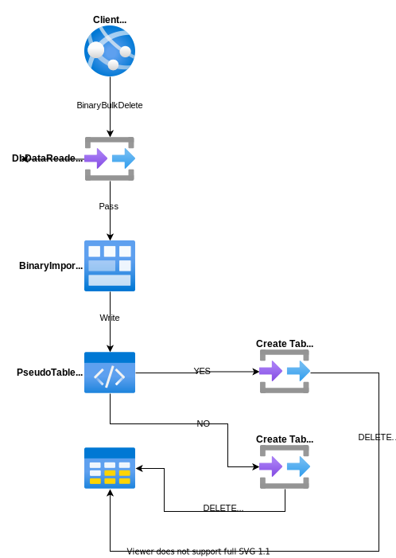

---
layout: default
sidebar: operations
title: "BinaryBulkDelete"
permalink: /operation/binarybulkdelete
tags: [repodb, tutorial, binarybulkdelete, orm, hybrid-orm, sqlserver]
parent: OPERATIONS
---

# BinaryBulkDelete

---

This method deletes existing rows from the database in bulk. It is supported only for [PostgreSQL](https://www.nuget.org/packages/RepoDb.PostgreSql.BulkOperations).

## Call Flow Diagram

The diagram below shows the flow when calling this operation.



## Use Case

Use this method to delete rows at high speed. It leverages the native bulk operation from the Npgsql library via the [NpgsqlBinaryImporter](https://www.npgsql.org/doc/api/Npgsql.NpgsqlBinaryImporter.html) class.

For deleting 1,000 or more rows, prefer this method over [DeleteAll](/operation/deleteall).

## Special Arguments

The `qualifiers`, `keepIdentity`, and `pseudoTableType` arguments are available for this operation.

`qualifiers` defines the qualifier fields used in the operation, corresponding to the WHERE clause. Defaults to the primary column if not specified.

`keepIdentity` controls whether the identity property of the entity/model is preserved during the operation.

`pseudoTableType` controls whether a physical pseudo-table is created during the operation. Defaults to a temporary table.

{: .important }
> It is highly recommended to use the [BulkImportPseudoTableType.Temporary](/enumeration/bulkimportpseudotabletype#temporary) value in the `pseudoTableType` argument when working with parallelism.

## Usability

Pass the list of entities to the operation.

```csharp
using (var connection = new NpgsqlConnection(connectionString))
{
    var people = connection.Query<Person>(e => e.IsActive == false);
    var deletedRows = connection.BinaryBulkDelete<Person>(people);
}
```

{: .note }
> It returns the number of rows deleted from the underlying table.

To specify a batch size:

```csharp
using (var connection = new NpgsqlConnection(connectionString))
{
    var deletedRows = connection.BinaryBulkDelete<Person>(people, batchSize: 100);
}
```

{: .important }
> If `batchSize` is not set, all items in the collection are sent at once.

To target a specific table, pass the literal table name.

```csharp
using (var connection = new NpgsqlConnection(connectionString))
{
    var deletedRows = connection.BinaryBulkDelete("[dbo].[Person]", people);
}
```

#### DataTable

```csharp
using (var connection = new NpgsqlConnection(connectionString))
{
    var table = ConvertToDataTable(people);
    var deletedRows = connection.BinaryBulkDelete("[dbo].[Person]", table);
}
```

#### Dictionary/ExpandoObject

```csharp
using (var sourceConnection = new NpgsqlConnection(sourceConnectionString))
{
    var people = sourceConnection.Query("[dbo].[Person]", new { IsActive = false });

    using (var destinationConnection = new NpgsqlConnection(destinationConnectionString))
    {
        var deletedRows = destinationConnection.BinaryBulkDelete("[dbo].[Person]", people);
    }
}
```

#### DataReader

```csharp
using (var sourceConnection = new NpgsqlConnection(sourceConnectionString))
{
    using (var reader = sourceConnection.ExecuteReader("SELECT * FROM [dbo].[Person];"))
    {
        using (var destinationConnection = new NpgsqlConnection(destinationConnectionString))
        {
            var deletedRows = destinationConnection.BinaryBulkDelete("[dbo].[Person]", reader);
        }
    }
}
```

Or via [DataEntityDataReader](/class/dataentitydatareader).

```csharp
using (var connection = new NpgsqlConnection(connectionString))
{
    using (var reader = new DataEntityDataReader<Person>(people))
    {
        var deletedRows = connection.BinaryBulkDelete("[dbo].[Person]", reader);
    }
}
```

## Field Qualifiers

By default, the primary column is used as the qualifier. To override, pass a list of [Field](/class/field) objects in the `qualifiers` argument.

```csharp
using (var connection = new NpgsqlConnection(connectionString))
{
    var deletedRows = connection.BinaryBulkDelete<Person>(people,
        qualifiers: e => new { e.LastName, e.DateOfBirth });
}
```

{: .important }
> Use indexed columns from the target table as qualifiers to maximize performance.

## Physical Temporary Table

To use a physical pseudo-temporary table, pass [BulkImportPseudoTableType.Temporary](/enumeration/bulkimportpseudotabletype#physical) in the `pseudoTableType` argument.

```csharp
using (var connection = new NpgsqlConnection(connectionString))
{
    var deletedRows = connection.BinaryBulkDelete("[dbo].[Person]",
        people,
        pseudoTableType: BulkImportPseudoTableType.Physical);
}
```

{: .note }
> A physical pseudo-temporary table improves performance over a standard temporary table, but is shared across all calls. Parallelism may fail in this scenario.

