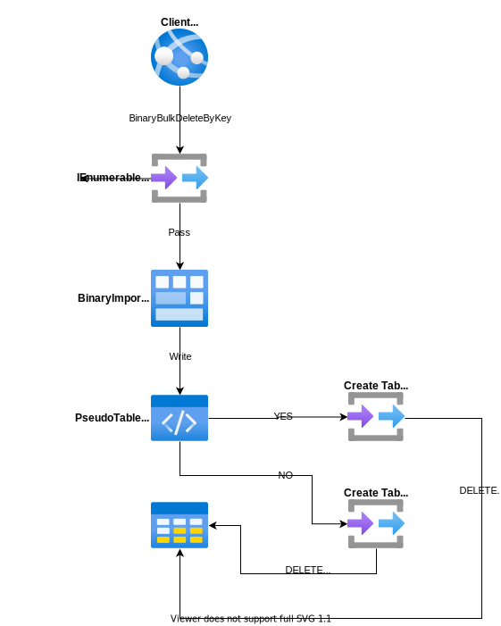

# BinaryBulkDeleteByKey

---

This method is used to delete the rows from the database via the list of primary keys by bulk. It is only supporting the [PostgreSQL](https://www.nuget.org/packages/RepoDb.PostgreSql.BulkOperations) RDBMS.

## Call Flow Diagram

The diagram below shows the flow when calling this operation.



## Use Case

This method is very useful if you would like to delete the rows from the database (via a list of primary keys) in a very speedy manner. It is high-performant in nature as it is using the real bulk operation natively from the Npgsql library (via the [NpgsqlBinaryImporter](https://www.npgsql.org/doc/api/Npgsql.NpgsqlBinaryImporter.html) class).

## Special Arguments

A `pseudoTableType` argument is provided on this operation to define a value whether a physical pseudo-table will be created during the operation. By default, a temporary table is used.

{: .important }
> It is highly recommended to use the [BulkImportPseudoTableType.Temporary](/enumerations/bulkimportpseudotabletype#temporary) value in the `pseudoTableType` argument when working with parallelism.

## Usability

Simply pass the list of primary keys on the operation.

```csharp
using (var connection = new NpgsqlConnection(connectionString))
{
    var primaryKeys = connection.Query<Person>(p => p.IsActive == false).Select(p => p.Id);
    var deletedRows = connection.BinaryBulkDeleteByKey("[dbo].[Person]",
        primaryKeys);
}
```

{: .note }
> It returns the number of rows deleted from the underlying table.

And below if you would like to specify the batch size.

```csharp
using (var connection = new NpgsqlConnection(connectionString))
{
    var primaryKeys = connection.Query<Person>(p => p.IsActive == false).Select(p => p.Id);
    var deletedRows = connection.BinaryBulkDeleteByKey("[dbo].[Person]",
        primaryKeys,
        batchSize: 100);
}
```

{: .important }
> If the `batchSize` argument is not set, then all the items from the collection will be sent and used.

## Physical Temporary Table

To use a physical pseudo-temporary table, simply pass the [BulkImportPseudoTableType.Temporary](/enumerations/bulkimportpseudotabletype#physical) value in the `pseudoTableType` argument.

```csharp
using (var connection = new NpgsqlConnection(connectionString))
{
    var primaryKeys = connection.Query<Person>(p => p.IsActive == false).Select(p => p.Id);
    var deletedRows = connection.BinaryBulkDeleteByKey("[dbo].[Person]",
        primaryKeys,
        pseudoTableType: BulkImportPseudoTableType.Physical);
}
```

{: .note }
> By using the actual pseudo physical temporary table, it will further help you maximize the performance over using the normal temporary table. However, you need to be aware that the table is shared to any call, so parallelism may fail on this scenario.
