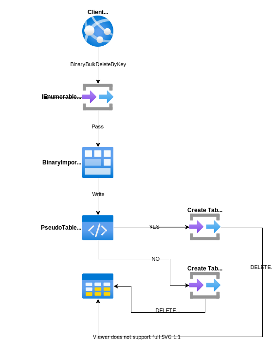

---
layout: default
sidebar: operations
title: "BinaryBulkDeleteByKey"
permalink: /operation/binarybulkdeletebykey
tags: [repodb, tutorial, binarybulkdeletebykey, orm, hybrid-orm, sqlserver]
parent: OPERATIONS
---

# BinaryBulkDeleteByKey

---

This method deletes rows from the database using a list of primary keys in bulk. It is supported only for [PostgreSQL](https://www.nuget.org/packages/RepoDb.PostgreSql.BulkOperations).

## Call Flow Diagram

The diagram below shows the flow when calling this operation.



## Use Case

Use this method to delete rows by primary key at high speed. It leverages the native bulk operation from the Npgsql library via the [NpgsqlBinaryImporter](https://www.npgsql.org/doc/api/Npgsql.NpgsqlBinaryImporter.html) class.

## Special Arguments

The `pseudoTableType` argument controls whether a physical pseudo-table is created during the operation. Defaults to a temporary table.

{: .important }
> It is highly recommended to use the [BulkImportPseudoTableType.Temporary](/enumeration/bulkimportpseudotabletype#temporary) value in the `pseudoTableType` argument when working with parallelism.

## Usability

Pass the list of primary keys to the operation.

```csharp
using (var connection = new NpgsqlConnection(connectionString))
{
    var primaryKeys = connection.Query<Person>(p => p.IsActive == false).Select(p => p.Id);
    var deletedRows = connection.BinaryBulkDeleteByKey("[dbo].[Person]",
        primaryKeys);
}
```

{: .note }
> It returns the number of rows deleted from the underlying table.

To specify a batch size:

```csharp
using (var connection = new NpgsqlConnection(connectionString))
{
    var primaryKeys = connection.Query<Person>(p => p.IsActive == false).Select(p => p.Id);
    var deletedRows = connection.BinaryBulkDeleteByKey("[dbo].[Person]",
        primaryKeys,
        batchSize: 100);
}
```

{: .important }
> If `batchSize` is not set, all items in the collection are sent at once.

## Physical Temporary Table

To use a physical pseudo-temporary table, pass [BulkImportPseudoTableType.Temporary](/enumeration/bulkimportpseudotabletype#physical) in the `pseudoTableType` argument.

```csharp
using (var connection = new NpgsqlConnection(connectionString))
{
    var primaryKeys = connection.Query<Person>(p => p.IsActive == false).Select(p => p.Id);
    var deletedRows = connection.BinaryBulkDeleteByKey("[dbo].[Person]",
        primaryKeys,
        pseudoTableType: BulkImportPseudoTableType.Physical);
}
```

{: .note }
> A physical pseudo-temporary table improves performance over a standard temporary table, but is shared across all calls. Parallelism may fail in this scenario.

