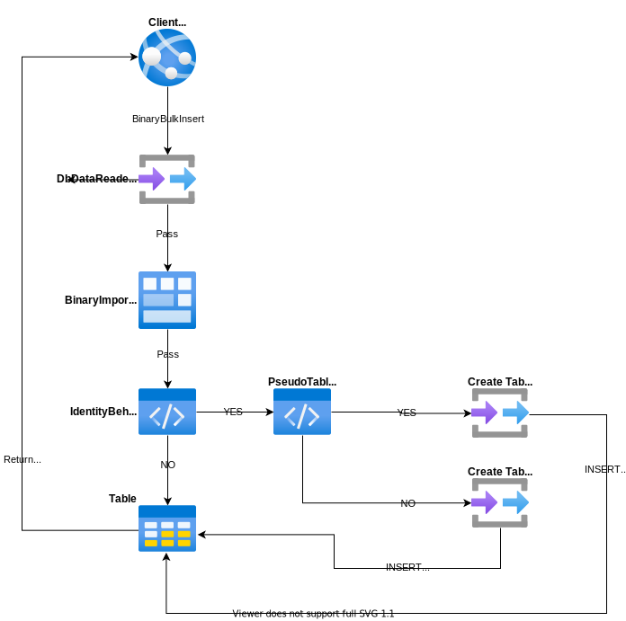

# BinaryBulkInsert

---

This method is used to insert multiple rows towards the database by bulk. It is only supporting the [PostgreSQL](https://www.nuget.org/packages/RepoDb.PostgreSql.BulkOperations) RDBMS.

## Call Flow Diagram

The diagram below shows the flow when calling this operation.



## Use Case

This method is very useful if you would like to insert multiple rows towards the database in a very speedy manner. It is high-performant in nature as it is using the real bulk operation natively from the Npgsql library (via the [NpgsqlBinaryImporter](https://www.npgsql.org/doc/api/Npgsql.NpgsqlBinaryImporter.html) class).

If you are working to insert range of rows from 1000 or more, then use this method over the [InsertAll](/operation/insertall) operation. Alternatively, you can also use the [BinaryImport](/operation/binaryimport) operation.

## Special Arguments

The `identityBehavior` and `pseudoTableType` arguments were provided on this operation.

The `identityBehavior` is used to define a value whether an identity property of the entity/model will be kept, or, the newly generated identity values from the database will be returned after the operation. 

The `pseudoTableType` is used to define a value whether a physical pseudo-table will be created during the operation. By default, a temporary table is used.

{: .note }
> It is highly recommended to use the [BulkImportPseudoTableType.Temporary](/enumerations/bulkimportpseudotabletype#temporary) value in the `pseudoTableType` argument when working with parallelism.

## Enum Types

Npgsql supports the following .NET enum mappings:

- .NET Enum → PostgreSQL text-based types (e.g. `text`, `varchar`)
- .NET Enum → PostgreSQL integer types (e.g. `int4`, `int8`)
- .NET Enum → Native PostgreSQL enum type, when mapped via `NpgsqlDataSource.MapEnum()`

These mappings work correctly with standard fluent operations such as [Insert](https://repodb.net/operation/insert) and [InsertAll](https://repodb.net/operation/insertall). However, bulk operations such as [BinaryBulkInsert](https://repodb.net/operation/binarybulkinsert) may fail with the following error when an enum property towards Native PostgreSQL enum type (item 3) is involved:

```
'RepoDb.PostgreSql.BulkOperations.IntegrationTests.Enumerations.Hands' is not supported for parameters having NpgsqlDbType 'Unknown'.
```

To fix this, you have to follow the steps below.

Use the `NpgsqlDataSource.MapEnum()` method to map the PostgreSQL enum type on the current data source. Use the `NpgsqlDataSourceBuilder` class and then use the connection object created from this builder.

```csharp
var dataSource = new NpgsqlDataSourceBuilder(Database.ConnectionString)
	.MapEnum<Hands>("hand", new NpgsqlNullNameTranslator())
	.Build();
var connection = dataSource.CreateConnection();

// Do your bulk stuffs here
```

Then, map the column to the right data type as seen in the `ColumnEnumHand` property below.

```csharp
var mappings = return new[]
{
    ...
    new NpgsqlBulkInsertMapItem(nameof(EnumTable.ColumnEnumInt), nameof(EnumTable.ColumnEnumInt), NpgsqlTypes.NpgsqlDbType.Integer),
    new NpgsqlBulkInsertMapItem(nameof(EnumTable.ColumnEnumHand), nameof(EnumTable.ColumnEnumHand), "hand")
}

// Pass to 'mappings' argument
var result = NpgsqlConnectionExtension.BinaryBulkInsert<EnumTable>(connection,
    tableName,
    entities: entities,
    mappings: Helper.GetEnumTableMappings());
```

## Usability

Simply pass the list of the entities when calling this operation.

```csharp
using (var connection = new NpgsqlConnection(connectionString))
{
    var people = GetPeople(1000);
    var insertedRows = connection.BinaryBulkInsert<Person>(people);
}
```

{: .note }
> It returns the number of rows inserted into the underlying table.

And below if you would like to specify the batch size.

```csharp
using (var connection = new NpgsqlConnection(connectionString))
{
    var people = GetPeople(1000);
    var insertedRows = connection.BinaryBulkInsert<Person>(people, batchSize: 100);
}
```

{: .important }
> If the `batchSize` argument is not set, then all the items from the collection will be sent together.

You can also target a specific table by passing the literal table name like below.

```csharp
using (var connection = new NpgsqlConnection(connectionString))
{
    var insertedRows = connection.BinaryBulkInsert("[dbo].[Person]", people);
}
```

#### DataTable

Below is the sample code to bulk-insert via data table.

```csharp
using (var connection = new NpgsqlConnection(connectionString))
{
    var people = GetPeople(1000);
    var table = ConvertToDataTable(people);
    var insertedRows = connection.BinaryBulkInsert("[dbo].[Person]", table);
}
```

#### Dictionary/ExpandoObject

Below is the sample code to bulk-insert via `Dictionary<string, object>` or [ExpandoObject](https://learn.microsoft.com/en-us/dotnet/api/system.dynamic.expandoobject?view=net-7.0).

```csharp
var people = GetPeopleAsDictionary(1000);

using (var connection = new NpgsqlConnection(destinationConnectionString))
{
    var insertedRows = connection.BinaryBulkInsert("[dbo].[Person]", people);
}
```

#### DataReader

Below is the sample code to bulk-insert via [DbDataReader](https://learn.microsoft.com/en-us/dotnet/api/system.data.common.dbdatareader?view=net-6.0).

```csharp
using (var sourceConnection = new NpgsqlConnection(sourceConnectionString))
{
    using (var reader = sourceConnection.ExecuteReader("SELECT * FROM [dbo].[Person];"))
    {
        using (var destinationConnection = new NpgsqlConnection(destinationConnectionString))
        {
            var insertedRows = destinationConnection.BinaryBulkInsert("[dbo].[Person]", reader);
        }
    }
}
```

Or via [DataEntityDataReader](/class/dataentitydatareader) class.

```csharp
using (var connection = new NpgsqlConnection(connectionString))
{
    using (var reader = new DataEntityDataReader<Person>(people))
    {
        var insertedRows = connection.BinaryBulkInsert("[dbo].[Person]", reader);
    }
}
```

## Physical Temporary Table

To use a physical pseudo-temporary table, simply pass the [BulkImportPseudoTableType.Temporary](/enumerations/bulkimportpseudotabletype#physical) value in the `pseudoTableType` argument.

```csharp
using (var connection = new NpgsqlConnection(connectionString))
{
    var insertedRows = connection.BinaryBulkInsert("[dbo].[Person]",
        people,
        pseudoTableType: BulkImportPseudoTableType.Physical);
}
```

{: .note }
> By using the actual pseudo physical temporary table, it will further help you maximize the performance over using the normal temporary table. However, you need to be aware that the table is shared to any call, so parallelism may fail on this scenario.
