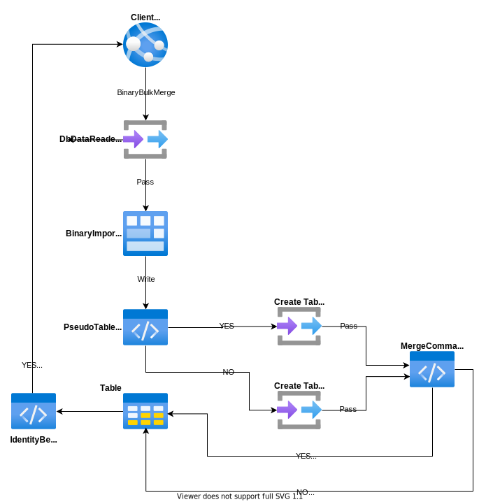

# BinaryBulkMerge

---

This method is used to merge the target rows from the database by bulk. This operation is only supporting the [PostgreSQL](https://www.nuget.org/packages/RepoDb.PostgreSql.BulkOperations) RDBMS.

### Call Flow Diagram

The diagram below shows the flow when calling this operation.



### Use Case

This method is very useful if you would like to merge multiple rows into the database in a very speedy manner. It is high-performant in nature as it is using the real bulk operation natively from the Npgsql library (via the [NpgsqlBinaryImporter](https://www.npgsql.org/doc/api/Npgsql.NpgsqlBinaryImporter.html) class).

If you are working to merge range of rows from 1000 or beyond, then use this method over the [MergeAll](/operation/mergeall) operation.

### Special Arguments

The `mergedCommandType`, `identityBehavior` and `pseudoTableType` arguments were provided on this operation.

The `mergedCommandType` is used to define a value whether the existing `ON CONFLICT DO UPDATE` will be used over the `UPDATE/INSERT` SQL commands during operations.

The `identityBehavior` is used to define a value whether an identity property of the entity/model will be kept, or, the newly generated identity values from the database will be returned after the operation. 

The `pseudoTableType` is used to define a value whether a physical pseudo-table will be created during the operation. By default, a temporary table is used.

> Please be noted that it is highly recommended to use the [BulkImportPseudoTableType.Temporary](/enumerations/bulkimportpseudotabletype#temporary) value in the `pseudoTableType` argument when working with parallelism.

### Usability

Simply pass the list of the entities when calling this operation.

```csharp
using (var connection = new NpgsqlConnection(connectionString))
{
    var people = GetPeople(1000);
    var mergedRows = connection.BinaryBulkMerge<Person>(people);
}
```

> It returns the number of rows merged into the underlying table.

And below if you would like to specify the batch size.

```csharp
using (var connection = new NpgsqlConnection(connectionString))
{
    var people = GetPeople(1000);
    var mergedRows = connection.BinaryBulkMerge<Person>(people, batchSize: 100);
}
```

> If the `batchSize` argument is not set, then all the items from the collection will be sent together.

You can also target a specific table by passing the literal table name like below.

```csharp
using (var connection = new NpgsqlConnection(connectionString))
{
    var mergedRows = connection.BinaryBulkMerge("[dbo].[Person]", people);
}
```

#### DataTable

Below is the sample code to bulk-merge via data table.

```csharp
using (var connection = new NpgsqlConnection(connectionString))
{
    var people = GetPeople(1000);
    var table = ConvertToDataTable(people);
    var mergedRows = connection.BinaryBulkMerge("[dbo].[Person]", table);
}
```

#### Dictionary/ExpandoObject

Below is the sample code to bulk-merge via `Dictionary<string, object>` or `ExpandoObject`.

```csharp
var people = GetPeopleAsDictionary(1000);

using (var destinationConnection = new NpgsqlConnection(destinationConnectionString))
{
    var mergedRows = destinationConnection.BinaryBulkMerge("[dbo].[Person]", people);
}
```

#### DataReader

Below is the sample code to bulk-merge via `DbDataReader`.

```csharp
using (var sourceConnection = new NpgsqlConnection(sourceConnectionString))
{
    using (var reader = sourceConnection.ExecuteReader("SELECT * FROM [dbo].[Person];"))
    {
        using (var destinationConnection = new NpgsqlConnection(destinationConnectionString))
        {
            var mergedRows = destinationConnection.BinaryBulkMerge("[dbo].[Person]", reader);
        }
    }
}
```

Or via [DataEntityDataReader](/class/dataentitydatareader) class.

```csharp
using (var connection = new NpgsqlConnection(connectionString))
{
    using (var reader = new DataEntityDataReader<Person>(people))
    {
        var mergedRows = connection.BinaryBulkMerge("[dbo].[Person]", reader);
    }
}
```

### Field Qualifiers

By default, this operation is using the primary column as the qualifier. You can override the qualifiers by simply passing the list of [Field](/class/field) object in the `qualifiers` argument.

```csharp
using (var connection = new NpgsqlConnection(connectionString))
{
    var mergedRows = connection.BinaryBulkMerge<Person>(people,
        qualifiers: e => new { e.LastName, e.DateOfBirth });
}
```

> When using the qualifiers, we recommend that you use the list of columns that is indexed from the target table to maximize the performance.

### Physical Temporary Table

To use a physical pseudo-temporary table, simply pass the [BulkImportPseudoTableType.Temporary](/enumerations/bulkimportpseudotabletype#physical) value in the `pseudoTableType` argument.

```csharp
using (var connection = new NpgsqlConnection(connectionString))
{
    var mergedRows = connection.BinaryBulkMerge("[dbo].[Person]",
        people,
        pseudoTableType: BulkImportPseudoTableType.Physical);
}
```

> By using the actual pseudo physical temporary table, it will further help you maximize the performance over using the normal temporary table. However, you need to be aware that the table is shared to any call, so parallelism may fail on this scenario.
