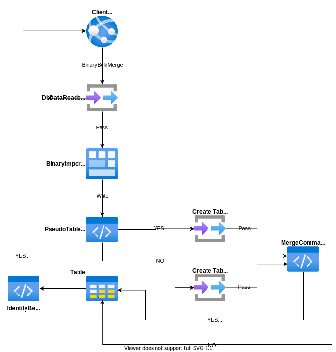

---
layout: default
sidebar: operations
title: "BinaryBulkMerge"
permalink: /operation/binarybulkmerge
tags: [repodb, tutorial, binarybulkmerge, orm, hybrid-orm, sqlserver]
parent: OPERATIONS
---

# BinaryBulkMerge

---

This method merges multiple rows into the database in bulk. It does not delete rows — it updates existing rows (if present) and inserts new rows (if absent) based on the given qualifiers. It is supported only for [PostgreSQL](https://www.nuget.org/packages/RepoDb.PostgreSql.BulkOperations).

## Call Flow Diagram

The diagram below shows the flow when calling this operation.



## Use Case

Use this method to merge rows at high speed. It leverages the native bulk operation from the Npgsql library via the [NpgsqlBinaryImporter](https://www.npgsql.org/doc/api/Npgsql.NpgsqlBinaryImporter.html) class.

For merging 1,000 or more rows, prefer this method over [MergeAll](/operation/mergeall).

## Special Arguments

The `mergedCommandType`, `identityBehavior`, and `pseudoTableType` arguments are available for this operation.

`mergedCommandType` controls whether `ON CONFLICT DO UPDATE` is used instead of separate `UPDATE/INSERT` SQL commands.

`identityBehavior` controls whether the identity property of the entity/model is preserved, or whether newly generated identity values from the database are returned after the operation.

`pseudoTableType` controls whether a physical pseudo-table is created during the operation. Defaults to a temporary table.

{: .important }
> It is highly recommended to use the [BulkImportPseudoTableType.Temporary](/enumeration/bulkimportpseudotabletype#temporary) value in the `pseudoTableType` argument when working with parallelism.

## Usability

Pass the list of entities to the operation.

```csharp
using (var connection = new NpgsqlConnection(connectionString))
{
    var people = GetPeople(1000);
    var mergedRows = connection.BinaryBulkMerge<Person>(people);
}
```

{: .note }
> It returns the number of rows merged into the underlying table.

To specify a batch size:

```csharp
using (var connection = new NpgsqlConnection(connectionString))
{
    var people = GetPeople(1000);
    var mergedRows = connection.BinaryBulkMerge<Person>(people, batchSize: 100);
}
```

{: .important }
> If `batchSize` is not set, all items in the collection are sent at once.

To target a specific table, pass the literal table name.

```csharp
using (var connection = new NpgsqlConnection(connectionString))
{
    var mergedRows = connection.BinaryBulkMerge("[dbo].[Person]", people);
}
```

#### DataTable

```csharp
using (var connection = new NpgsqlConnection(connectionString))
{
    var people = GetPeople(1000);
    var table = ConvertToDataTable(people);
    var mergedRows = connection.BinaryBulkMerge("[dbo].[Person]", table);
}
```

#### Dictionary/ExpandoObject

```csharp
var people = GetPeopleAsDictionary(1000);

using (var connection = new NpgsqlConnection(destinationConnectionString))
{
    var mergedRows = connection.BinaryBulkMerge("[dbo].[Person]", people);
}
```

#### DataReader

```csharp
using (var sourceConnection = new NpgsqlConnection(sourceConnectionString))
{
    using (var reader = sourceConnection.ExecuteReader("SELECT * FROM [dbo].[Person];"))
    {
        using (var destinationConnection = new NpgsqlConnection(destinationConnectionString))
        {
            var mergedRows = destinationConnection.BinaryBulkMerge("[dbo].[Person]", reader);
        }
    }
}
```

Or via [DataEntityDataReader](/class/dataentitydatareader).

```csharp
using (var connection = new NpgsqlConnection(connectionString))
{
    using (var reader = new DataEntityDataReader<Person>(people))
    {
        var mergedRows = connection.BinaryBulkMerge("[dbo].[Person]", reader);
    }
}
```

## Field Qualifiers

By default, the primary column is used as the qualifier. To override, pass a list of [Field](/class/field) objects in the `qualifiers` argument.

```csharp
using (var connection = new NpgsqlConnection(connectionString))
{
    var mergedRows = connection.BinaryBulkMerge<Person>(people,
        qualifiers: e => new { e.LastName, e.DateOfBirth });
}
```

> Use indexed columns from the target table as qualifiers to maximize performance.

## Physical Temporary Table

To use a physical pseudo-temporary table, pass [BulkImportPseudoTableType.Temporary](/enumeration/bulkimportpseudotabletype#physical) in the `pseudoTableType` argument.

```csharp
using (var connection = new NpgsqlConnection(connectionString))
{
    var mergedRows = connection.BinaryBulkMerge("[dbo].[Person]",
        people,
        pseudoTableType: BulkImportPseudoTableType.Physical);
}
```

{: .note }
> A physical pseudo-temporary table improves performance over a standard temporary table, but is shared across all calls. Parallelism may fail in this scenario.

