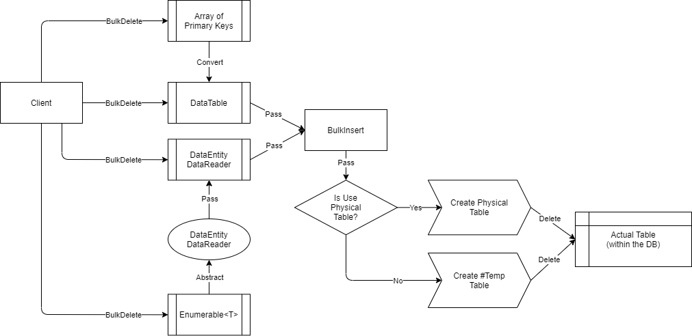

# BulkDelete

---

This method is used to delete the target rows from the database by bulk. This operation only supports the [SQL Server](https://www.nuget.org/packages/RepoDb.SqlServer.BulkOperations) RDBMS.

### Call Flow Diagram

The diagram below shows the flow when calling this operation.



### Use Case

This method is very useful if you are deleting multiple rows in the database. It is high-performant in nature as it is using the real bulk operation natively from ADO.NET (via `SqlBulkCopy` class).

If you are working to delete range of rows from 1000 or beyond, then use this method over [DeleteAll](/operation/deleteall).

### Special Arguments

The arguments `qualifiers` and `usePhysicalPseudoTempTable` is provided on this operation.

The `qualifiers` is used to define the qualifier fields to be used in the operation. It usually refers to the WHERE expression of the SQL Statements. If not given, the primary or identity column will be used.

The `usePhysicalPseudoTempTable` is used to define whether a physical pseudo-table will be created during the operation. By default, a temporary table (i.e.: `#TableName`) is used.

### Caveats

RepoDB is automatically setting the value of the `options` argument to `SqlBulkCopyOptions.KeepIdentity` when calling this method and if you have not passed any qualifiers and if your table has an IDENTITY primary key column. The same logic will apply if there is no primary key but has an IDENTITY column defined in the table.

In addition, when calling this method, the library is creating a pseudo temporary table behind the scene. It requires your user to have the correct privilege to create a table in the database, otherwise a `SqlException` will be thrown.

### How to call?

Let us say you are retrieving all inactive people from the database.

```csharp
using (var connection = new SqlConnection(connectionString))
{
    var people = connection.Query<Person>(e => e.IsActive == false);
}
```

Then, below is the code that bulk-deletes all those inactive rows from the `[dbo].[Sales]` table.

```csharp
using (var connection = new SqlConnection(connectionString))
{
    var deletedRows = connection.BulkDelete<Person>(people);
}
```

And below if you would like to specify the batch size.

```csharp
using (var connection = new SqlConnection(connectionString))
{
    var deletedRows = connection.BulkDelete<Person>(people, batchSize: 100);
}
```

> By default, the batch size is 10, equals to `Constant.DefaultBatchOperationSize` value.

#### PrimaryKeys

Below is the sample code to bulk-delete by primary keys.

```csharp
using (var connection = new SqlConnection(connectionString))
{
    var primaryKeys = people.Select(e => e.Id);
    var deletedRows = connection.BulkDelete<Person>(primaryKeys);
}
```

#### DataTable

Below is the sample code to bulk-delete via data table.

```csharp
using (var connection = new SqlConnection(connectionString))
{
    var table = ConvertToDataTable(people);
    var deletedRows = connection.BulkDelete<Person>(table);
}
```

#### Dictionary/ExpandoObject

Below is the sample code to bulk-delete via `Dictionary<string, object>` or `ExpandoObject`.

```csharp
using (var sourceConnection = new SqlConnection(sourceConnectionString))
{
    var result = sourceConnection.QueryAll("Person");
    using (var destinationConnection = new SqlConnection(destinationConnectionString))
    {
        var mergedRows = destinationConnection.BulkDelete("Person", result,
            qualifiers: Field.From("SSN"));
    }
}
```

#### DataReader

Below is the sample code to bulk-delete via `DbDataReader`.

```csharp
using (var sourceConnection = new SqlConnection(sourceConnectionString))
{
    using (var reader = sourceConnection.ExecuteReader("SELECT * FROM [dbo].[Person];"))
    {
        using (var destinationConnection = new SqlConnection(destinationConnectionString))
        {
            var rows = destinationConnection.BulkDelete<Person>(reader);
        }
    }
}
```

### Targeting a Table

You can also target a specific table by passing the literal table and field name like below.

```csharp
using (var connection = new SqlConnection(connectionString))
{
    var deletedRows = connection.BulkDelete("[dbo].[Person]", people);
}
```

### Field Qualifiers

By default, this operation is using the primary or identity as a qualifier. You can override the qualifiers by simply passing the list of [Field](/class/field) object in the `qualifiers` argument.

```csharp
using (var connection = new SqlConnection(connectionString))
{
    var deletedRows = connection.BulkDelete<Person>(people,
        qualifiers: e => new { e.LastName, e.DateOfBirth });
}
```

Or by parsing the field expression.

> When using the qualifiers, we recommend that you use the list of columns that has the correct index from the original table.

### Table Hints

To pass a hint, simply write the table-hints and pass it in the `hints` argument.

```csharp
using (var connection = new SqlConnection(connectionString))
{
    var deletedRows = connection.BulkDelete("[dbo].[Person]",
        people,
        hints: "WITH (TABLOCK)");
}
```

Or, you can use the [SqlServerTableHints](/class/sqlservertablehints) class.

```csharp
using (var connection = new SqlConnection(connectionString))
{
    var deletedRows = connection.BulkDelete("[dbo].[Person]",
        people,
        hints: SqlServerTableHints.TabLock);
}
```

### Physical Temporary Table

To ensure using a physical pseudo-temporary table, simply pass `true` in the `usePhysicalPseudoTempTable` argument.

```csharp
using (var connection = new SqlConnection(connectionString))
{
    var deletedRows = connection.BulkDelete("[dbo].[Person]",
        people,
        usePhysicalPseudoTempTable: true);
}
```

> By using the actual pseudo physical temporary table, it will further help you maximize the performance over using the normal temporary table. However, you need to be aware that the table is shared to any call, so parallelism may fail on this scenario.
