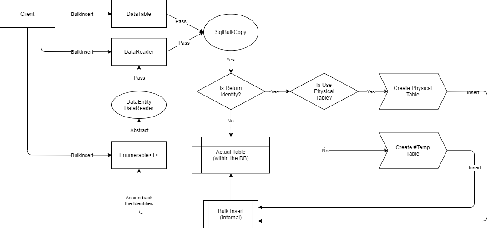

# BulkInsert

---

This method is used to insert all the rows from the client application into the database by bulk. This operation only supports the [SQL Server](https://www.nuget.org/packages/RepoDb.SqlServer.BulkOperations) RDBMS.

### Call Flow Diagram

The diagram below shows the flow when calling this operation.



### Use Case

This method is very useful if you are inserting multiple rows towards the database. It is high-performant in nature as it is using the real bulk operation natively from ADO.NET (via `SqlBulkCopy` class).

If you are working to insert range of rows from 1000 or beyond, then use this method over [InsertAll](/operation/insertall).

### Special Arguments

The arguments `isReturnIdentity`, and `usePhysicalPseudoTempTable` is provided on this operation.

The `isReturnIdentity` is used to define the behaviour of the execution whether the newly generated identity will be set-back to the data entities. By default, it is disabled.

The `usePhysicalPseudoTempTable` is used to define whether a physical pseudo-table will be created during the operation. This will only work if the `isReturnIdentity` is `true`. By default, a temporary table (i.e.: `#TableName`) is used.

### How to call?

Let us say you have a method that create a list of `Person` from the client application.

```csharp
private IEnumerable<Person> GetPeople(int count = 1000)
{
    for (var i = 0; i < count; i++)
    {
        yield return new Person
        {
            Name = $"Person-{i}",
            SSN = Guid.NewGuid().ToString(),
            IsActive = true,
            DateInsertedUtc = DateTime.UtcNow
        };
    }
}
```

Then, below is the code that bulk-inserts 10K of rows towards the `[dbo].[Person]` table.

```csharp
using (var connection = new SqlConnection(connectionString))
{
    var people = GetPeople(10000);
    var insertedRows = connection.BulkInsert(people);
}
```

And below if you would like to specify the batch size.

```csharp
using (var connection = new SqlConnection(connectionString))
{
    var people = GetPeople(10000);
    var insertedRows = connection.BulkInsert(people, batchSize: 100);
}
```

> By default, the batch size is 10, equals to `Constant.DefaultBatchOperationSize` value.

#### DataTable

Below is the sample code to bulk-insert via data table.

```csharp
using (var connection = new SqlConnection(connectionString))
{
    var people = GetPeople(10000);
    var table = ConvertToDataTable(people);
    var insertedRows = connection.BulkInsert<Person>(table);
}
```

#### Dictionary/ExpandoObject

Below is the sample code to bulk-insert via `Dictionary<string, object>` or `ExpandoObject`.

```csharp
using (var sourceConnection = new SqlConnection(sourceConnectionString))
{
    var result = sourceConnection.QueryAll("Person");
    using (var destinationConnection = new SqlConnection(destinationConnectionString))
    {
        var insertedRows = destinationConnection.BulkInsert("Person", result);
    }
}
```

#### DataReader

Below is the sample code to bulk-insert via `DbDataReader`.

```csharp
using (var sourceConnection = new SqlConnection(sourceConnectionString))
{
    using (var reader = sourceConnection.ExecuteReader("SELECT * FROM [dbo].[Person];"))
    {
        using (var destinationConnection = new SqlConnection(destinationConnectionString))
        {
            var rows = destinationConnection.BulkInsert<Person>(reader);
        }
    }
}
```

Or you can also convert the list of `Person` into a `DataEntityDataReader` object and bulk-insert it.

```csharp
using (var connection = new SqlConnection(connectionString))
{
    var people = GetPeople(10000);
    using (var reader = new DataEntityDataReader<Person>(people))
    {
        var insertedRows = connection.BulkInsert<Person>(reader);
    }
}
```

### Column Mappings

You can add a mapping via `BulkInsertMapItem` class.

```csharp
var mappings = new List<BulkInsertMapItem>();

// Add the mappings
mappings.Add(new BulkInsertMapItem("SourceId", "DestinationId"));
mappings.Add(new BulkInsertMapItem("SourceName", "DestinationName"));
mappings.Add(new BulkInsertMapItem("SourceIsActive", "DestinationIsActive"));
mappings.Add(new BulkInsertMapItem("SourceDateInsertedUtc", "DestinationDateInsertedUtc"));

// Execute
using (var connection = new SqlConnection(connectionString))
{
    var people = GetPeople(10000);
    var insertedRows = connection.BulkInsert(people,
        mappings: mappings);
}
```

### Bulk Copy Options

You can define your bulk-copy options by passing a value of `SqlBulkCopyOptions` in the `options` argument.

```csharp
using (var connection = new SqlConnection(connectionString))
{
    var people = GetPeople(10000);
    var insertedRows = connection.BulkInsert(people,
        options: SqlBulkCopyOptions.KeepIdentity);
}
```

### Targeting a Table

You can also target a specific table by passing the literal table and field name like below.

```csharp
using (var connection = new SqlConnection(connectionString))
{
    var people = GetPeople(10000);
    var insertedRows = connection.BulkInsert("[dbo].[Person]", people);
}
```

### Table Hints

To pass a hint, simply write the table-hints and pass it in the `hints` argument.

```csharp
using (var connection = new SqlConnection(connectionString))
{
    var people = GetPeople(10000);
    var insertedRows = connection.BulkInsert(people,
        hints: "WITH (TABLOCK)");
}
```

Or, you can use the [SqlServerTableHints](/class/sqlservertablehints) class.

```csharp
using (var connection = new SqlConnection(connectionString))
{
    var people = GetPeople(10000);
    var insertedRows = connection.BulkInsert(people,
        hints: SqlServerTableHints.TabLock);
}
```
