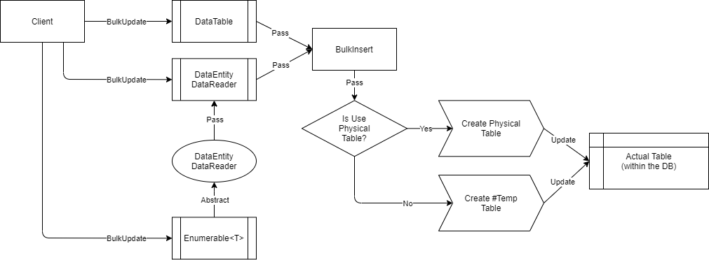

# BulkUpdate

This method is used to bulk-update all the rows from the client into the database. For now, this operation only supports [SQL Server](https://www.nuget.org/packages/RepoDb.SqlServer.BulkOperations).

#### Call Flow Diagram

The diagram below shows the flow when calling this operation.



#### Use Case

This method is very useful if you are updating multiple rows towards the database. It is high-performant in nature as it is using the real bulk operation natively from ADO.NET (via `SqlBulkCopy` class).

If you are working to update range of rows from 1000 or beyond, then use this method over [UpdateAll](/operation/updateall).

#### Special Arguments

The arguments `qualifiers` and `usePhysicalPseudoTempTable` is provided on this operation.

The `qualifiers` is used to define the qualifier fields to be used in the operation. It usually refers to the `WHERE` expression of SQL statements. If not given, the primary key (or identity) field will be used.

The `usePhysicalPseudoTempTable` is used to define whether a physical pseudo-table will be created during the operation. By default, a temporary table (i.e.: `#TableName`) is used.

#### Caveats

RepoDb is automatically setting the value of options argument to `SqlBulkCopyOptions.KeepIdentity` when calling this method and if you have not passed any qualifiers and if your table has an `IDENTITY` primary key column. The same logic will apply if there is no primary key but has an `IDENTITY` column defined in the table.

In addition, when calling this method, the library is creating a pseudo temporary table behind the scene. It requires your user to have the correct privilege to create a table in the database, otherwise a `SqlException` will be thrown.

#### Installation

To install, simply type the code snippets below in your Package Manager Console.

```csharp
> Install-Package RepoDb.SqlServer.BulkOperations
```

Then call the bootstrapper once.

```csharp
RepoDb.SqlServerBootstrap.Initialize();
```

Or visit our [installation](/tutorial/installation) page for more information.

#### Learnings

Let us say you have a list of `Person` model at variable `people` that contains both existing and non-existing rows from the database.

Then, below is the code to bulk-update those rows `[dbo].[Person]` table.

```csharp
using (var connection = new SqlConnection(connectionString))
{
	var updatedRows = connection.BulkUpdate(people);
}
```

And below if you would like to specify the batch size.

```csharp
using (var connection = new SqlConnection(connectionString))
{
	var updatedRows = connection.BulkUpdate(people, batchSize: 100);
}
```

> By default, the batch size is `10`, equals to `Constant.DefaultBatchOperationSize` value.

##### DataTable

Below is a sample code to bulk-update by data table.

```csharp
using (var connection = new SqlConnection(connectionString))
{
	var table = ConvertToDataTable(people);
	var updatedRows = connection.BulkUpdate<Person>(table);
}
```

##### DataReader

Below is a sample code to bulk-update by data reader.

```csharp
using (var sourceConnection = new SqlConnection(sourceConnectionString))
{
	using (var reader = sourceConnection.ExecuteReader("SELECT * FROM [dbo].[Person] WHERE (IsActive = 1);"))
	{
		using (var destinationConnection = new SqlConnection(destinationConnectionString))
		{
			var rows = destinationConnection.BulkUpdate<Person>(reader);
		}
	}
}
```

Or you can also convert the list of `Person` to a `DataEntityDataReader` object and bulk-insert it.

```csharp
using (var connection = new SqlConnection(connectionString))
{
	var people = GetPeople(10000);
	using (var reader = new DataEntityDataReader<Person>(people))
	{
		var updatedRows = connection.BulkUpdate<Person>(reader);
	}
}
```

#### Field Qualifiers

By default, this method is using the primary key (or identify field) as the qualifier. You can override it by passing the list of `Field` objects in the `qualifiers` argument.

```csharp
using (var connection = new SqlConnection(connectionString))
{
	var people = GetPeople(10000);
	var updatedRows = connection.BulkUpdate<Person>(people,
		qualifiers: new { e.LastName, e.DateOfBirth });
}
```

> When using the qualifiers, we recommend that you use the list of columns that has the correct index from the original table.

#### Column Mappings

You can add a mapping via `BulkInsertMapItem` class.

```csharp
var mappings = new List<BulkInsertMapItem>();

// Add the mappings
mappings.Add(new BulkInsertMapItem("Id", "Id"));
mappings.Add(new BulkInsertMapItem("Name", "Name"));
mappings.Add(new BulkInsertMapItem("IsActive", "Active"));
mappings.Add(new BulkInsertMapItem("DateInsertedUtc", "CreatedDateUtc"));

// Execute
using (var connection = new SqlConnection(connectionString))
{
	var people = GetPeople(10000);
	var updatedRows = connection.BulkUpdate(people,
		mappings: mappings);
}
```

#### Bulk Copy Options

You can define your bulk-copy options by passing a value of `SqlBulkCopyOptions` in the `options` argument.

```csharp
using (var connection = new SqlConnection(connectionString))
{
	var people = GetPeople(10000);
	var updatedRows = connection.BulkUpdate(people,
		options: SqlBulkCopyOptions.KeepIdentity);
}
```

#### Targetting a Table

You can also target a specific table by passing the literal table and field name like below.

```csharp
using (var connection = new SqlConnection(connectionString))
{
	var people = GetPeople(10000);
	var updatedRows = connection.BulkUpdate("[dbo].[Person]", people);
}
```

#### Table Hints

To pass a hint, simply write the table-hints and pass it in the `hints` argument.

```csharp
using (var connection = new SqlConnection(connectionString))
{
	var people = GetPeople(10000);
	var updatedRows = connection.BulkUpdate(people,
		hints: "WITH (TABLOCK)");
}
```

Or, you can use the [SqlServerTableHints](/class/sqlservertablehints) class.

```csharp
using (var connection = new SqlConnection(connectionString))
{
	var people = GetPeople(10000);
	var updatedRows = connection.BulkUpdate(people,
		hints: SqlServerTableHints.TabLock);
}
```
