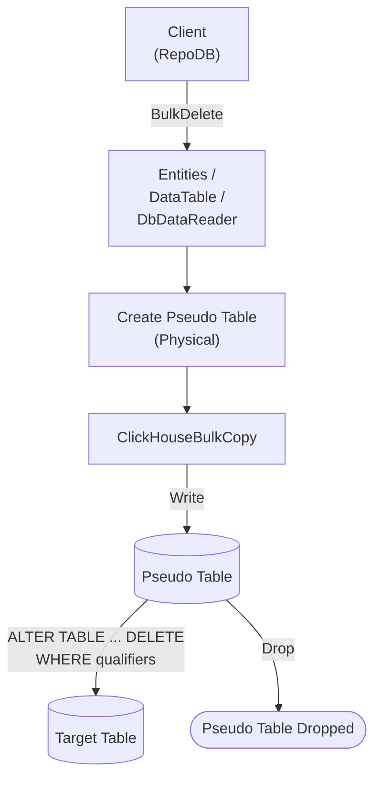

# BulkDelete

---

This method deletes rows from the database in bulk, matched by the defined qualifiers. It is supported for [RepoDb.ClickHouse.BulkOperations](https://www.nuget.org/packages/RepoDb.ClickHouse.BulkOperations). This package also has a dedicated [BulkDeleteByKey](/operation/clickhouse/bulkdeletebykey) operation for deleting by primary key.

## Call Flow Diagram

The diagram below shows the flow when calling this operation.



## Use Case

Use this method to delete rows at high speed. It leverages this package's internal `ClickHouseBulkCopy` class (see [Operations (ClickHouse)](/operation/clickhouse)).

For deleting 1,000 or more rows, prefer this method over [DeleteAll](/operation/deleteall).

A pseudo (staging) table is created for the call. The library writes to it via `ClickHouseBulkCopy`, then cascades the deletions to the target table via an `ALTER TABLE ... DELETE` mutation matched on the qualifiers — see [Operations (ClickHouse)](/operation/clickhouse) for the underlying mechanics.

{: .important }
> The reported result is the number of rows **staged**, not a confirmed post-mutation count — see [No Reliable Affected-Row Count](/operation/clickhouse#no-reliable-affected-row-count).

## Special Arguments

The `qualifiers`, `bulkCopyTimeout`, `batchSize` and `pseudoTableType` arguments are available for this operation.

`qualifiers` defines the fields used to match existing rows. Defaults to the primary column if not specified.

`bulkCopyTimeout` is accepted for API parity with other providers, but currently has no effect.

`batchSize` overrides the number of rows sent to the server per batch. When not set, the driver's own default (100,000) is used.

`pseudoTableType` (via [ClickHouseBulkImportPseudoTableType](/enumeration/clickhouse/clickhousebulkimportpseudotabletype)) controls the kind of staging table used internally.

{: .important }
> Every `pseudoTableType` value currently resolves to `Physical` at runtime — see [Operations (ClickHouse)](/operation/clickhouse#pseudo-table-type) for details.

## Usability

The following example retrieves all inactive people, then bulk-deletes them from the `Person` table.

```csharp
using (var connection = new ClickHouseConnection(connectionString))
{
    var people = connection.Query<Person>(e => e.IsActive == false);
    var deletedRows = connection.BulkDelete<Person>(people);
}
```

To specify a batch size:

```csharp
using (var connection = new ClickHouseConnection(connectionString))
{
    var deletedRows = connection.BulkDelete<Person>(people, batchSize: 1000);
}
```

#### DataTable

```csharp
using (var connection = new ClickHouseConnection(connectionString))
{
    var table = ConvertToDataTable(people);
    var deletedRows = connection.BulkDelete("Person", table);
}
```

#### DataReader

```csharp
using (var sourceConnection = new ClickHouseConnection(sourceConnectionString))
{
    using (var reader = sourceConnection.ExecuteReader("SELECT * FROM Person"))
    {
        using (var destinationConnection = new ClickHouseConnection(destinationConnectionString))
        {
            var rows = destinationConnection.BulkDelete("Person", reader);
        }
    }
}
```

## Targeting a Table

To target a specific table, pass the literal table name.

```csharp
using (var connection = new ClickHouseConnection(connectionString))
{
    var deletedRows = connection.BulkDelete("Person", people);
}
```

## Field Qualifiers

By default, the primary column is used as the qualifier. To override, pass a list of [Field](/class/field) objects in the `qualifiers` argument.

```csharp
using (var connection = new ClickHouseConnection(connectionString))
{
    var deletedRows = connection.BulkDelete<Person>(people,
        qualifiers: e => new { e.LastName, e.DateOfBirth });
}
```

## Async Method

An equivalent `BulkDeleteAsync` method is also available.

```csharp
using (var connection = new ClickHouseConnection(connectionString))
{
    var people = connection.Query<Person>(e => e.IsActive == false);
    var deletedRows = await connection.BulkDeleteAsync<Person>(people);
}
```
