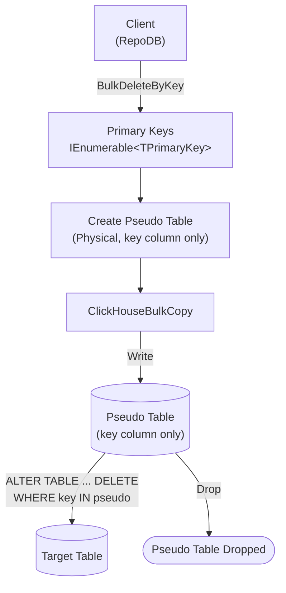

# BulkDeleteByKey

---

This method deletes rows from the database using a list of primary keys in bulk. It is supported for [RepoDb.ClickHouse.BulkOperations](https://www.nuget.org/packages/RepoDb.ClickHouse.BulkOperations).

## Call Flow Diagram

The diagram below shows the flow when calling this operation.



## Use Case

Use this method to delete rows by primary key at high speed. It leverages this package's internal `ClickHouseBulkCopy` class (see [Operations (ClickHouse)](/operation/clickhouse)).

Prefer this method over [BulkDelete](/operation/clickhouse/bulkdelete) when you only have the primary keys of the rows to delete (not the full entities). The pseudo table used internally stages only the key values, taking a bare list of primary key values rather than entities/`DataTable`/reader input.

{: .important }
> The reported result is the number of rows **staged**, not a confirmed post-mutation count — see [No Reliable Affected-Row Count](/operation/clickhouse#no-reliable-affected-row-count).

## Special Arguments

The `bulkCopyTimeout`, `batchSize` and `pseudoTableType` arguments are available for this operation.

`bulkCopyTimeout` is accepted for API parity with other providers, but currently has no effect.

`batchSize` overrides the number of rows sent to the server per batch. When not set, the driver's own default (100,000) is used.

`pseudoTableType` (via [ClickHouseBulkImportPseudoTableType](/enumeration/clickhouse/clickhousebulkimportpseudotabletype)) controls the kind of staging table used internally.

{: .important }
> Every `pseudoTableType` value currently resolves to `Physical` at runtime — see [Operations (ClickHouse)](/operation/clickhouse#pseudo-table-type) for details.

{: .note }
> `BulkDeleteByKey` has no `qualifiers` or `mappings` argument of its own, since the key values themselves are the match criteria, and there is only one shape (no entity/`DataTable`/reader overloads).

## Usability

Pass the target table name and the list of primary keys to the operation.

```csharp
using (var connection = new ClickHouseConnection(connectionString))
{
    var primaryKeys = connection.Query<Person>(p => p.IsActive == false).Select(p => p.Id);
    var deletedRows = connection.BulkDeleteByKey("Person", primaryKeys);
}
```

To specify a batch size:

```csharp
using (var connection = new ClickHouseConnection(connectionString))
{
    var primaryKeys = connection.Query<Person>(p => p.IsActive == false).Select(p => p.Id);
    var deletedRows = connection.BulkDeleteByKey("Person",
        primaryKeys,
        batchSize: 1000);
}
```

## Async Method

An equivalent `BulkDeleteByKeyAsync` method is also available.

```csharp
using (var connection = new ClickHouseConnection(connectionString))
{
    var primaryKeys = connection.Query<Person>(p => p.IsActive == false).Select(p => p.Id);
    var deletedRows = await connection.BulkDeleteByKeyAsync("Person", primaryKeys);
}
```
