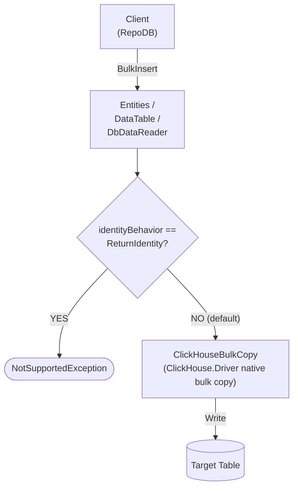

# BulkInsert

---

This method inserts all rows from the client application into the database in bulk. It is supported for [RepoDb.ClickHouse.BulkOperations](https://www.nuget.org/packages/RepoDb.ClickHouse.BulkOperations).

## Call Flow Diagram

The diagram below shows the flow when calling this operation.



## Use Case

Use this method to insert rows at high speed. Unlike some other RepoDB providers, this operation is backed by the underlying [ClickHouse.Driver](https://www.nuget.org/packages/ClickHouse.Driver)'s own native streaming bulk-copy API, wrapped by this package's internal `ClickHouseBulkCopy` adapter class.

For inserting 1,000 or more rows, prefer this method over [InsertAll](/operation/insertall).

Rows are written straight to the target table — there is no staging/pseudo table involved at all, since `identityBehavior: ReturnIdentity` (the only reason one would be needed) is never supported. See [Operations (ClickHouse)](/operation/clickhouse) for the underlying mechanics.

## Special Arguments

The `mappings`, `bulkCopyTimeout`, `batchSize` and `identityBehavior` arguments are available for this operation.

`mappings` (via `ClickHouseBulkInsertMapItem`) defines explicit column mappings between the source properties and the destination columns, with an optional explicit ClickHouse type name override. When omitted, columns are auto-mapped by name.

`bulkCopyTimeout` is accepted for API parity with other providers, but the driver has no per-copy timeout knob, so it currently has no effect.

`batchSize` overrides the number of rows sent to the server per batch. When not set, the driver's own default (100,000) is used.

`identityBehavior` (via [ClickHouseBulkImportIdentityBehavior](/enumeration/clickhouse/clickhousebulkimportidentitybehavior)) defaults to `KeepIdentity`, which writes the key/identity value exactly as supplied on the entity.

{: .important }
> Passing `identityBehavior: ClickHouseBulkImportIdentityBehavior.ReturnIdentity` always throws `NotSupportedException` — ClickHouse has no session-wide scope identity, sequence, or auto-increment mechanism. Assign key values on the entity yourself before calling this operation.

## Usability

The following example defines a method that produces a list of `Person` objects, then bulk-inserts 10,000 rows into the `Person` table.

```csharp
private IEnumerable<Person> GetPeople(int count = 1000)
{
    for (var i = 0; i < count; i++)
    {
        yield return new Person
        {
            Id = (ulong)(i + 1),
            Name = $"Person-{i}",
            Age = 30,
            CreatedDateUtc = DateTime.UtcNow
        };
    }
}
```

```csharp
using (var connection = new ClickHouseConnection(connectionString))
{
    var people = GetPeople(10000);
    var insertedRows = connection.BulkInsert(people);
}
```

To specify a batch size:

```csharp
using (var connection = new ClickHouseConnection(connectionString))
{
    var people = GetPeople(10000);
    var insertedRows = connection.BulkInsert(people, batchSize: 1000);
}
```

{: .note }
> When `batchSize` is not set, the driver's own default batch size (100,000 rows) is used.

#### DataTable

```csharp
using (var connection = new ClickHouseConnection(connectionString))
{
    var people = GetPeople(10000);
    var table = ConvertToDataTable(people);
    var insertedRows = connection.BulkInsert("Person", table);
}
```

#### DataReader

```csharp
using (var sourceConnection = new ClickHouseConnection(sourceConnectionString))
{
    using (var reader = sourceConnection.ExecuteReader("SELECT * FROM Person"))
    {
        using (var destinationConnection = new ClickHouseConnection(destinationConnectionString))
        {
            var rows = destinationConnection.BulkInsert("Person", reader);
        }
    }
}
```

To bulk-insert via [DataEntityDataReader](/class/dataentitydatareader):

```csharp
using (var connection = new ClickHouseConnection(connectionString))
{
    var people = GetPeople(10000);
    using (var reader = new DataEntityDataReader<Person>(people))
    {
        var insertedRows = connection.BulkInsert("Person", reader);
    }
}
```

## Column Mappings

Add column mappings using the `ClickHouseBulkInsertMapItem` class.

```csharp
var mappings = new List<ClickHouseBulkInsertMapItem>();

// Add the mappings
mappings.Add(new ClickHouseBulkInsertMapItem("SourceId", "DestinationId"));
mappings.Add(new ClickHouseBulkInsertMapItem("SourceName", "DestinationName"));
mappings.Add(new ClickHouseBulkInsertMapItem("SourceCreatedDateUtc", "DestinationCreatedDateUtc", "Nullable(DateTime64(3))"));

// Execute
using (var connection = new ClickHouseConnection(connectionString))
{
    var people = GetPeople(10000);
    var insertedRows = connection.BulkInsert(people,
        mappings: mappings);
}
```

## Targeting a Table

To target a specific table, pass the literal table name.

```csharp
using (var connection = new ClickHouseConnection(connectionString))
{
    var people = GetPeople(10000);
    var insertedRows = connection.BulkInsert("Person", people);
}
```

## Async Method

An equivalent `BulkInsertAsync` method is also available.

```csharp
using (var connection = new ClickHouseConnection(connectionString))
{
    var people = GetPeople(10000);
    var insertedRows = await connection.BulkInsertAsync(people);
}
```
