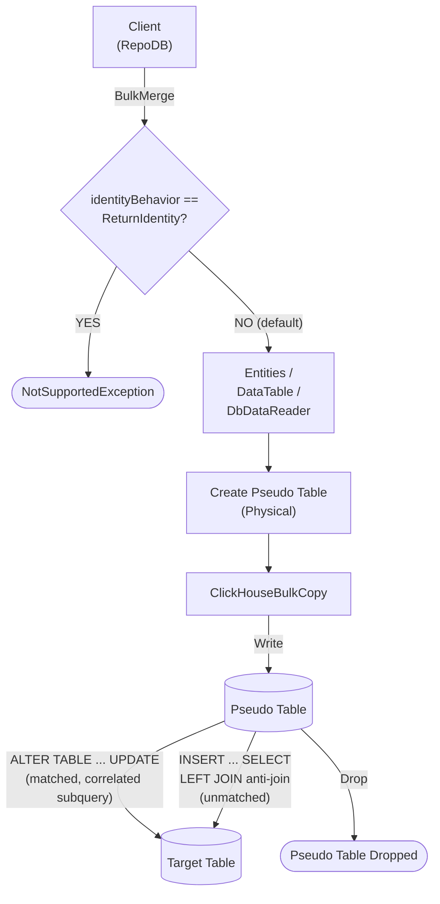

# BulkMerge

---

This method merges all rows from the client application into the database in bulk — inserting new rows and updating existing ones based on the defined qualifiers. It is supported for [RepoDb.ClickHouse.BulkOperations](https://www.nuget.org/packages/RepoDb.ClickHouse.BulkOperations).

## Call Flow Diagram

The diagram below shows the flow when calling this operation.



## Use Case

Use this method to merge rows at high speed. It leverages this package's internal `ClickHouseBulkCopy` class (see [Operations (ClickHouse)](/operation/clickhouse)).

For merging 1,000 or more rows, prefer this method over [MergeAll](/operation/mergeall).

A pseudo (staging) table is created for the call. The library writes to it via `ClickHouseBulkCopy`, then cascades the changes to the target table. ClickHouse has no `MERGE` statement, so this is done via an `ALTER TABLE ... UPDATE` mutation for matched rows followed by an `INSERT ... SELECT` guarded by a `LEFT JOIN ... WHERE ... IS NULL` anti-join for unmatched rows — see [Operations (ClickHouse)](/operation/clickhouse) for the underlying mechanics.

{: .important }
> The reported result is the number of rows **staged**, not a confirmed post-mutation count — `ALTER TABLE ... UPDATE` is an asynchronous mutation applied by background merges, and neither it nor a plain `INSERT` report a reliable affected-row figure. See [No Reliable Affected-Row Count](/operation/clickhouse#no-reliable-affected-row-count).

## Special Arguments

The `qualifiers`, `mappings`, `bulkCopyTimeout`, `batchSize`, `identityBehavior` and `pseudoTableType` arguments are available for this operation.

`qualifiers` defines the fields used to match existing rows. Defaults to the primary column if not specified.

`mappings` (via `ClickHouseBulkInsertMapItem`) defines explicit column mappings between the source properties and the destination columns. When omitted, columns are auto-mapped by name.

`bulkCopyTimeout` is accepted for API parity with other providers, but currently has no effect.

`batchSize` overrides the number of rows sent to the server per batch. When not set, the driver's own default (100,000) is used.

`identityBehavior` (via [ClickHouseBulkImportIdentityBehavior](/enumeration/clickhouse/clickhousebulkimportidentitybehavior)) defaults to `KeepIdentity`.

`pseudoTableType` (via [ClickHouseBulkImportPseudoTableType](/enumeration/clickhouse/clickhousebulkimportpseudotabletype)) controls the kind of staging table used internally.

{: .important }
> Passing `identityBehavior: ClickHouseBulkImportIdentityBehavior.ReturnIdentity` always throws `NotSupportedException`.

{: .important }
> Every `pseudoTableType` value currently resolves to `Physical` at runtime — see [Operations (ClickHouse)](/operation/clickhouse#pseudo-table-type) for details.

{: .note }
> The identity column, if any, is always left out of the `INSERT` column list generated for unmatched rows — a brand-new row's identity property is typically an unset default (e.g. `0`), not a real value meant to be inserted as-is.

## Usability

Given a list of `Person` models containing both existing and new rows, the following example bulk-merges them into the `Person` table.

```csharp
using (var connection = new ClickHouseConnection(connectionString))
{
    var mergedRows = connection.BulkMerge(people);
}
```

To specify a batch size:

```csharp
using (var connection = new ClickHouseConnection(connectionString))
{
    var mergedRows = connection.BulkMerge(people, batchSize: 1000);
}
```

#### DataTable

```csharp
using (var connection = new ClickHouseConnection(connectionString))
{
    var table = ConvertToDataTable(people);
    var mergedRows = connection.BulkMerge("Person", table);
}
```

#### DataReader

```csharp
using (var sourceConnection = new ClickHouseConnection(sourceConnectionString))
{
    using (var reader = sourceConnection.ExecuteReader("SELECT * FROM Person WHERE (IsActive = true)"))
    {
        using (var destinationConnection = new ClickHouseConnection(destinationConnectionString))
        {
            var rows = destinationConnection.BulkMerge("Person", reader);
        }
    }
}
```

To bulk-merge via [DataEntityDataReader](/class/dataentitydatareader):

```csharp
using (var connection = new ClickHouseConnection(connectionString))
{
    var people = GetPeople(10000);
    using (var reader = new DataEntityDataReader<Person>(people))
    {
        var mergedRows = connection.BulkMerge("Person", reader);
    }
}
```

## Field Qualifiers

By default, the primary column is used as the qualifier. To override, pass a list of [Field](/class/field) objects in the `qualifiers` argument.

```csharp
using (var connection = new ClickHouseConnection(connectionString))
{
    var people = GetPeople(10000);
    var mergedRows = connection.BulkMerge<Person>(people,
        qualifiers: e => new { e.LastName, e.DateOfBirth });
}
```

## Column Mappings

Add column mappings using the `ClickHouseBulkInsertMapItem` class.

```csharp
var mappings = new List<ClickHouseBulkInsertMapItem>();

// Add the mappings
mappings.Add(new ClickHouseBulkInsertMapItem("SourceId", "DestinationId"));
mappings.Add(new ClickHouseBulkInsertMapItem("SourceName", "DestinationName"));

// Execute
using (var connection = new ClickHouseConnection(connectionString))
{
    var people = GetPeople(10000);
    var mergedRows = connection.BulkMerge(people,
        mappings: mappings);
}
```

## Targeting a Table

To target a specific table, pass the literal table name.

```csharp
using (var connection = new ClickHouseConnection(connectionString))
{
    var people = GetPeople(10000);
    var mergedRows = connection.BulkMerge("Person", people);
}
```

## Async Method

An equivalent `BulkMergeAsync` method is also available.

```csharp
using (var connection = new ClickHouseConnection(connectionString))
{
    var mergedRows = await connection.BulkMergeAsync(people);
}
```
