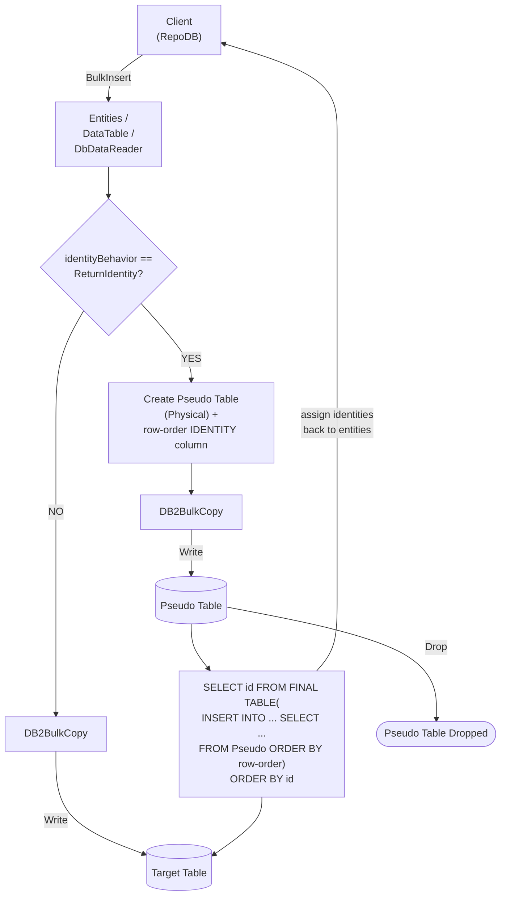

# BulkInsert

---

This method inserts all rows from the client application into the database in bulk. It is supported for [Db2](https://www.nuget.org/packages/RepoDb.Db2.BulkOperations).

{: .note }
> This page documents the Db2-specific arguments and examples. For the SQL Server implementation, see [BulkInsert (SQL Server)](/operation/sqlserver/bulkinsert).

## Call Flow Diagram

The diagram below shows the flow when calling this operation.



## Use Case

Use this method to insert rows at high speed. It leverages the native bulk operation from the IBM Data Server .NET Provider via the [DB2BulkCopy](https://www.ibm.com/docs/en/db2/11.5?topic=classes-db2bulkcopy-class) class.

For inserting 1,000 or more rows, prefer this method over [InsertAll](/operation/insertall).

Rows are written straight to the target table. A staging table is only used when `identityBehavior` is set to `ReturnIdentity` (see below) — see [Operations (Db2)](/operation/db2) for the underlying mechanics.

## Special Arguments

The `mappings`, `bulkCopyTimeout`, `batchSize`, `identityBehavior` and `pseudoTableType` arguments are available for this operation.

`mappings` (via `Db2BulkInsertMapItem`) defines explicit column mappings between the source properties and the destination columns, with an optional `DB2Type` override per mapping. When omitted, columns are auto-mapped by name (case-insensitive).

`bulkCopyTimeout` overrides the command timeout, in seconds.

`batchSize` overrides the number of rows sent to the server per batch. When not set, all items are sent at once.

`identityBehavior` (via [Db2BulkImportIdentityBehavior](/enumeration/db2/db2bulkimportidentitybehavior)) controls whether newly generated identity values are set back on the data entities. Disabled (`KeepIdentity`) by default. Enabling this (`ReturnIdentity`) routes the operation through a staging table instead, reading the generated identity values back via Db2's `SELECT ... FROM FINAL TABLE (INSERT ...)` clause.

`pseudoTableType` (via [Db2BulkImportPseudoTableType](/enumeration/db2/db2bulkimportpseudotabletype)) controls the kind of staging table used when `identityBehavior` is `ReturnIdentity`.

{: .important }
> Every `pseudoTableType` value currently resolves to `Physical` at runtime — see [Operations (Db2)](/operation/db2#pseudo-table-type) for details.

{: .note }
> The `DbDataReader` overload has no `identityBehavior` argument — a forward-only, single-pass reader cannot be rewound to correlate generated identity values back onto a source row, so `ReturnIdentity` is not supported for that overload.

## Identity Setting Alignment

When `identityBehavior` is `ReturnIdentity`, the library adds a `__RepoDbBulkRowOrder__` identity column to the staging table to track each entity's position in the source [IEnumerable](https://learn.microsoft.com/en-us/dotnet/api/system.collections.generic.ienumerable-1?view=net-7.0). The staged rows are then fed into the real `INSERT` ordered by that column, and the generated identities are read back — in the same statement — via `SELECT identity FROM FINAL TABLE (INSERT ... ) ORDER BY identity`, then assigned back to the correct entity via the compiled identity-setter function.

## Usability

The following example defines a method that produces a list of `Person` objects, then bulk-inserts 10,000 rows into the `Person` table.

```csharp
private IEnumerable<Person> GetPeople(int count = 1000)
{
    for (var i = 0; i < count; i++)
    {
        yield return new Person
        {
            Name = $"Person-{i}",
            SSN = Guid.NewGuid().ToString(),
            IsActive = true,
            DateInsertedUtc = DateTime.UtcNow
        };
    }
}
```

```csharp
using (var connection = new DB2Connection(connectionString))
{
    var people = GetPeople(10000);
    var insertedRows = connection.BulkInsert(people);
}
```

To specify a batch size:

```csharp
using (var connection = new DB2Connection(connectionString))
{
    var people = GetPeople(10000);
    var insertedRows = connection.BulkInsert(people, batchSize: 100);
}
```

{: .note }
> When `batchSize` is not set, all rows are sent to the server in a single batch.

To return the newly generated identity values:

```csharp
using (var connection = new DB2Connection(connectionString))
{
    var people = GetPeople(10000);
    var insertedRows = connection.BulkInsert(people,
        identityBehavior: Db2BulkImportIdentityBehavior.ReturnIdentity);
}
```

#### DataTable

```csharp
using (var connection = new DB2Connection(connectionString))
{
    var people = GetPeople(10000);
    var table = ConvertToDataTable(people);
    var insertedRows = connection.BulkInsert("Person", table);
}
```

#### Dictionary/ExpandoObject

```csharp
using (var sourceConnection = new DB2Connection(sourceConnectionString))
{
    var result = sourceConnection.QueryAll("Person");
    using (var destinationConnection = new DB2Connection(destinationConnectionString))
    {
        var insertedRows = destinationConnection.BulkInsert("Person", result);
    }
}
```

#### DataReader

```csharp
using (var sourceConnection = new DB2Connection(sourceConnectionString))
{
    using (var reader = sourceConnection.ExecuteReader("SELECT * FROM Person"))
    {
        using (var destinationConnection = new DB2Connection(destinationConnectionString))
        {
            var rows = destinationConnection.BulkInsert("Person", reader);
        }
    }
}
```

To bulk-insert via [DataEntityDataReader](/class/dataentitydatareader):

```csharp
using (var connection = new DB2Connection(connectionString))
{
    var people = GetPeople(10000);
    using (var reader = new DataEntityDataReader<Person>(people))
    {
        var insertedRows = connection.BulkInsert("Person", reader);
    }
}
```

## Column Mappings

Add column mappings using the `Db2BulkInsertMapItem` class.

```csharp
var mappings = new List<Db2BulkInsertMapItem>();

// Add the mappings
mappings.Add(new Db2BulkInsertMapItem("SourceId", "DestinationId"));
mappings.Add(new Db2BulkInsertMapItem("SourceName", "DestinationName"));
mappings.Add(new Db2BulkInsertMapItem("SourceIsActive", "DestinationIsActive"));
mappings.Add(new Db2BulkInsertMapItem("SourceDateInsertedUtc", "DestinationDateInsertedUtc"));

// Execute
using (var connection = new DB2Connection(connectionString))
{
    var people = GetPeople(10000);
    var insertedRows = connection.BulkInsert(people,
        mappings: mappings);
}
```

## Targeting a Table

To target a specific table, pass the literal table name.

```csharp
using (var connection = new DB2Connection(connectionString))
{
    var people = GetPeople(10000);
    var insertedRows = connection.BulkInsert("Person", people);
}
```

## Async Method

An equivalent [BulkInsertAsync](/operation/db2/bulkinsert) method is also available.

```csharp
using (var connection = new DB2Connection(connectionString))
{
    var people = GetPeople(10000);
    var insertedRows = await connection.BulkInsertAsync(people);
}
```
