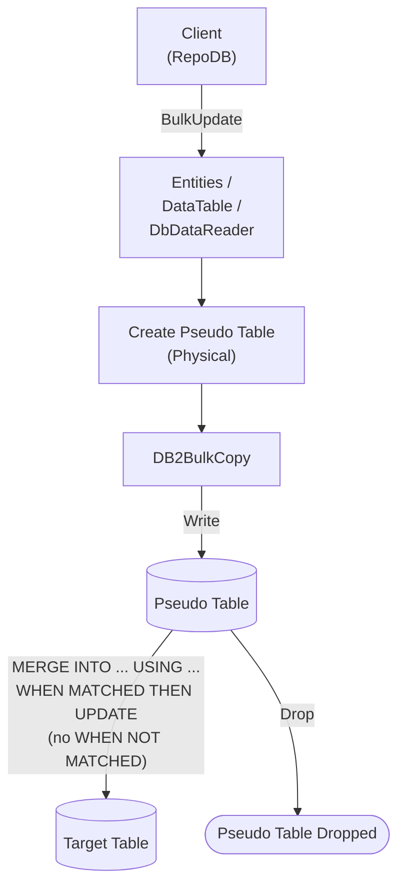

# BulkUpdate

---

This method updates existing rows in the database in bulk, matched by the defined qualifiers. It is supported for [Db2](https://www.nuget.org/packages/RepoDb.Db2.BulkOperations).

{: .note }
> This page documents the Db2-specific arguments and examples. For the SQL Server implementation, see [BulkUpdate (SQL Server)](/operation/sqlserver/bulkupdate).

## Call Flow Diagram

The diagram below shows the flow when calling this operation.



## Use Case

Use this method to update rows at high speed. It leverages the native bulk operation from the IBM Data Server .NET Provider via the [DB2BulkCopy](https://www.ibm.com/docs/en/db2/11.5?topic=classes-db2bulkcopy-class) class.

For updating 1,000 or more rows, prefer this method over [UpdateAll](/operation/updateall).

A pseudo (staging) table is created under a transaction context. The library writes to it via [BulkInsert](/operation/db2/bulkinsert) internally, then cascades the changes to the target table via a `MERGE` statement with no `WHEN NOT MATCHED` branch — staged rows with no matching target row are left as-is, not inserted. See [Operations (Db2)](/operation/db2) for the underlying mechanics.

## Special Arguments

The `qualifiers`, `mappings`, `bulkCopyTimeout`, `batchSize` and `pseudoTableType` arguments are available for this operation.

`qualifiers` defines the fields used to match existing rows, corresponding to the `WHERE` clause. Defaults to the primary column if not specified.

`mappings` (via `Db2BulkInsertMapItem`) defines explicit column mappings between the source properties and the destination columns, with an optional `DB2Type` override per mapping. When omitted, columns are auto-mapped by name (case-insensitive).

`bulkCopyTimeout` overrides the command timeout, in seconds.

`batchSize` overrides the number of rows sent to the server per batch. When not set, all items are sent at once.

`pseudoTableType` (via [Db2BulkImportPseudoTableType](/enumeration/db2/db2bulkimportpseudotabletype)) controls the kind of staging table used internally.

{: .important }
> Every `pseudoTableType` value currently resolves to `Physical` at runtime — see [Operations (Db2)](/operation/db2#pseudo-table-type) for details.

## Caveats

This operation creates a pseudo-temporary table internally under a transaction context. The database user must have permission to create tables, or a `DB2Exception` will be thrown.

{: .note }
> The `DB2BulkCopy` load into the staging table does not participate in the caller-supplied `transaction` — only the surrounding staging-table DDL and the final `MERGE` against the real table do.

## Usability

Given a list of `Person` models, the following example bulk-updates rows in the `Person` table.

```csharp
using (var connection = new DB2Connection(connectionString))
{
    var updatedRows = connection.BulkUpdate(people);
}
```

To specify a batch size:

```csharp
using (var connection = new DB2Connection(connectionString))
{
    var updatedRows = connection.BulkUpdate(people, batchSize: 100);
}
```

{: .note }
> When `batchSize` is not set, all rows are sent to the server in a single batch.

#### DataTable

```csharp
using (var connection = new DB2Connection(connectionString))
{
    var table = ConvertToDataTable(people);
    var updatedRows = connection.BulkUpdate("Person", table);
}
```

#### Dictionary/ExpandoObject

```csharp
using (var sourceConnection = new DB2Connection(sourceConnectionString))
{
    var result = sourceConnection.QueryAll("Person");
    using (var destinationConnection = new DB2Connection(destinationConnectionString))
    {
        var updatedRows = destinationConnection.BulkUpdate("Person", result,
            qualifiers: Field.From("LastName", "DateOfBirth"));
    }
}
```

#### DataReader

```csharp
using (var sourceConnection = new DB2Connection(sourceConnectionString))
{
    using (var reader = sourceConnection.ExecuteReader("SELECT * FROM Person WHERE (IsActive = 1)"))
    {
        using (var destinationConnection = new DB2Connection(destinationConnectionString))
        {
            var rows = destinationConnection.BulkUpdate("Person", reader);
        }
    }
}
```

To bulk-update via [DataEntityDataReader](/class/dataentitydatareader):

```csharp
using (var connection = new DB2Connection(connectionString))
{
    var people = GetPeople(10000);
    using (var reader = new DataEntityDataReader<Person>(people))
    {
        var updatedRows = connection.BulkUpdate("Person", reader);
    }
}
```

## Field Qualifiers

By default, the primary column is used as the qualifier. To override, pass a list of [Field](/class/field) objects in the `qualifiers` argument.

```csharp
using (var connection = new DB2Connection(connectionString))
{
    var people = GetPeople(10000);
    var updatedRows = connection.BulkUpdate<Person>(people,
        qualifiers: e => new { e.LastName, e.DateOfBirth });
}
```

{: .important }
> Use indexed columns from the target table as qualifiers to maximize performance.

## Column Mappings

Add column mappings using the `Db2BulkInsertMapItem` class.

```csharp
var mappings = new List<Db2BulkInsertMapItem>();

// Add the mappings
mappings.Add(new Db2BulkInsertMapItem("SourceId", "DestinationId"));
mappings.Add(new Db2BulkInsertMapItem("SourceName", "DestinationName"));
mappings.Add(new Db2BulkInsertMapItem("SourceIsActive", "DestinationIsActive"));
mappings.Add(new Db2BulkInsertMapItem("SourceDateInsertedUtc", "DestinationDateInsertedUtc"));

// Execute
using (var connection = new DB2Connection(connectionString))
{
    var people = GetPeople(10000);
    var updatedRows = connection.BulkUpdate(people,
        mappings: mappings);
}
```

## Targeting a Table

To target a specific table, pass the literal table name.

```csharp
using (var connection = new DB2Connection(connectionString))
{
    var people = GetPeople(10000);
    var updatedRows = connection.BulkUpdate("Person", people);
}
```

## Async Method

An equivalent [BulkUpdateAsync](/operation/db2/bulkupdate) method is also available.

```csharp
using (var connection = new DB2Connection(connectionString))
{
    var updatedRows = await connection.BulkUpdateAsync(people);
}
```
