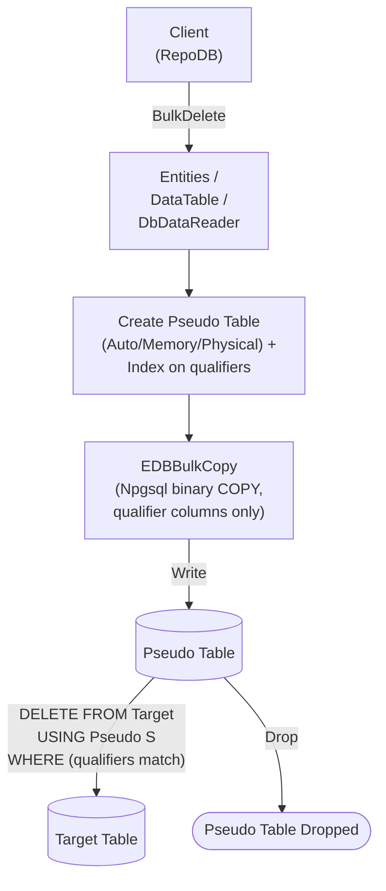

# BulkDelete

---

This method deletes rows from the database in bulk, matched by the defined qualifiers. It is supported for [EnterpriseDB](https://www.nuget.org/packages/RepoDb.EnterpriseDb.BulkOperations). EnterpriseDB also has a dedicated [BulkDeleteByKey](/operation/enterprisedb/bulkdeletebykey) operation for deleting by primary key.

{: .note }
> This page documents the EnterpriseDB-specific arguments and examples. For the SQL Server implementation, see [BulkDelete (SQL Server)](/operation/sqlserver/bulkdelete).

## Call Flow Diagram

The diagram below shows the flow when calling this operation.



## Use Case

Use this method to delete rows against EnterpriseDB at high speed. It leverages `RepoDb.Connector.EnterpriseDb`'s `EDBBulkCopy`, itself built on top of Npgsql's native binary `COPY` protocol — a genuine bulk load, not a client-side loop of single-row statements.

A pseudo (staging) table, containing only the qualifier columns and indexed on them, is created for every call and dropped afterward. The library writes to it via `EDBBulkCopy`, then cascades the deletions to the target table via a `DELETE ... USING` join — see [Operations (EnterpriseDB)](/operation/enterprisedb) for the underlying mechanics.

## Special Arguments

The `qualifiers`, `bulkCopyTimeout`, `batchSize` and `pseudoTableType` arguments are available for this operation.

`qualifiers` defines the fields used to match existing rows, corresponding to the `USING` join. Defaults to the primary or identity column if not specified.

`bulkCopyTimeout` overrides the command timeout, in seconds, applied to the underlying `EDBBulkCopy` write while staging.

`batchSize` overrides the number of rows written per batch. When not set, the provider's default batch size is used.

`pseudoTableType` (via [EDBBulkImportPseudoTableType](/enumeration/enterprisedb/edbbulkimportpseudotabletype)) controls the kind of staging table used — `Auto` (default) picks `Physical` once the row count reaches the internal threshold (`5000`), otherwise `Memory`.

## Usability

The following example retrieves all inactive people, then bulk-deletes them from the `Person` table.

```csharp
using (var connection = new EDBConnection(connectionString))
{
    var people = connection.Query<Person>(e => e.IsActive == false);
    var deletedRows = connection.BulkDelete<Person>(people);
}
```

To specify a batch size:

```csharp
using (var connection = new EDBConnection(connectionString))
{
    var deletedRows = connection.BulkDelete<Person>(people, batchSize: 100);
}
```

#### DataTable

```csharp
using (var connection = new EDBConnection(connectionString))
{
    var table = ConvertToDataTable(people);
    var deletedRows = connection.BulkDelete("\"Person\"", table);
}
```

#### Dictionary/ExpandoObject

```csharp
using (var sourceConnection = new EDBConnection(sourceConnectionString))
{
    var result = sourceConnection.QueryAll("\"Person\"");
    using (var destinationConnection = new EDBConnection(destinationConnectionString))
    {
        var deletedRows = destinationConnection.BulkDelete("\"Person\"", result);
    }
}
```

#### DataReader

```csharp
using (var sourceConnection = new EDBConnection(sourceConnectionString))
{
    using (var reader = sourceConnection.ExecuteReader("SELECT * FROM \"Person\""))
    {
        using (var destinationConnection = new EDBConnection(destinationConnectionString))
        {
            var deletedRows = destinationConnection.BulkDelete("\"Person\"", reader);
        }
    }
}
```

## Targeting a Table

To target a specific table, pass the literal table name.

```csharp
using (var connection = new EDBConnection(connectionString))
{
    var deletedRows = connection.BulkDelete("\"Person\"", people);
}
```

## Field Qualifiers

By default, the primary or identity column is used as the qualifier. To override, pass a list of [Field](/class/field) objects in the `qualifiers` argument.

```csharp
using (var connection = new EDBConnection(connectionString))
{
    var deletedRows = connection.BulkDelete<Person>(people,
        qualifiers: e => new { e.Name });
}
```

{: .important }
> Use indexed columns from the target table as qualifiers to maximize performance.

## Async Method

An equivalent [BulkDeleteAsync](/operation/enterprisedb/bulkdelete) method is also available.

```csharp
using (var connection = new EDBConnection(connectionString))
{
    var people = connection.Query<Person>(e => e.IsActive == false);
    var deletedRows = await connection.BulkDeleteAsync<Person>(people);
}
```
