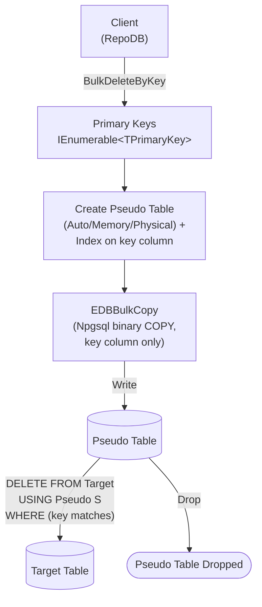

# BulkDeleteByKey

---

This method deletes rows from the database using a list of primary keys in bulk. It is supported for [EnterpriseDB](https://www.nuget.org/packages/RepoDb.EnterpriseDb.BulkOperations).

{: .note }
> Unlike [BulkDelete](/operation/enterprisedb/bulkdelete), this operation takes the target table name directly (`BulkDeleteByKey<TPrimaryKey>(connection, tableName, primaryKeys, ...)`) rather than an entity type parameter — there is no `BulkDeleteByKey<TEntity, TPrimaryKey>` overload.

## Call Flow Diagram

The diagram below shows the flow when calling this operation.



## Use Case

Use this method to delete rows by primary key against EnterpriseDB at high speed. It leverages `RepoDb.Connector.EnterpriseDb`'s `EDBBulkCopy`, itself built on top of Npgsql's native binary `COPY` protocol — a genuine bulk load, not a client-side loop of single-row statements.

A pseudo (staging) table, containing only the key column and indexed on it, is created for every call and dropped afterward — see [Operations (EnterpriseDB)](/operation/enterprisedb) for the underlying mechanics.

## Special Arguments

The `bulkCopyTimeout`, `batchSize` and `pseudoTableType` arguments are available for this operation.

`bulkCopyTimeout` overrides the command timeout, in seconds, applied to the underlying `EDBBulkCopy` write while staging.

`batchSize` overrides the number of rows written per batch. When not set, the provider's default batch size is used.

`pseudoTableType` (via [EDBBulkImportPseudoTableType](/enumeration/enterprisedb/edbbulkimportpseudotabletype)) controls the kind of staging table used — `Auto` (default) picks `Physical` once the row count reaches the internal threshold (`5000`), otherwise `Memory`.

## Usability

Pass the target table name and the list of primary keys to the operation.

```csharp
using (var connection = new EDBConnection(connectionString))
{
    var primaryKeys = connection.Query<Person>(p => p.IsActive == false).Select(p => p.Id);
    var deletedRows = connection.BulkDeleteByKey<long>("\"Person\"", primaryKeys);
}
```

{: .note }
> It returns the number of rows deleted from the underlying table.

To specify a batch size:

```csharp
using (var connection = new EDBConnection(connectionString))
{
    var primaryKeys = connection.Query<Person>(p => p.IsActive == false).Select(p => p.Id);
    var deletedRows = connection.BulkDeleteByKey<long>("\"Person\"", primaryKeys,
        batchSize: 100);
}
```

## Async Method

An equivalent [BulkDeleteByKeyAsync](/operation/enterprisedb/bulkdeletebykey) method is also available.

```csharp
using (var connection = new EDBConnection(connectionString))
{
    var primaryKeys = connection.Query<Person>(p => p.IsActive == false).Select(p => p.Id);
    var deletedRows = await connection.BulkDeleteByKeyAsync<long>("\"Person\"", primaryKeys);
}
```
