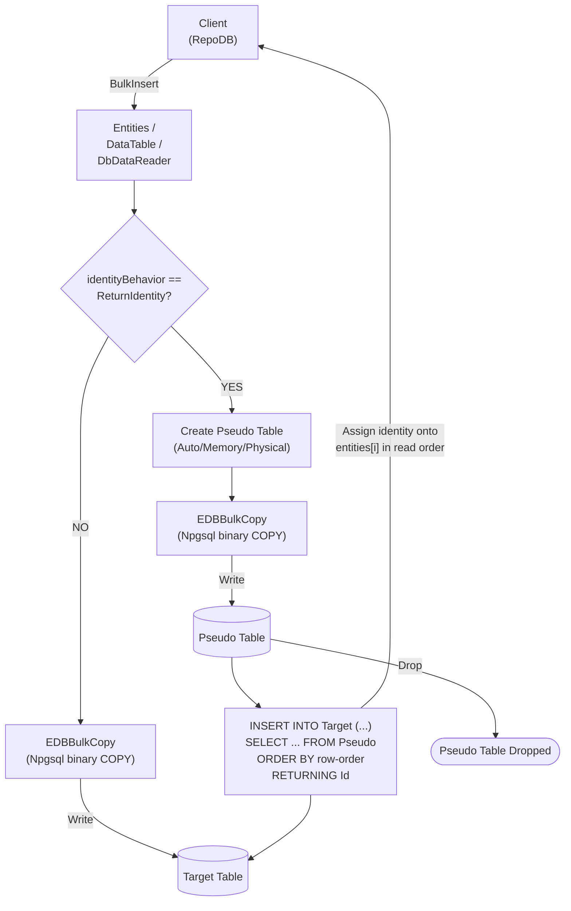

# BulkInsert

---

This method inserts all rows from the client application into the database in bulk. It is supported for [EnterpriseDB](https://www.nuget.org/packages/RepoDb.EnterpriseDb.BulkOperations).

{: .note }
> This page documents the EnterpriseDB-specific arguments and examples. For the SQL Server implementation, see [BulkInsert (SQL Server)](/operation/sqlserver/bulkinsert).

## Call Flow Diagram

The diagram below shows the flow when calling this operation.



## Use Case

Use this method to insert rows against EnterpriseDB at high speed. It leverages `RepoDb.Connector.EnterpriseDb`'s `EDBBulkCopy`, itself built on top of Npgsql's native binary `COPY` protocol — a genuine bulk load, not a client-side loop of single-row statements.

Rows are written straight into the target table. A pseudo (staging) table is only used when `identityBehavior` is set to `ReturnIdentity` (see below), so the generated identity values can be read back — see [Operations (EnterpriseDB)](/operation/enterprisedb) for the underlying mechanics.

## Special Arguments

The `mappings`, `bulkCopyTimeout`, `batchSize`, `identityBehavior` and `pseudoTableType` arguments are available for this operation.

`mappings` (via [EDBBulkInsertMapItem](/class/enterprisedb/edbbulkinsertmapitem)) defines explicit column mappings between the source properties and the destination columns, with an optional `EDBType` override per mapping. When omitted, columns are auto-mapped by name (case-insensitive). Mismatched source/destination CLR types throw an `InvalidTypeException` up front.

`bulkCopyTimeout` overrides the command timeout, in seconds, applied to the underlying `EDBBulkCopy` write.

`batchSize` overrides the number of rows written per batch. When not set, the provider's default batch size is used.

`identityBehavior` (via [EDBBulkImportIdentityBehavior](/enumeration/enterprisedb/edbbulkimportidentitybehavior)) controls whether newly generated identity values are set back on the data entities. Disabled (`KeepIdentity`) by default. Enabling this (`ReturnIdentity`) routes the operation through a pseudo table instead.

`pseudoTableType` (via [EDBBulkImportPseudoTableType](/enumeration/enterprisedb/edbbulkimportpseudotabletype)) controls the kind of staging table used when `identityBehavior` is `ReturnIdentity` — `Auto` (default) picks `Physical` once the row count reaches the internal threshold (`5000`), otherwise `Memory`; `Memory` backs the operation with a session-private temporary table; `Physical` backs it with an ordinary heap table shared across calls.

{: .note }
> The `DbDataReader` overload has no `identityBehavior` argument — a forward-only, single-pass reader cannot be rewound to correlate generated identity values back onto a source row. Its `pseudoTableType` argument is likewise unused, kept only for signature symmetry with the other bulk operations.

## Identity Setting Alignment

When `identityBehavior` is `ReturnIdentity`, the pseudo table gets an extra `__RepoDbBulkRowOrder__` identity column recording each row's original load position. After staging completes, the library runs:

```csharp
> INSERT INTO "OriginalTable" (Field1, Field2, ...)
> SELECT Field1, Field2, ... FROM "PseudoTable" ORDER BY "__RepoDbBulkRowOrder__"
> RETURNING "Id" AS "Result";
```

Results are then read back in that same row-order and assigned positionally onto the matching entity or `DataRow`.

## Usability

The following example defines a method that produces a list of `Person` objects, then bulk-inserts 10,000 rows into the `Person` table.

```csharp
private IEnumerable<Person> GetPeople(int count = 1000)
{
    for (var i = 0; i < count; i++)
    {
        yield return new Person
        {
            Name = $"Person-{i}",
            Age = 30,
            CreatedDateUtc = DateTime.UtcNow
        };
    }
}
```

```csharp
using (var connection = new EDBConnection(connectionString))
{
    var people = GetPeople(10000);
    var insertedRows = connection.BulkInsert(people);
}
```

To specify a batch size:

```csharp
using (var connection = new EDBConnection(connectionString))
{
    var people = GetPeople(10000);
    var insertedRows = connection.BulkInsert(people, batchSize: 100);
}
```

To return the newly generated identity values:

```csharp
using (var connection = new EDBConnection(connectionString))
{
    var people = GetPeople(10000); // Id not set
    var insertedRows = connection.BulkInsert(people,
        identityBehavior: EDBBulkImportIdentityBehavior.ReturnIdentity);
    // people[i].Id now holds the generated identity for each row
}
```

#### DataTable

```csharp
using (var connection = new EDBConnection(connectionString))
{
    var people = GetPeople(10000);
    var table = ConvertToDataTable(people);
    var insertedRows = connection.BulkInsert("\"Person\"", table);
}
```

#### Dictionary/ExpandoObject

```csharp
using (var sourceConnection = new EDBConnection(sourceConnectionString))
{
    var result = sourceConnection.QueryAll("\"Person\"");
    using (var destinationConnection = new EDBConnection(destinationConnectionString))
    {
        var insertedRows = destinationConnection.BulkInsert("\"Person\"", result);
    }
}
```

#### DataReader

```csharp
using (var sourceConnection = new EDBConnection(sourceConnectionString))
{
    using (var reader = sourceConnection.ExecuteReader("SELECT * FROM \"Person\""))
    {
        using (var destinationConnection = new EDBConnection(destinationConnectionString))
        {
            var insertedRows = destinationConnection.BulkInsert("\"Person\"", reader);
        }
    }
}
```

To bulk-insert via [DataEntityDataReader](/class/dataentitydatareader):

```csharp
using (var connection = new EDBConnection(connectionString))
{
    var people = GetPeople(10000);
    using (var reader = new DataEntityDataReader<Person>(people))
    {
        var insertedRows = connection.BulkInsert("\"Person\"", reader);
    }
}
```

## Column Mappings

Add column mappings using the `EDBBulkInsertMapItem` class.

```csharp
var mappings = new List<EDBBulkInsertMapItem>();

// Add the mappings
mappings.Add(new EDBBulkInsertMapItem("SourceId", "DestinationId"));
mappings.Add(new EDBBulkInsertMapItem("SourceName", "DestinationName"));
mappings.Add(new EDBBulkInsertMapItem("SourceAge", "DestinationAge"));
mappings.Add(new EDBBulkInsertMapItem("SourceCreatedDateUtc", "DestinationCreatedDateUtc"));

// Execute
using (var connection = new EDBConnection(connectionString))
{
    var people = GetPeople(10000);
    var insertedRows = connection.BulkInsert(people,
        mappings: mappings);
}
```

## Targeting a Table

To target a specific table, pass the literal table name.

```csharp
using (var connection = new EDBConnection(connectionString))
{
    var people = GetPeople(10000);
    var insertedRows = connection.BulkInsert("\"Person\"", people);
}
```

## Async Method

An equivalent [BulkInsertAsync](/operation/enterprisedb/bulkinsert) method is also available.

```csharp
using (var connection = new EDBConnection(connectionString))
{
    var people = GetPeople(10000);
    var insertedRows = await connection.BulkInsertAsync(people);
}
```
