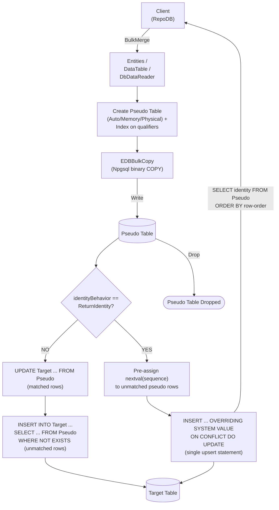

# BulkMerge

---

This method merges all rows from the client application into the database in bulk — inserting new rows and updating existing ones based on the defined qualifiers. It is supported for [EnterpriseDB](https://www.nuget.org/packages/RepoDb.EnterpriseDb.BulkOperations).

{: .note }
> This page documents the EnterpriseDB-specific arguments and examples. For the SQL Server implementation, see [BulkMerge (SQL Server)](/operation/sqlserver/bulkmerge).

## Call Flow Diagram

The diagram below shows the flow when calling this operation.



## Use Case

Use this method to merge rows against EnterpriseDB at high speed. It leverages `RepoDb.Connector.EnterpriseDb`'s `EDBBulkCopy`, itself built on top of Npgsql's native binary `COPY` protocol — a genuine bulk load, not a client-side loop of single-row statements.

A pseudo (staging) table, indexed on the qualifier columns, is created for every call and dropped afterward. The library writes to it via `EDBBulkCopy`, then cascades the changes to the target table — see [Operations (EnterpriseDB)](/operation/enterprisedb) for the underlying mechanics.

{: .note }
> Without `identityBehavior: ReturnIdentity`, the cascade is a plain `UPDATE ... FROM` followed by an `INSERT ... WHERE NOT EXISTS` — two statements, not a single ANSI `MERGE`. With `ReturnIdentity`, it becomes a single `ON CONFLICT (...) DO UPDATE` upsert instead.

## Special Arguments

The `qualifiers`, `mappings`, `bulkCopyTimeout`, `batchSize`, `identityBehavior` and `pseudoTableType` arguments are available for this operation.

`qualifiers` defines the fields used to match existing rows. Defaults to the primary or identity column if not specified.

`mappings` (via [EDBBulkInsertMapItem](/class/enterprisedb/edbbulkinsertmapitem)) defines explicit column mappings between the source properties and the destination columns, with an optional `EDBType` override per mapping. When omitted, columns are auto-mapped by name (case-insensitive).

`bulkCopyTimeout` overrides the command timeout, in seconds, applied to the underlying `EDBBulkCopy` write while staging.

`batchSize` overrides the number of rows written per batch. When not set, the provider's default batch size is used.

`identityBehavior` (via [EDBBulkImportIdentityBehavior](/enumeration/enterprisedb/edbbulkimportidentitybehavior)) controls whether newly generated identity values are set back on the data entities. Disabled (`KeepIdentity`) by default.

`pseudoTableType` (via [EDBBulkImportPseudoTableType](/enumeration/enterprisedb/edbbulkimportpseudotabletype)) controls the kind of staging table used — `Auto` (default) picks `Physical` once the row count reaches the internal threshold (`5000`), otherwise `Memory`.

{: .note }
> The `DbDataReader` overload has no `identityBehavior` argument, for the same reason as [BulkInsert](/operation/enterprisedb/bulkinsert)'s reader overload.

## Identity Setting Alignment

When `identityBehavior` is `ReturnIdentity`, resolving every pseudo row's final identity value takes two steps, run once staging completes:

1. **Pre-assign fresh identities to unmatched rows.** Every pseudo row with no existing match in the target table (by the qualifier columns) gets `nextval(pg_get_serial_sequence(...))` written into its identity column.
2. **Upsert.** A single `INSERT ... OVERRIDING SYSTEM VALUE ... ON CONFLICT (qualifiers) DO UPDATE` runs against the target table, inserting the pre-assigned identity for new rows and updating matched rows in place, `RETURNING` the identity column.

Every row's identity is then read back via that same statement, ordered by the pseudo table's row-order column, and assigned positionally onto the matching entity or `DataRow`.

## Usability

Given a list of `Person` models containing both existing and new rows, the following example bulk-merges them into the `Person` table.

```csharp
using (var connection = new EDBConnection(connectionString))
{
    var mergedRows = connection.BulkMerge(people);
}
```

Or with qualifiers:

```csharp
using (var connection = new EDBConnection(connectionString))
{
    var mergedRows = connection.BulkMerge(people, qualifiers: e => new { e.LastName, e.DateOfBirth });
}
```

To specify a batch size:

```csharp
using (var connection = new EDBConnection(connectionString))
{
    var mergedRows = connection.BulkMerge(people, batchSize: 100);
}
```

#### DataTable

```csharp
using (var connection = new EDBConnection(connectionString))
{
    var table = ConvertToDataTable(people);
    var mergedRows = connection.BulkMerge("\"Person\"", table);
}
```

#### Dictionary/ExpandoObject

```csharp
using (var sourceConnection = new EDBConnection(sourceConnectionString))
{
    var result = sourceConnection.QueryAll("\"Person\"");
    using (var destinationConnection = new EDBConnection(destinationConnectionString))
    {
        var mergedRows = destinationConnection.BulkMerge("\"Person\"", result,
            qualifiers: Field.From("Name"));
    }
}
```

#### DataReader

```csharp
using (var sourceConnection = new EDBConnection(sourceConnectionString))
{
    using (var reader = sourceConnection.ExecuteReader("SELECT * FROM \"Person\" WHERE \"Age\" > 18"))
    {
        using (var destinationConnection = new EDBConnection(destinationConnectionString))
        {
            var mergedRows = destinationConnection.BulkMerge("\"Person\"", reader);
        }
    }
}
```

To bulk-merge via [DataEntityDataReader](/class/dataentitydatareader):

```csharp
using (var connection = new EDBConnection(connectionString))
{
    var people = GetPeople(10000);
    using (var reader = new DataEntityDataReader<Person>(people))
    {
        var mergedRows = connection.BulkMerge("\"Person\"", reader);
    }
}
```

## Field Qualifiers

By default, the primary or identity column is used as the qualifier. To override, pass a list of [Field](/class/field) objects in the `qualifiers` argument.

```csharp
using (var connection = new EDBConnection(connectionString))
{
    var people = GetPeople(10000);
    var mergedRows = connection.BulkMerge<Person>(people,
        qualifiers: e => new { e.Name });
}
```

{: .important }
> Use indexed columns from the target table as qualifiers to maximize performance.

## Column Mappings

Add column mappings using the `EDBBulkInsertMapItem` class.

```csharp
var mappings = new List<EDBBulkInsertMapItem>();

// Add the mappings
mappings.Add(new EDBBulkInsertMapItem("SourceId", "DestinationId"));
mappings.Add(new EDBBulkInsertMapItem("SourceName", "DestinationName"));
mappings.Add(new EDBBulkInsertMapItem("SourceAge", "DestinationAge"));
mappings.Add(new EDBBulkInsertMapItem("SourceCreatedDateUtc", "DestinationCreatedDateUtc"));

// Execute
using (var connection = new EDBConnection(connectionString))
{
    var people = GetPeople(10000);
    var mergedRows = connection.BulkMerge(people,
        mappings: mappings);
}
```

## Targeting a Table

To target a specific table, pass the literal table name.

```csharp
using (var connection = new EDBConnection(connectionString))
{
    var people = GetPeople(10000);
    var mergedRows = connection.BulkMerge("\"Person\"", people);
}
```

## Async Method

An equivalent [BulkMergeAsync](/operation/enterprisedb/bulkmerge) method is also available.

```csharp
using (var connection = new EDBConnection(connectionString))
{
    var mergedRows = await connection.BulkMergeAsync(people);
}
```
