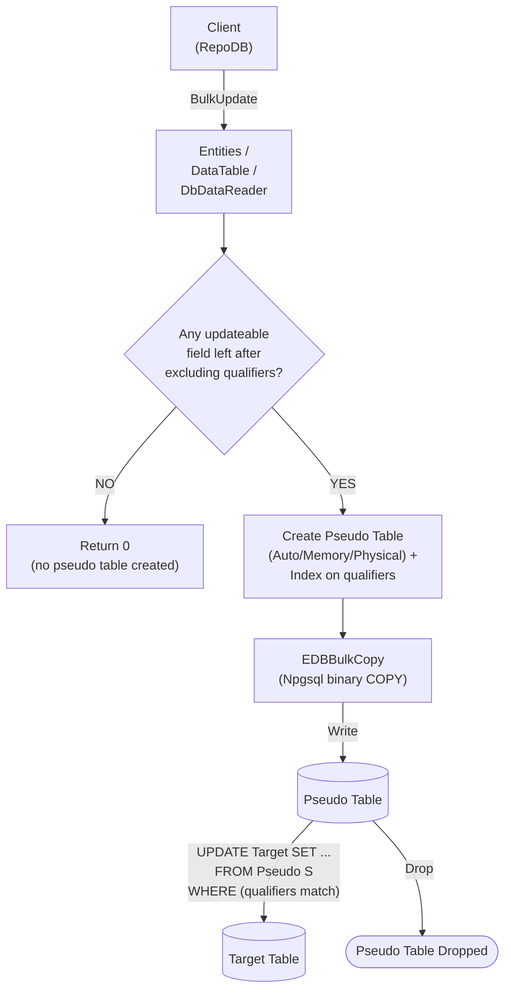

# BulkUpdate

---

This method updates existing rows in the database in bulk, matched by the defined qualifiers. It is supported for [EnterpriseDB](https://www.nuget.org/packages/RepoDb.EnterpriseDb.BulkOperations).

{: .note }
> This page documents the EnterpriseDB-specific arguments and examples. For the SQL Server implementation, see [BulkUpdate (SQL Server)](/operation/sqlserver/bulkupdate).

## Call Flow Diagram

The diagram below shows the flow when calling this operation.



## Use Case

Use this method to update rows against EnterpriseDB at high speed. It leverages `RepoDb.Connector.EnterpriseDb`'s `EDBBulkCopy`, itself built on top of Npgsql's native binary `COPY` protocol — a genuine bulk load, not a client-side loop of single-row statements.

A pseudo (staging) table, indexed on the qualifier columns, is created for every call and dropped afterward. The library writes to it via `EDBBulkCopy`, then cascades the changes to the target table via an `UPDATE ... FROM` join — see [Operations (EnterpriseDB)](/operation/enterprisedb) for the underlying mechanics.

{: .note }
> Unlike [BulkMerge](/operation/enterprisedb/bulkmerge), staged rows with no matching target row are left as-is, not inserted.

## Special Arguments

The `qualifiers`, `mappings`, `bulkCopyTimeout`, `batchSize` and `pseudoTableType` arguments are available for this operation.

`qualifiers` defines the fields used to match existing rows, corresponding to the `WHERE` clause. Defaults to the primary or identity column if not specified.

`mappings` (via [EDBBulkInsertMapItem](/class/enterprisedb/edbbulkinsertmapitem)) defines explicit column mappings between the source properties and the destination columns, with an optional `EDBType` override per mapping. When omitted, columns are auto-mapped by name (case-insensitive).

`bulkCopyTimeout` overrides the command timeout, in seconds, applied to the underlying `EDBBulkCopy` write while staging.

`batchSize` overrides the number of rows written per batch. When not set, the provider's default batch size is used.

`pseudoTableType` (via [EDBBulkImportPseudoTableType](/enumeration/enterprisedb/edbbulkimportpseudotabletype)) controls the kind of staging table used — `Auto` (default) picks `Physical` once the row count reaches the internal threshold (`5000`), otherwise `Memory`.

{: .note }
> If every staged field is also a qualifier (nothing left to actually update), the operation returns `0` immediately — no pseudo table is created at all.

## Usability

Given a list of `Person` models, the following example bulk-updates rows in the `Person` table.

```csharp
using (var connection = new EDBConnection(connectionString))
{
    var updatedRows = connection.BulkUpdate(people);
}
```

Or with qualifiers:

```csharp
using (var connection = new EDBConnection(connectionString))
{
    var updatedRows = connection.BulkUpdate(people, qualifiers: e => new { e.LastName, e.DateOfBirth });
}
```

To specify a batch size:

```csharp
using (var connection = new EDBConnection(connectionString))
{
    var updatedRows = connection.BulkUpdate(people, batchSize: 100);
}
```

#### DataTable

```csharp
using (var connection = new EDBConnection(connectionString))
{
    var table = ConvertToDataTable(people);
    var updatedRows = connection.BulkUpdate("\"Person\"", table);
}
```

#### Dictionary/ExpandoObject

```csharp
using (var sourceConnection = new EDBConnection(sourceConnectionString))
{
    var result = sourceConnection.QueryAll("\"Person\"");
    using (var destinationConnection = new EDBConnection(destinationConnectionString))
    {
        var updatedRows = destinationConnection.BulkUpdate("\"Person\"", result,
            qualifiers: Field.From("Name"));
    }
}
```

#### DataReader

```csharp
using (var sourceConnection = new EDBConnection(sourceConnectionString))
{
    using (var reader = sourceConnection.ExecuteReader("SELECT * FROM \"Person\" WHERE \"Age\" > 18"))
    {
        using (var destinationConnection = new EDBConnection(destinationConnectionString))
        {
            var updatedRows = destinationConnection.BulkUpdate("\"Person\"", reader);
        }
    }
}
```

To bulk-update via [DataEntityDataReader](/class/dataentitydatareader):

```csharp
using (var connection = new EDBConnection(connectionString))
{
    var people = GetPeople(10000);
    using (var reader = new DataEntityDataReader<Person>(people))
    {
        var updatedRows = connection.BulkUpdate("\"Person\"", reader);
    }
}
```

## Field Qualifiers

By default, the primary or identity column is used as the qualifier. To override, pass a list of [Field](/class/field) objects in the `qualifiers` argument.

```csharp
using (var connection = new EDBConnection(connectionString))
{
    var people = GetPeople(10000);
    var updatedRows = connection.BulkUpdate<Person>(people,
        qualifiers: e => new { e.Name });
}
```

{: .important }
> Use indexed columns from the target table as qualifiers to maximize performance.

## Column Mappings

Add column mappings using the `EDBBulkInsertMapItem` class.

```csharp
var mappings = new List<EDBBulkInsertMapItem>();

// Add the mappings
mappings.Add(new EDBBulkInsertMapItem("SourceId", "DestinationId"));
mappings.Add(new EDBBulkInsertMapItem("SourceName", "DestinationName"));
mappings.Add(new EDBBulkInsertMapItem("SourceAge", "DestinationAge"));
mappings.Add(new EDBBulkInsertMapItem("SourceCreatedDateUtc", "DestinationCreatedDateUtc"));

// Execute
using (var connection = new EDBConnection(connectionString))
{
    var people = GetPeople(10000);
    var updatedRows = connection.BulkUpdate(people,
        mappings: mappings);
}
```

## Targeting a Table

To target a specific table, pass the literal table name.

```csharp
using (var connection = new EDBConnection(connectionString))
{
    var people = GetPeople(10000);
    var updatedRows = connection.BulkUpdate("\"Person\"", people);
}
```

## Async Method

An equivalent [BulkUpdateAsync](/operation/enterprisedb/bulkupdate) method is also available.

```csharp
using (var connection = new EDBConnection(connectionString))
{
    var updatedRows = await connection.BulkUpdateAsync(people);
}
```
