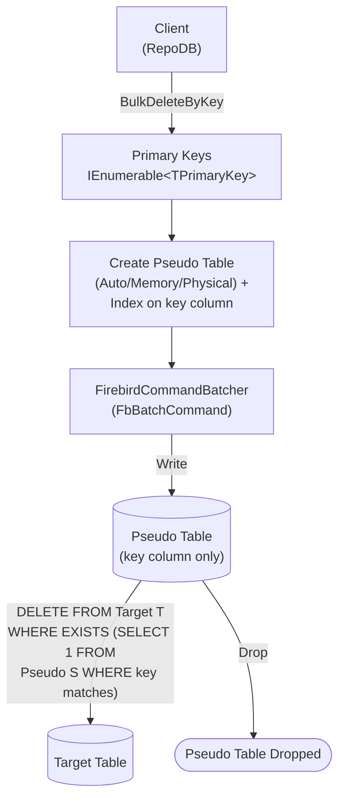

# BulkDeleteByKey

---

This method deletes rows from the database using a list of primary keys in bulk. It is supported for [Firebird](https://www.nuget.org/packages/RepoDb.Firebird.BulkOperations).

## Call Flow Diagram

The diagram below shows the flow when calling this operation.



## Use Case

Use this method to delete rows by primary key at high speed. It leverages `FbBatchCommand`, the FirebirdSql.Data.FirebirdClient driver's native ADO.NET batching API, via [FirebirdCommandBatcher](/class/firebird/firebirdcommandbatcher).

## Special Arguments

The `bulkCopyTimeout`, `batchSize` and `pseudoTableType` arguments are available for this operation.

`bulkCopyTimeout` overrides the command timeout, in seconds. `FbBatchCommand` has no timeout-equivalent property, so this argument currently has nothing to apply to.

`batchSize` overrides the number of rows sent to the server per batch. When not set, all items are sent at once.

`pseudoTableType` (via [FirebirdBulkImportPseudoTableType](/enumeration/firebird/firebirdbulkimportpseudotabletype)) controls the kind of staging table used internally.

## Caveats

This operation creates a pseudo (staging) table for every call — a per-call, uniquely-named `TABLE` or `GLOBAL TEMPORARY TABLE`, per `pseudoTableType`. The database user must have permission to create tables, or an `FbException` will be thrown.

{: .note }
> Every step (creating the pseudo table and its index, writing to it, the cascading `DELETE`, and dropping the pseudo table) is executed against the same `transaction` argument when one is supplied — since Firebird's DDL is itself transactional, passing an explicit `FbTransaction` makes the whole pipeline atomic (a rollback undoes the pseudo table creation too). Without one, each step runs under its own implicit transaction, so a failure partway through can leave an orphaned pseudo table behind.

## Usability

Pass the target table name and the list of primary keys to the operation.

```csharp
using (var connection = new FbConnection(connectionString))
{
    var primaryKeys = connection.Query<Person>(p => p.IsActive == false).Select(p => p.Id);
    var deletedRows = connection.BulkDeleteByKey<Person, long>(primaryKeys);
}
```

{: .note }
> It returns the number of rows deleted from the underlying table.

To specify a batch size:

```csharp
using (var connection = new FbConnection(connectionString))
{
    var primaryKeys = connection.Query<Person>(p => p.IsActive == false).Select(p => p.Id);
    var deletedRows = connection.BulkDeleteByKey<Person, long>(primaryKeys,
        batchSize: 100);
}
```

## Async Method

An equivalent [BulkDeleteByKeyAsync](/operation/firebird/bulkdeletebykey) method is also available.

```csharp
using (var connection = new FbConnection(connectionString))
{
    var primaryKeys = connection.Query<Person>(p => p.IsActive == false).Select(p => p.Id);
    var deletedRows = await connection.BulkDeleteByKeyAsync<Person, long>(primaryKeys);
}
```
