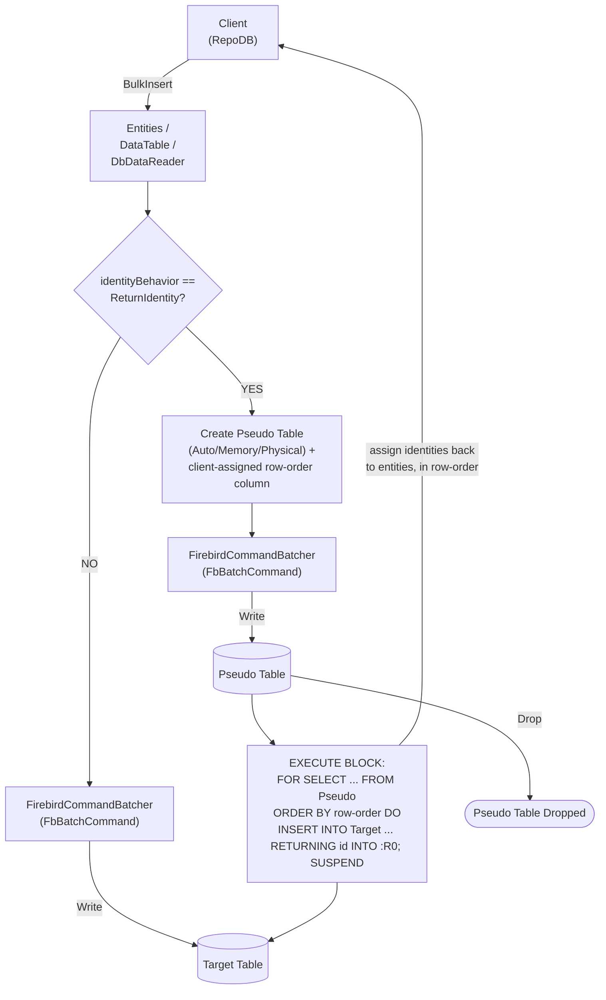

# BulkInsert

---

This method inserts all rows from the client application into the database in bulk. It is supported for [Firebird](https://www.nuget.org/packages/RepoDb.Firebird.BulkOperations).

{: .note }
> This page documents the Firebird-specific arguments and examples. For the SQL Server implementation, see [BulkInsert (SQL Server)](/operation/sqlserver/bulkinsert).

## Call Flow Diagram

The diagram below shows the flow when calling this operation.



## Use Case

Use this method to insert rows at high speed. It leverages `FbBatchCommand`, the FirebirdSql.Data.FirebirdClient driver's native ADO.NET batching API, via [FirebirdCommandBatcher](/class/firebird/firebirdcommandbatcher).

For inserting 1,000 or more rows, prefer this method over [InsertAll](/operation/insertall) — Firebird's `IsMultiStatementExecutable` setting is `false`, so [InsertAll](/operation/insertall) issues one round trip per row, while this method batches many rows per round trip.

Rows are written straight to the target table. A pseudo (staging) table is only used when `identityBehavior` is set to `ReturnIdentity` (see below) — see [Operations (Firebird)](/operation/firebird) for the underlying mechanics.

## Special Arguments

The `mappings`, `bulkCopyTimeout`, `batchSize`, `identityBehavior` and `pseudoTableType` arguments are available for this operation.

`mappings` (via `FirebirdCommandBatcherMapItem`) defines explicit column mappings between the source properties and the destination columns, with an optional `FbDbType` override per mapping. When omitted, columns are auto-mapped by name (case-insensitive).

`bulkCopyTimeout` overrides the command timeout, in seconds. `FbBatchCommand` has no timeout-equivalent property, so this argument currently has nothing to apply to.

`batchSize` overrides the number of rows sent to the server per batch. When not set, all items are sent at once.

`identityBehavior` (via [FirebirdBulkImportIdentityBehavior](/enumeration/firebird/firebirdbulkimportidentitybehavior)) controls whether newly generated identity values are set back on the data entities. Disabled (`KeepIdentity`) by default. Enabling this (`ReturnIdentity`) routes the operation through a pseudo table instead, reading the generated identity values back via an `EXECUTE BLOCK` loop of `INSERT ... RETURNING`.

`pseudoTableType` (via [FirebirdBulkImportPseudoTableType](/enumeration/firebird/firebirdbulkimportpseudotabletype)) controls the kind of staging table used when `identityBehavior` is `ReturnIdentity`.

{: .note }
> The `DbDataReader` overload has no `identityBehavior` argument — a forward-only, single-pass reader cannot be rewound to correlate generated identity values back onto a source row, so `ReturnIdentity` is not supported for that overload.

## Identity Setting Alignment

When `identityBehavior` is `ReturnIdentity`, the library assigns a client-side, zero-based row-order value onto a copy of the source rows before staging them, rather than relying on a server-generated ordering column. The staged rows are then fed into the real `INSERT` via an `EXECUTE BLOCK` cursor loop ordered by that row-order column, and the generated identity from each `RETURNING ... INTO :R0` is assigned back to the correspondingly-positioned entity as the loop's result set is read.

{: .note }
> Because the row order is explicitly assigned client-side rather than inferred by sorting the generated identity values themselves, this correlation does not depend on an unverified ordering assumption the way some other providers' `FINAL TABLE`-based approaches do.

## Usability

The following example defines a method that produces a list of `Person` objects, then bulk-inserts 10,000 rows into the `Person` table.

```csharp
private IEnumerable<Person> GetPeople(int count = 1000)
{
    for (var i = 0; i < count; i++)
    {
        yield return new Person
        {
            Name = $"Person-{i}",
            Age = 30,
            CreatedDateUtc = DateTime.UtcNow
        };
    }
}
```

```csharp
using (var connection = new FbConnection(connectionString))
{
    var people = GetPeople(10000);
    var insertedRows = connection.BulkInsert(people);
}
```

To specify a batch size:

```csharp
using (var connection = new FbConnection(connectionString))
{
    var people = GetPeople(10000);
    var insertedRows = connection.BulkInsert(people, batchSize: 100);
}
```

{: .note }
> When `batchSize` is not set, all rows are sent to the server in a single batch.

To return the newly generated identity values:

```csharp
using (var connection = new FbConnection(connectionString))
{
    var people = GetPeople(10000);
    var insertedRows = connection.BulkInsert(people,
        identityBehavior: FirebirdBulkImportIdentityBehavior.ReturnIdentity);
}
```

#### DataTable

```csharp
using (var connection = new FbConnection(connectionString))
{
    var people = GetPeople(10000);
    var table = ConvertToDataTable(people);
    var insertedRows = connection.BulkInsert("\"Person\"", table);
}
```

#### Dictionary/ExpandoObject

```csharp
using (var sourceConnection = new FbConnection(sourceConnectionString))
{
    var result = sourceConnection.QueryAll("\"Person\"");
    using (var destinationConnection = new FbConnection(destinationConnectionString))
    {
        var insertedRows = destinationConnection.BulkInsert("\"Person\"", result);
    }
}
```

#### DataReader

```csharp
using (var sourceConnection = new FbConnection(sourceConnectionString))
{
    using (var reader = sourceConnection.ExecuteReader("SELECT * FROM \"Person\""))
    {
        using (var destinationConnection = new FbConnection(destinationConnectionString))
        {
            var rows = destinationConnection.BulkInsert("\"Person\"", reader);
        }
    }
}
```

To bulk-insert via [DataEntityDataReader](/class/dataentitydatareader):

```csharp
using (var connection = new FbConnection(connectionString))
{
    var people = GetPeople(10000);
    using (var reader = new DataEntityDataReader<Person>(people))
    {
        var insertedRows = connection.BulkInsert("\"Person\"", reader);
    }
}
```

## Column Mappings

Add column mappings using the `FirebirdCommandBatcherMapItem` class.

```csharp
var mappings = new List<FirebirdCommandBatcherMapItem>();

// Add the mappings
mappings.Add(new FirebirdCommandBatcherMapItem("SourceId", "DestinationId"));
mappings.Add(new FirebirdCommandBatcherMapItem("SourceName", "DestinationName"));
mappings.Add(new FirebirdCommandBatcherMapItem("SourceAge", "DestinationAge"));
mappings.Add(new FirebirdCommandBatcherMapItem("SourceCreatedDateUtc", "DestinationCreatedDateUtc"));

// Execute
using (var connection = new FbConnection(connectionString))
{
    var people = GetPeople(10000);
    var insertedRows = connection.BulkInsert(people,
        mappings: mappings);
}
```

## Targeting a Table

To target a specific table, pass the literal table name.

```csharp
using (var connection = new FbConnection(connectionString))
{
    var people = GetPeople(10000);
    var insertedRows = connection.BulkInsert("\"Person\"", people);
}
```

## Async Method

An equivalent [BulkInsertAsync](/operation/firebird/bulkinsert) method is also available.

```csharp
using (var connection = new FbConnection(connectionString))
{
    var people = GetPeople(10000);
    var insertedRows = await connection.BulkInsertAsync(people);
}
```
