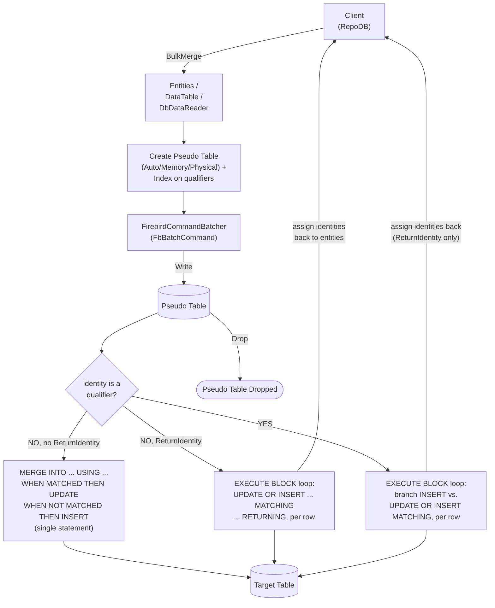

# BulkMerge

---

This method merges all rows from the client application into the database in bulk — inserting new rows and updating existing ones based on the defined qualifiers. It is supported for [Firebird](https://www.nuget.org/packages/RepoDb.Firebird.BulkOperations).

{: .note }
> This page documents the Firebird-specific arguments and examples. For the SQL Server implementation, see [BulkMerge (SQL Server)](/operation/sqlserver/bulkmerge).

## Call Flow Diagram

The diagram below shows the flow when calling this operation. The exact statement shape depends on whether the identity column is itself a qualifier and whether `identityBehavior` is `ReturnIdentity` — see [Operation SQL Statements](#operation-sql-statements) below.



## Use Case

Use this method to merge rows at high speed. It leverages `FbBatchCommand`, the FirebirdSql.Data.FirebirdClient driver's native ADO.NET batching API, via [FirebirdCommandBatcher](/class/firebird/firebirdcommandbatcher).

For merging 1,000 or more rows, prefer this method over [MergeAll](/operation/mergeall) — Firebird's `IsMultiStatementExecutable` setting is `false`, so [MergeAll](/operation/mergeall) issues one round trip per row.

A pseudo (staging) table, indexed on the qualifier columns, is created for every call. The library writes to it via [FirebirdCommandBatcher](/class/firebird/firebirdcommandbatcher) internally, then cascades the changes to the target table — see [Operations (Firebird)](/operation/firebird) for the underlying mechanics.

## Special Arguments

The `qualifiers`, `mappings`, `bulkCopyTimeout`, `batchSize`, `identityBehavior` and `pseudoTableType` arguments are available for this operation.

`qualifiers` defines the fields used to match existing rows, corresponding to the `MATCHING`/`ON` clause. Defaults to the primary or identity column if not specified.

`mappings` (via `FirebirdCommandBatcherMapItem`) defines explicit column mappings between the source properties and the destination columns, with an optional `FbDbType` override per mapping. When omitted, columns are auto-mapped by name (case-insensitive).

`bulkCopyTimeout` overrides the command timeout, in seconds. `FbBatchCommand` has no timeout-equivalent property, so this argument currently has nothing to apply to.

`batchSize` overrides the number of rows sent to the server per batch. When not set, all items are sent at once.

`identityBehavior` (via [FirebirdBulkImportIdentityBehavior](/enumeration/firebird/firebirdbulkimportidentitybehavior)) controls whether newly generated identity values are set back on the data entities. Disabled (`KeepIdentity`) by default.

`pseudoTableType` (via [FirebirdBulkImportPseudoTableType](/enumeration/firebird/firebirdbulkimportpseudotabletype)) controls the kind of staging table used internally.

{: .note }
> The `DbDataReader` overload has no `identityBehavior` argument, for the same reason as [BulkInsert](/operation/firebird/bulkinsert)'s reader overload.

## Operation SQL Statements

The exact statement(s) generated depend on whether the identity column (if any) is itself a merge qualifier — a plain `MATCHING`/`ON` clause can't tell "match this literal `0`/`null`" apart from "auto-generate me":

- **Identity is not a qualifier, no `ReturnIdentity`:** a single ANSI `MERGE INTO ... USING ... WHEN MATCHED THEN UPDATE ... WHEN NOT MATCHED THEN INSERT ...` statement — one round trip for the whole pseudo table.
- **Identity is not a qualifier, with `ReturnIdentity`:** an `EXECUTE BLOCK` loop of plain `UPDATE OR INSERT ... MATCHING ... RETURNING` calls, one per pseudo-table row, ordered by a client-assigned row-order column.
- **Identity is a qualifier (with or without `ReturnIdentity`):** an `EXECUTE BLOCK` loop that branches per row between a plain `INSERT` (identity `null`/`0` — auto-generate) and `UPDATE OR INSERT ... MATCHING` (a real identity value — match-or-insert-with-that-id).

{: .note }
> Firebird's engine reports no records-affected count for an `EXECUTE BLOCK` or a native `MERGE` statement (`ExecuteNonQuery` always answers `-1` for either), so the pseudo table's own row count — every staged row is guaranteed to be either inserted or updated — is used as the affected-row count instead.

{: .note }
> The identity column, if any, is always left out of the `INSERT`/insertable-columns list — a brand-new row's identity property is typically an unset default (e.g. `0`), not a real value meant to be inserted as-is.

## Usability

Given a list of `Person` models containing both existing and new rows, the following example bulk-merges them into the `Person` table.

```csharp
using (var connection = new FbConnection(connectionString))
{
    var mergedRows = connection.BulkMerge(people);
}
```

To specify a batch size:

```csharp
using (var connection = new FbConnection(connectionString))
{
    var mergedRows = connection.BulkMerge(people, batchSize: 100);
}
```

{: .note }
> When `batchSize` is not set, all rows are sent to the server in a single batch.

#### DataTable

```csharp
using (var connection = new FbConnection(connectionString))
{
    var table = ConvertToDataTable(people);
    var mergedRows = connection.BulkMerge("\"Person\"", table);
}
```

#### Dictionary/ExpandoObject

```csharp
using (var sourceConnection = new FbConnection(sourceConnectionString))
{
    var result = sourceConnection.QueryAll("\"Person\"");
    using (var destinationConnection = new FbConnection(destinationConnectionString))
    {
        var mergedRows = destinationConnection.BulkMerge("\"Person\"", result,
            qualifiers: Field.From("Name"));
    }
}
```

#### DataReader

```csharp
using (var sourceConnection = new FbConnection(sourceConnectionString))
{
    using (var reader = sourceConnection.ExecuteReader("SELECT * FROM \"Person\" WHERE \"Age\" > 18"))
    {
        using (var destinationConnection = new FbConnection(destinationConnectionString))
        {
            var rows = destinationConnection.BulkMerge("\"Person\"", reader);
        }
    }
}
```

To bulk-merge via [DataEntityDataReader](/class/dataentitydatareader):

```csharp
using (var connection = new FbConnection(connectionString))
{
    var people = GetPeople(10000);
    using (var reader = new DataEntityDataReader<Person>(people))
    {
        var mergedRows = connection.BulkMerge("\"Person\"", reader);
    }
}
```

## Field Qualifiers

By default, the primary or identity column is used as the qualifier. To override, pass a list of [Field](/class/field) objects in the `qualifiers` argument.

```csharp
using (var connection = new FbConnection(connectionString))
{
    var people = GetPeople(10000);
    var mergedRows = connection.BulkMerge<Person>(people,
        qualifiers: e => new { e.Name });
}
```

{: .important }
> Use indexed columns from the target table as qualifiers to maximize performance.

## Column Mappings

Add column mappings using the `FirebirdCommandBatcherMapItem` class.

```csharp
var mappings = new List<FirebirdCommandBatcherMapItem>();

// Add the mappings
mappings.Add(new FirebirdCommandBatcherMapItem("SourceId", "DestinationId"));
mappings.Add(new FirebirdCommandBatcherMapItem("SourceName", "DestinationName"));
mappings.Add(new FirebirdCommandBatcherMapItem("SourceAge", "DestinationAge"));
mappings.Add(new FirebirdCommandBatcherMapItem("SourceCreatedDateUtc", "DestinationCreatedDateUtc"));

// Execute
using (var connection = new FbConnection(connectionString))
{
    var people = GetPeople(10000);
    var mergedRows = connection.BulkMerge(people,
        mappings: mappings);
}
```

## Targeting a Table

To target a specific table, pass the literal table name.

```csharp
using (var connection = new FbConnection(connectionString))
{
    var people = GetPeople(10000);
    var mergedRows = connection.BulkMerge("\"Person\"", people);
}
```

## Async Method

An equivalent [BulkMergeAsync](/operation/firebird/bulkmerge) method is also available.

```csharp
using (var connection = new FbConnection(connectionString))
{
    var mergedRows = await connection.BulkMergeAsync(people);
}
```
