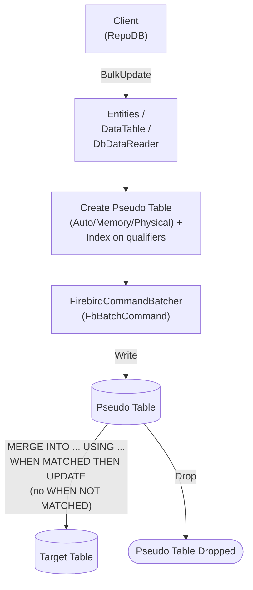

# BulkUpdate

---

This method updates existing rows in the database in bulk, matched by the defined qualifiers. It is supported for [Firebird](https://www.nuget.org/packages/RepoDb.Firebird.BulkOperations).

{: .note }
> This page documents the Firebird-specific arguments and examples. For the SQL Server implementation, see [BulkUpdate (SQL Server)](/operation/sqlserver/bulkupdate).

## Call Flow Diagram

The diagram below shows the flow when calling this operation.



## Use Case

Use this method to update rows at high speed. It leverages `FbBatchCommand`, the FirebirdSql.Data.FirebirdClient driver's native ADO.NET batching API, via [FirebirdCommandBatcher](/class/firebird/firebirdcommandbatcher).

For updating 1,000 or more rows, prefer this method over [UpdateAll](/operation/updateall) — Firebird's `IsMultiStatementExecutable` setting is `false`, so [UpdateAll](/operation/updateall) issues one round trip per row.

A pseudo (staging) table, indexed on the qualifier columns, is created for every call. The library writes to it via [FirebirdCommandBatcher](/class/firebird/firebirdcommandbatcher) internally, then cascades the changes to the target table via a `MERGE ... WHEN MATCHED THEN UPDATE` statement with no `WHEN NOT MATCHED` branch — staged rows with no matching target row are left as-is, not inserted. See [Operations (Firebird)](/operation/firebird) for the underlying mechanics.

## Special Arguments

The `qualifiers`, `mappings`, `bulkCopyTimeout`, `batchSize` and `pseudoTableType` arguments are available for this operation.

`qualifiers` defines the fields used to match existing rows, corresponding to the `ON` clause. Defaults to the primary or identity column if not specified.

`mappings` (via `FirebirdCommandBatcherMapItem`) defines explicit column mappings between the source properties and the destination columns, with an optional `FbDbType` override per mapping. When omitted, columns are auto-mapped by name (case-insensitive).

`bulkCopyTimeout` overrides the command timeout, in seconds. `FbBatchCommand` has no timeout-equivalent property, so this argument currently has nothing to apply to.

`batchSize` overrides the number of rows sent to the server per batch. When not set, all items are sent at once.

`pseudoTableType` (via [FirebirdBulkImportPseudoTableType](/enumeration/firebird/firebirdbulkimportpseudotabletype)) controls the kind of staging table used internally.

{: .note }
> If every staged field is also a qualifier (nothing left to actually update), the operation returns `0` immediately without creating a pseudo table at all.

## Caveats

This operation creates a pseudo (staging) table for every call — a per-call, uniquely-named `TABLE` or `GLOBAL TEMPORARY TABLE`, per `pseudoTableType`. The database user must have permission to create tables, or an `FbException` will be thrown.

{: .note }
> Every step (creating the pseudo table and its index, writing to it, the cascading `MERGE`, and dropping the pseudo table) is executed against the same `transaction` argument when one is supplied — since Firebird's DDL is itself transactional, passing an explicit `FbTransaction` makes the whole pipeline atomic (a rollback undoes the pseudo table creation too). Without one, each step runs under its own implicit transaction, so a failure partway through can leave an orphaned pseudo table behind.

## Usability

Given a list of `Person` models, the following example bulk-updates rows in the `Person` table.

```csharp
using (var connection = new FbConnection(connectionString))
{
    var updatedRows = connection.BulkUpdate(people);
}
```

To specify a batch size:

```csharp
using (var connection = new FbConnection(connectionString))
{
    var updatedRows = connection.BulkUpdate(people, batchSize: 100);
}
```

{: .note }
> When `batchSize` is not set, all rows are sent to the server in a single batch.

#### DataTable

```csharp
using (var connection = new FbConnection(connectionString))
{
    var table = ConvertToDataTable(people);
    var updatedRows = connection.BulkUpdate("\"Person\"", table);
}
```

#### Dictionary/ExpandoObject

```csharp
using (var sourceConnection = new FbConnection(sourceConnectionString))
{
    var result = sourceConnection.QueryAll("\"Person\"");
    using (var destinationConnection = new FbConnection(destinationConnectionString))
    {
        var updatedRows = destinationConnection.BulkUpdate("\"Person\"", result,
            qualifiers: Field.From("Name"));
    }
}
```

#### DataReader

```csharp
using (var sourceConnection = new FbConnection(sourceConnectionString))
{
    using (var reader = sourceConnection.ExecuteReader("SELECT * FROM \"Person\" WHERE \"Age\" > 18"))
    {
        using (var destinationConnection = new FbConnection(destinationConnectionString))
        {
            var rows = destinationConnection.BulkUpdate("\"Person\"", reader);
        }
    }
}
```

To bulk-update via [DataEntityDataReader](/class/dataentitydatareader):

```csharp
using (var connection = new FbConnection(connectionString))
{
    var people = GetPeople(10000);
    using (var reader = new DataEntityDataReader<Person>(people))
    {
        var updatedRows = connection.BulkUpdate("\"Person\"", reader);
    }
}
```

## Field Qualifiers

By default, the primary or identity column is used as the qualifier. To override, pass a list of [Field](/class/field) objects in the `qualifiers` argument.

```csharp
using (var connection = new FbConnection(connectionString))
{
    var people = GetPeople(10000);
    var updatedRows = connection.BulkUpdate<Person>(people,
        qualifiers: e => new { e.Name });
}
```

{: .important }
> Use indexed columns from the target table as qualifiers to maximize performance.

## Column Mappings

Add column mappings using the `FirebirdCommandBatcherMapItem` class.

```csharp
var mappings = new List<FirebirdCommandBatcherMapItem>();

// Add the mappings
mappings.Add(new FirebirdCommandBatcherMapItem("SourceId", "DestinationId"));
mappings.Add(new FirebirdCommandBatcherMapItem("SourceName", "DestinationName"));
mappings.Add(new FirebirdCommandBatcherMapItem("SourceAge", "DestinationAge"));
mappings.Add(new FirebirdCommandBatcherMapItem("SourceCreatedDateUtc", "DestinationCreatedDateUtc"));

// Execute
using (var connection = new FbConnection(connectionString))
{
    var people = GetPeople(10000);
    var updatedRows = connection.BulkUpdate(people,
        mappings: mappings);
}
```

## Targeting a Table

To target a specific table, pass the literal table name.

```csharp
using (var connection = new FbConnection(connectionString))
{
    var people = GetPeople(10000);
    var updatedRows = connection.BulkUpdate("\"Person\"", people);
}
```

## Async Method

An equivalent [BulkUpdateAsync](/operation/firebird/bulkupdate) method is also available.

```csharp
using (var connection = new FbConnection(connectionString))
{
    var updatedRows = await connection.BulkUpdateAsync(people);
}
```
