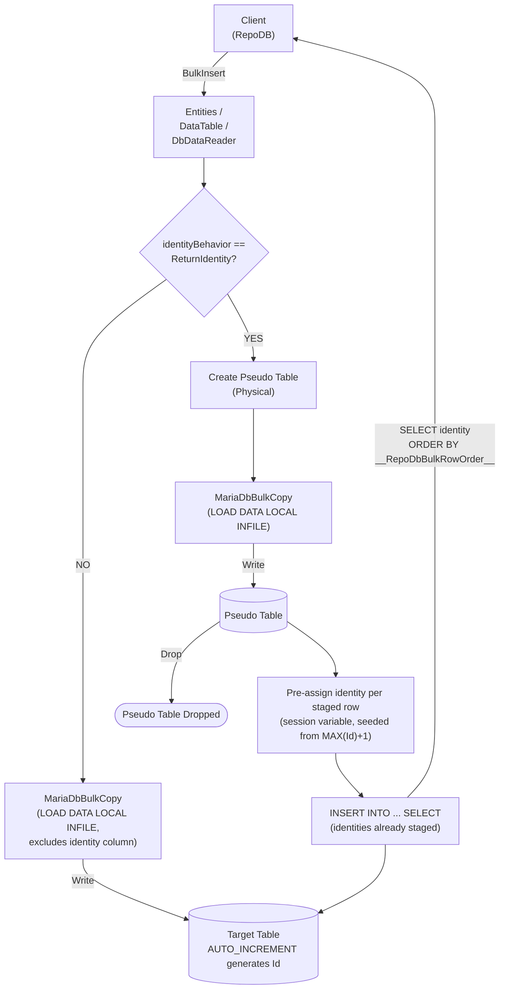

# BulkInsert

---

This method inserts all rows from the client application into the database in bulk. It is supported for [RepoDb.MariaDb.BulkOperations](https://www.nuget.org/packages/RepoDb.MariaDb.BulkOperations), targeting the [MySql.Data](https://www.nuget.org/packages/MySql.Data)-based driver.

{: .note }
> This page documents the `RepoDb.MariaDb` (`MySql.Data`-based) arguments and examples. For the `MySqlConnector`-based implementation, see [BulkInsert (MariaDbConnector)](/operation/mariadbconnector/bulkinsert); for MySQL, see [BulkInsert (MySQL)](/operation/mysql/bulkinsert).

## Call Flow Diagram

The diagram below shows the flow when calling this operation.



## Use Case

Use this method to insert rows at high speed. The underlying `MySql.Data` driver ships no reader-streaming bulk-copy API of its own, so this operation is backed by this package's own internal `MariaDbBulkCopy` class, which serializes rows to a temporary tab-delimited file and loads them via `RepoDb.Connector.MariaDb`'s `MariaDbBulkLoader` (`LOAD DATA LOCAL INFILE`).

For inserting 1,000 or more rows, prefer this method over [InsertAll](/operation/insertall).

Rows are written straight to the target table. A staging table is only used when `identityBehavior` is set to `ReturnIdentity` (see below) — see [Operations (MariaDb)](/operation/mariadb) for the underlying mechanics.

## Special Arguments

The `mappings`, `bulkCopyTimeout`, `batchSize`, `identityBehavior` and `pseudoTableType` arguments are available for this operation.

`mappings` (via `MariaDbBulkInsertMapItem`) defines explicit column mappings between the source properties and the destination columns. When omitted, columns are auto-mapped by name — the identity column is left out of this auto-mapping unless `identityBehavior` is `ReturnIdentity`, so `AUTO_INCREMENT` generates it as usual.

`bulkCopyTimeout` overrides the command timeout, in seconds.

`batchSize` overrides the number of rows sent to the server per batch. When not set, all items are sent at once.

`identityBehavior` (via [MariaDbBulkImportIdentityBehavior](/enumeration/mariadb/mariadb/mariadbbulkimportidentitybehavior)) controls whether newly generated identity values are set back on the data entities. Defaults to `KeepIdentity`, which excludes the identity column from the write entirely. Setting it to `ReturnIdentity` routes the operation through a staging table instead, so the generated values can be pre-assigned and read back — see [Identity Setting Alignment](#identity-setting-alignment) below.

`pseudoTableType` (via [MariaDbBulkImportPseudoTableType](/enumeration/mariadb/mariadb/mariadbbulkimportpseudotabletype)) controls the kind of staging table used when `identityBehavior` is `ReturnIdentity`.

{: .important }
> Every `pseudoTableType` value currently resolves to `Physical` at runtime — see [Operations (MariaDb)](/operation/mariadb#pseudo-table-type) for details.

## Identity Setting Alignment

When `identityBehavior` is `ReturnIdentity`, the library adds a surrogate `__RepoDbBulkRowOrder__` column to the staging table to track each entity's position in the source [IEnumerable](https://learn.microsoft.com/en-us/dotnet/api/system.collections.generic.ienumerable-1?view=net-7.0). Identity values are pre-assigned into the staging table via a session user variable seeded from the target table's current `MAX(identity) + 1` (read live off the table, not from `information_schema`'s cached `AUTO_INCREMENT` value), then copied over as literal values during the final `INSERT INTO ... SELECT`, ensuring the identity values returned from the database are assigned back to the correct entity via the compiled identity-setter function.

{: .important }
> This requires `AllowLoadLocalInfile=True;AllowUserVariables=True;` on your MariaDb connection string — see [Operations (MariaDb)](/operation/mariadb) for the full set of requirements, including the server-side `local_infile` global variable.

## Usability

The following example defines a method that produces a list of `Person` objects, then bulk-inserts 10,000 rows into the `Person` table.

```csharp
private IEnumerable<Person> GetPeople(int count = 1000)
{
    for (var i = 0; i < count; i++)
    {
        yield return new Person
        {
            Name = $"Person-{i}",
            SSN = Guid.NewGuid().ToString(),
            IsActive = true,
            DateInsertedUtc = DateTime.UtcNow
        };
    }
}
```

```csharp
using (var connection = new MariaDbConnection(connectionString))
{
    var people = GetPeople(10000);
    var insertedRows = connection.BulkInsert(people);
}
```

To specify a batch size:

```csharp
using (var connection = new MariaDbConnection(connectionString))
{
    var people = GetPeople(10000);
    var insertedRows = connection.BulkInsert(people, batchSize: 100);
}
```

{: .note }
> When `batchSize` is not set, all rows are sent to the server in a single batch.

To return the newly generated identity values:

```csharp
using (var connection = new MariaDbConnection(connectionString))
{
    var people = GetPeople(10000);
    var insertedRows = connection.BulkInsert(people,
        identityBehavior: MariaDbBulkImportIdentityBehavior.ReturnIdentity);
}
```

#### DataTable

```csharp
using (var connection = new MariaDbConnection(connectionString))
{
    var people = GetPeople(10000);
    var table = ConvertToDataTable(people);
    var insertedRows = connection.BulkInsert("Person", table);
}
```

#### Dictionary/ExpandoObject

```csharp
using (var sourceConnection = new MariaDbConnection(sourceConnectionString))
{
    var result = sourceConnection.QueryAll("Person");
    using (var destinationConnection = new MariaDbConnection(destinationConnectionString))
    {
        var insertedRows = destinationConnection.BulkInsert("Person", result);
    }
}
```

#### DataReader

```csharp
using (var sourceConnection = new MariaDbConnection(sourceConnectionString))
{
    using (var reader = sourceConnection.ExecuteReader("SELECT * FROM Person"))
    {
        using (var destinationConnection = new MariaDbConnection(destinationConnectionString))
        {
            var rows = destinationConnection.BulkInsert("Person", reader);
        }
    }
}
```

To bulk-insert via [DataEntityDataReader](/class/dataentitydatareader):

```csharp
using (var connection = new MariaDbConnection(connectionString))
{
    var people = GetPeople(10000);
    using (var reader = new DataEntityDataReader<Person>(people))
    {
        var insertedRows = connection.BulkInsert("Person", reader);
    }
}
```

## Column Mappings

Add column mappings using the `MariaDbBulkInsertMapItem` class.

```csharp
var mappings = new List<MariaDbBulkInsertMapItem>();

// Add the mappings
mappings.Add(new MariaDbBulkInsertMapItem("SourceId", "DestinationId"));
mappings.Add(new MariaDbBulkInsertMapItem("SourceName", "DestinationName"));
mappings.Add(new MariaDbBulkInsertMapItem("SourceIsActive", "DestinationIsActive"));
mappings.Add(new MariaDbBulkInsertMapItem("SourceDateInsertedUtc", "DestinationDateInsertedUtc"));

// Execute
using (var connection = new MariaDbConnection(connectionString))
{
    var people = GetPeople(10000);
    var insertedRows = connection.BulkInsert(people,
        mappings: mappings);
}
```

{: .note }
> `MariaDbBulkInsertMapItem` also accepts an explicit `MariaDbType` override per mapping, but this package's internal `MariaDbBulkCopy` has no per-column type slot to feed it into — it infers each field's on-the-wire representation from the value's own CLR type when serializing rows to the `LOAD DATA LOCAL INFILE` temp file, so the override currently has no effect.

## Targeting a Table

To target a specific table, pass the literal table name.

```csharp
using (var connection = new MariaDbConnection(connectionString))
{
    var people = GetPeople(10000);
    var insertedRows = connection.BulkInsert("Person", people);
}
```

## Async Method

An equivalent [BulkInsertAsync](/operation/mariadb/bulkinsert) method is also available.

```csharp
using (var connection = new MariaDbConnection(connectionString))
{
    var people = GetPeople(10000);
    var insertedRows = await connection.BulkInsertAsync(people);
}
```
