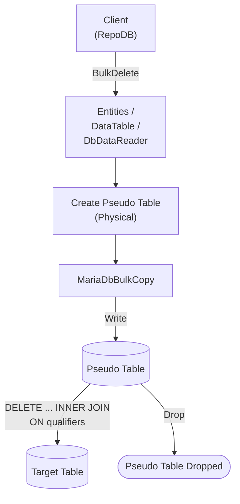

# BulkDelete

---

This method deletes rows from the database in bulk, matched by the defined qualifiers. It is supported for [RepoDb.MariaDbConnector.BulkOperations](https://www.nuget.org/packages/RepoDb.MariaDbConnector.BulkOperations), targeting the [MySqlConnector](https://www.nuget.org/packages/MySqlConnector)-based driver. This package also has a dedicated [BulkDeleteByKey](/operation/mariadbconnector/bulkdeletebykey) operation for deleting by primary key.

{: .note }
> This page documents the `RepoDb.MariaDbConnector` (`MySqlConnector`-based) arguments and examples. For the `MySql.Data`-based implementation, see [BulkDelete (MariaDb)](/operation/mariadb/bulkdelete); for MySqlConnector's own MySQL provider, see [BulkDelete (MySqlConnector)](/operation/mysqlconnector/bulkdelete).

## Call Flow Diagram

The diagram below shows the flow when calling this operation.



## Use Case

Use this method to delete rows at high speed. It leverages `RepoDb.Connector.MariaDbConnector`'s own `MariaDbBulkCopy` class, built on top of [MySqlConnector](https://www.nuget.org/packages/MySqlConnector).

For deleting 1,000 or more rows, prefer this method over [DeleteAll](/operation/deleteall).

A pseudo (staging) table is created for the call. The library writes to it via [BulkInsert](/operation/mariadbconnector/bulkinsert) internally, then cascades the deletions to the target table via a `DELETE ... INNER JOIN` matched on the qualifiers — see [Operations (MariaDbConnector)](/operation/mariadbconnector) for the underlying mechanics.

## Special Arguments

The `qualifiers`, `bulkCopyTimeout`, `batchSize` and `pseudoTableType` arguments are available for this operation.

`qualifiers` defines the fields used to match existing rows, corresponding to the `ON` clause of the join. Defaults to the primary column if not specified.

`bulkCopyTimeout` overrides the command timeout, in seconds.

`batchSize` overrides the number of rows sent to the server per batch. When not set, all items are sent at once.

`pseudoTableType` (via [MariaDbBulkImportPseudoTableType](/enumeration/mariadb/mariadbconnector/mariadbbulkimportpseudotabletype)) controls the kind of staging table used internally.

{: .important }
> Every `pseudoTableType` value currently resolves to `Physical` at runtime — see [Operations (MariaDbConnector)](/operation/mariadbconnector#pseudo-table-type) for details.

{: .note }
> `BulkDelete` only ever stages the qualifier columns (not the whole row) — it's the lightest of the entity/`DataTable`-based operations.

## Usability

The following example retrieves all inactive people, then bulk-deletes them from the `Person` table.

```csharp
using (var connection = new MariaDbConnection(connectionString))
{
    var people = connection.Query<Person>(e => e.IsActive == false);
    var deletedRows = connection.BulkDelete<Person>(people);
}
```

To specify a batch size:

```csharp
using (var connection = new MariaDbConnection(connectionString))
{
    var deletedRows = connection.BulkDelete<Person>(people, batchSize: 100);
}
```

{: .note }
> When `batchSize` is not set, all rows are sent to the server in a single batch.

#### DataTable

```csharp
using (var connection = new MariaDbConnection(connectionString))
{
    var table = ConvertToDataTable(people);
    var deletedRows = connection.BulkDelete("Person", table);
}
```

#### Dictionary/ExpandoObject

```csharp
using (var sourceConnection = new MariaDbConnection(sourceConnectionString))
{
    var result = sourceConnection.QueryAll("Person");
    using (var destinationConnection = new MariaDbConnection(destinationConnectionString))
    {
        var deletedRows = destinationConnection.BulkDelete("Person", result);
    }
}
```

#### DataReader

```csharp
using (var sourceConnection = new MariaDbConnection(sourceConnectionString))
{
    using (var reader = sourceConnection.ExecuteReader("SELECT * FROM Person"))
    {
        using (var destinationConnection = new MariaDbConnection(destinationConnectionString))
        {
            var rows = destinationConnection.BulkDelete("Person", reader);
        }
    }
}
```

## Targeting a Table

To target a specific table, pass the literal table name.

```csharp
using (var connection = new MariaDbConnection(connectionString))
{
    var deletedRows = connection.BulkDelete("Person", people);
}
```

## Field Qualifiers

By default, the primary column is used as the qualifier. To override, pass a list of [Field](/class/field) objects in the `qualifiers` argument.

```csharp
using (var connection = new MariaDbConnection(connectionString))
{
    var deletedRows = connection.BulkDelete<Person>(people,
        qualifiers: e => new { e.LastName, e.DateOfBirth });
}
```

{: .important }
> Use indexed columns from the target table as qualifiers to maximize performance.

## Async Method

An equivalent [BulkDeleteAsync](/operation/mariadbconnector/bulkdelete) method is also available.

```csharp
using (var connection = new MariaDbConnection(connectionString))
{
    var people = connection.Query<Person>(e => e.IsActive == false);
    var deletedRows = await connection.BulkDeleteAsync<Person>(people);
}
```
