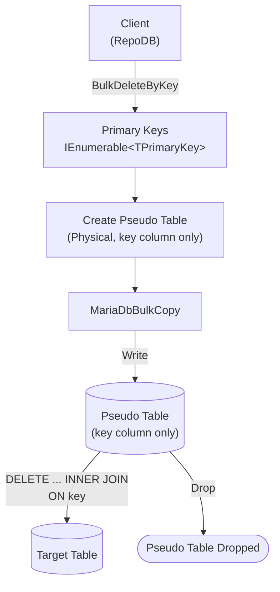

# BulkDeleteByKey

---

This method deletes rows from the database using a list of primary keys in bulk. It is supported for [RepoDb.MariaDbConnector.BulkOperations](https://www.nuget.org/packages/RepoDb.MariaDbConnector.BulkOperations), targeting the [MySqlConnector](https://www.nuget.org/packages/MySqlConnector)-based driver.

{: .note }
> This page documents the `RepoDb.MariaDbConnector` (`MySqlConnector`-based) arguments and examples. For the `MySql.Data`-based implementation, see [BulkDeleteByKey (MariaDb)](/operation/mariadb/bulkdeletebykey); for MySqlConnector's own MySQL provider, see [BulkDeleteByKey (MySqlConnector)](/operation/mysqlconnector/bulkdeletebykey).

## Call Flow Diagram

The diagram below shows the flow when calling this operation.



## Use Case

Use this method to delete rows by primary key at high speed. It leverages `RepoDb.Connector.MariaDbConnector`'s own `MariaDbBulkCopy` class, built on top of [MySqlConnector](https://www.nuget.org/packages/MySqlConnector).

Prefer this method over [BulkDelete](/operation/mariadbconnector/bulkdelete) when you only have the primary keys of the rows to delete (not the full entities). The pseudo table used internally only ever stages the one qualifier column, making this the lightest of the bulk operations.

## Special Arguments

The `bulkCopyTimeout`, `batchSize` and `pseudoTableType` arguments are available for this operation.

`bulkCopyTimeout` overrides the command timeout, in seconds.

`batchSize` overrides the number of rows sent to the server per batch. When not set, all items are sent at once.

`pseudoTableType` (via [MariaDbBulkImportPseudoTableType](/enumeration/mariadb/mariadbconnector/mariadbbulkimportpseudotabletype)) controls the kind of staging table used internally.

{: .important }
> Every `pseudoTableType` value currently resolves to `Physical` at runtime — see [Operations (MariaDbConnector)](/operation/mariadbconnector#pseudo-table-type) for details.

{: .note }
> `BulkDeleteByKey` has no `qualifiers` argument of its own, since the key values themselves are the match criteria.

## Caveats

This operation creates a pseudo-temporary table for each call. The database user must have permission to create tables, or a `MySqlException` will be thrown.

## Usability

Pass the target table name and the list of primary keys to the operation.

```csharp
using (var connection = new MariaDbConnection(connectionString))
{
    var primaryKeys = connection.Query<Person>(p => p.IsActive == false).Select(p => p.Id);
    var deletedRows = connection.BulkDeleteByKey("Person", primaryKeys);
}
```

{: .note }
> It returns the number of rows deleted from the underlying table.

To specify a batch size:

```csharp
using (var connection = new MariaDbConnection(connectionString))
{
    var primaryKeys = connection.Query<Person>(p => p.IsActive == false).Select(p => p.Id);
    var deletedRows = connection.BulkDeleteByKey("Person",
        primaryKeys,
        batchSize: 100);
}
```

{: .important }
> If `batchSize` is not set, all items in the collection are sent at once.

#### DataReader

```csharp
using (var sourceConnection = new MariaDbConnection(sourceConnectionString))
{
    using (var reader = sourceConnection.ExecuteReader("SELECT Id FROM Person WHERE (IsActive = 0)"))
    {
        var primaryKeys = new List<int>();
        while (reader.Read())
        {
            primaryKeys.Add(reader.GetInt32(0));
        }
        using (var destinationConnection = new MariaDbConnection(destinationConnectionString))
        {
            var deletedRows = destinationConnection.BulkDeleteByKey("Person", primaryKeys);
        }
    }
}
```

## Async Method

An equivalent [BulkDeleteByKeyAsync](/operation/mariadbconnector/bulkdeletebykey) method is also available.

```csharp
using (var connection = new MariaDbConnection(connectionString))
{
    var primaryKeys = connection.Query<Person>(p => p.IsActive == false).Select(p => p.Id);
    var deletedRows = await connection.BulkDeleteByKeyAsync("Person", primaryKeys);
}
```
