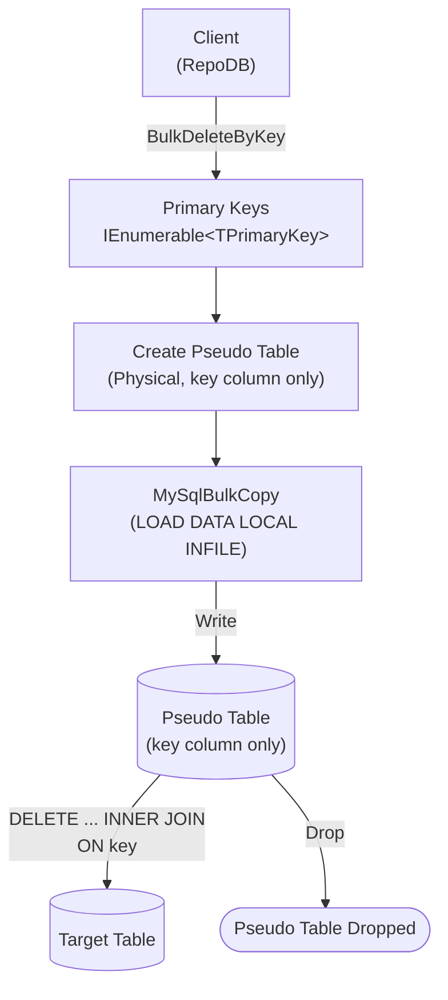

# BulkDeleteByKey

---

This method deletes rows from the database using a list of primary keys in bulk. It is supported for [RepoDb.MySql.BulkOperations](https://www.nuget.org/packages/RepoDb.MySql.BulkOperations), targeting the [MySql.Data](https://www.nuget.org/packages/MySql.Data) driver.

{: .note }
> This page documents the MySql.Data-specific arguments and examples. For the MySqlConnector implementation, see [BulkDeleteByKey (MySqlConnector)](/operation/mysqlconnector/bulkdeletebykey); for SQL Server, see [BulkDeleteByKey (SQL Server)](/operation/sqlserver/bulkdeletebykey); for Oracle, see [BulkDeleteByKey (Oracle)](/operation/oracle/bulkdeletebykey).

## Call Flow Diagram

The diagram below shows the flow when calling this operation.



## Use Case

Use this method to delete rows by primary key at high speed. It leverages this package's internal `MySqlBulkCopy` class (`LOAD DATA LOCAL INFILE`-based, see [Operations (MySQL)](/operation/mysql)).

Prefer this method over [BulkDelete](/operation/mysql/bulkdelete) when you only have the primary keys of the rows to delete (not the full entities). The pseudo table used internally only ever stages the one key column, making this the lightest of the bulk operations, and it's named distinctly from `BulkDelete`'s so the two never collide even against the same real table.

## Special Arguments

The `bulkCopyTimeout`, `batchSize` and `pseudoTableType` arguments are available for this operation.

`bulkCopyTimeout` overrides the command timeout, in seconds.

`batchSize` overrides the number of rows sent to the server per batch. When not set, all items are sent at once.

`pseudoTableType` (via `MySqlBulkImportPseudoTableType`) controls the kind of staging table used internally.

{: .important }
> Every `pseudoTableType` value currently resolves to `Physical` at runtime — see [Operations (MySQL)](/operation/mysql#pseudo-table-type) for details.

{: .note }
> `BulkDeleteByKey` has no `qualifiers` argument of its own, since the key values themselves are the match criteria.

## Caveats

This operation creates a pseudo-temporary table for each call. The database user must have permission to create tables, or a `MySqlException` will be thrown. Because `CREATE TABLE`/`DROP TABLE` are DDL, each call implicitly commits any other pending work on the connection — see [The Staging Table Lifecycle](/operation/mysql#the-staging-table-lifecycle).

## Usability

Pass the target table name and the list of primary keys to the operation.

```csharp
using (var connection = new MySqlConnection(connectionString))
{
    var primaryKeys = connection.Query<Person>(p => p.IsActive == false).Select(p => p.Id);
    var deletedRows = connection.BulkDeleteByKey("Person", primaryKeys);
}
```

{: .note }
> It returns the number of rows deleted from the underlying table.

To specify a batch size:

```csharp
using (var connection = new MySqlConnection(connectionString))
{
    var primaryKeys = connection.Query<Person>(p => p.IsActive == false).Select(p => p.Id);
    var deletedRows = connection.BulkDeleteByKey("Person",
        primaryKeys,
        batchSize: 100);
}
```

{: .important }
> If `batchSize` is not set, all items in the collection are sent at once.

#### DataReader

```csharp
using (var sourceConnection = new MySqlConnection(sourceConnectionString))
{
    using (var reader = sourceConnection.ExecuteReader("SELECT Id FROM Person WHERE (IsActive = 0)"))
    {
        var primaryKeys = new List<int>();
        while (reader.Read())
        {
            primaryKeys.Add(reader.GetInt32(0));
        }
        using (var destinationConnection = new MySqlConnection(destinationConnectionString))
        {
            var deletedRows = destinationConnection.BulkDeleteByKey("Person", primaryKeys);
        }
    }
}
```

## Async Method

An equivalent [BulkDeleteByKeyAsync](/operation/mysql/bulkdeletebykey) method is also available.

```csharp
using (var connection = new MySqlConnection(connectionString))
{
    var primaryKeys = connection.Query<Person>(p => p.IsActive == false).Select(p => p.Id);
    var deletedRows = await connection.BulkDeleteByKeyAsync("Person", primaryKeys);
}
```
