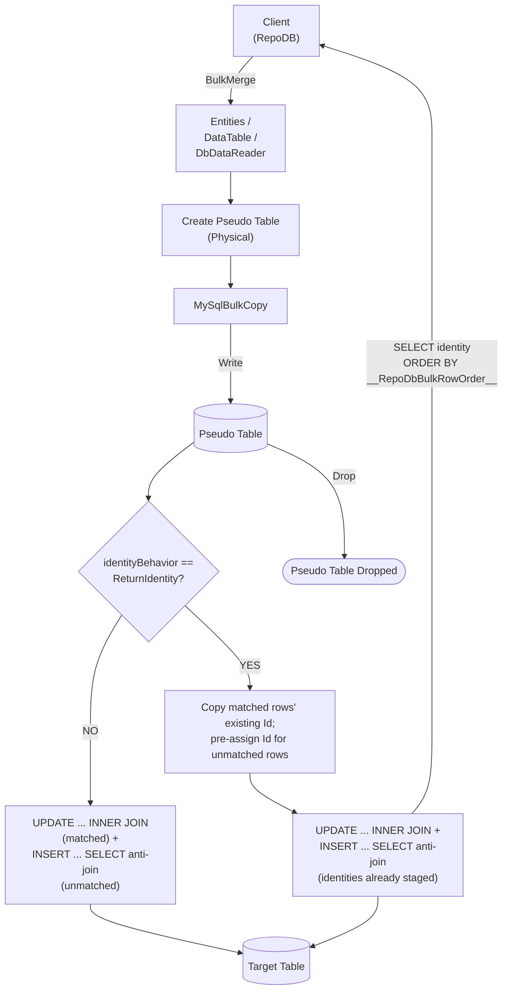

# BulkMerge

---

This method merges all rows from the client application into the database in bulk — inserting new rows and updating existing ones based on the defined qualifiers. It is supported for [MySqlConnector](https://www.nuget.org/packages/RepoDb.MySqlConnector.BulkOperations).

{: .note }
> This page documents the MySqlConnector-specific arguments and examples. For the SQL Server implementation, see [BulkMerge (SQL Server)](/operation/sqlserver/bulkmerge); for Oracle, see [BulkMerge (Oracle)](/operation/oracle/bulkmerge).

## Call Flow Diagram

The diagram below shows the flow when calling this operation.



## Use Case

Use this method to merge rows at high speed. It leverages the native bulk operation from MySqlConnector via the [MySqlBulkCopy](https://mysqlconnector.net/api/mysqlconnector/mysqlbulkcopytype/) class.

For merging 1,000 or more rows, prefer this method over [MergeAll](/operation/mergeall).

A pseudo (staging) table is created under a transaction context. The library writes to it via [BulkInsert](/operation/mysqlconnector/bulkinsert) internally, then cascades the changes to the target table. MySQL has no `MERGE` statement, so this is done via an `UPDATE ... INNER JOIN` for matched rows followed by an `INSERT ... SELECT` guarded by a `LEFT JOIN ... WHERE ... IS NULL` anti-join for unmatched rows — see [Operations (MySqlConnector)](/operation/mysqlconnector) for the underlying mechanics.

## Special Arguments

The `qualifiers`, `mappings`, `bulkCopyTimeout`, `batchSize`, `identityBehavior` and `pseudoTableType` arguments are available for this operation.

`qualifiers` defines the fields used to match existing rows, corresponding to the join's `ON` clause. Defaults to the primary column if not specified.

`mappings` (via `MySqlConnectorBulkInsertMapItem`) defines explicit column mappings between the source properties and the destination columns. When omitted, columns are auto-mapped by name (case-insensitive).

`bulkCopyTimeout` overrides the command timeout, in seconds.

`batchSize` overrides the number of rows sent to the server per batch. When not set, all items are sent at once.

`identityBehavior` (via [MySqlConnectorBulkImportIdentityBehavior](/enumeration/mysqlconnector/mysqlconnectorbulkimportidentitybehavior)) controls whether newly generated identity values are set back on the data entities. Defaults to `KeepIdentity`.

`pseudoTableType` (via [MySqlConnectorBulkImportPseudoTableType](/enumeration/mysqlconnector/mysqlconnectorbulkimportpseudotabletype)) controls the kind of staging table used internally.

{: .important }
> Every `pseudoTableType` value currently resolves to `Physical` at runtime — see [Operations (MySqlConnector)](/operation/mysqlconnector#pseudo-table-type) for details.

{: .note }
> The identity column, if any, is always left out of the `INSERT` column list generated for unmatched rows — a brand-new row's identity property is typically an unset default (e.g. `0`), not a real value meant to be inserted as-is.

## Identity Setting Alignment

When `identityBehavior` is `ReturnIdentity`, the library adds a surrogate `__RepoDbBulkRowOrder__` column to the staging table to track each entity's position in the source [IEnumerable](https://learn.microsoft.com/en-us/dotnet/api/system.collections.generic.ienumerable-1?view=net-7.0). Matched rows have their existing identity value copied onto the staged row via an `UPDATE ... INNER JOIN`; unmatched rows get a freshly pre-assigned value via a session user variable seeded from the target table's current `MAX(identity) + 1`. Both are then read back ordered by `__RepoDbBulkRowOrder__` and assigned onto the correct entity via the compiled identity-setter function.

{: .important }
> This requires `AllowUserVariables=True` on your MySqlConnector connection string — it is `false` by default.

## Usability

Given a list of `Person` models containing both existing and new rows, the following example bulk-merges them into the `Person` table.

```csharp
using (var connection = new MySqlConnection(connectionString))
{
    var mergedRows = connection.BulkMerge(people);
}
```

To specify a batch size:

```csharp
using (var connection = new MySqlConnection(connectionString))
{
    var mergedRows = connection.BulkMerge(people, batchSize: 100);
}
```

{: .note }
> When `batchSize` is not set, all rows are sent to the server in a single batch.

#### DataTable

```csharp
using (var connection = new MySqlConnection(connectionString))
{
    var table = ConvertToDataTable(people);
    var mergedRows = connection.BulkMerge("Person", table);
}
```

#### Dictionary/ExpandoObject

```csharp
using (var sourceConnection = new MySqlConnection(sourceConnectionString))
{
    var result = sourceConnection.QueryAll("Person");
    using (var destinationConnection = new MySqlConnection(destinationConnectionString))
    {
        var mergedRows = destinationConnection.BulkMerge("Person", result,
            qualifiers: Field.From("LastName", "DateOfBirth"));
    }
}
```

#### DataReader

```csharp
using (var sourceConnection = new MySqlConnection(sourceConnectionString))
{
    using (var reader = sourceConnection.ExecuteReader("SELECT * FROM Person WHERE (IsActive = 1)"))
    {
        using (var destinationConnection = new MySqlConnection(destinationConnectionString))
        {
            var rows = destinationConnection.BulkMerge("Person", reader);
        }
    }
}
```

To bulk-merge via [DataEntityDataReader](/class/dataentitydatareader):

```csharp
using (var connection = new MySqlConnection(connectionString))
{
    var people = GetPeople(10000);
    using (var reader = new DataEntityDataReader<Person>(people))
    {
        var mergedRows = connection.BulkMerge("Person", reader);
    }
}
```

## Field Qualifiers

By default, the primary column is used as the qualifier. To override, pass a list of [Field](/class/field) objects in the `qualifiers` argument.

```csharp
using (var connection = new MySqlConnection(connectionString))
{
    var people = GetPeople(10000);
    var mergedRows = connection.BulkMerge<Person>(people,
        qualifiers: e => new { e.LastName, e.DateOfBirth });
}
```

{: .important }
> Use indexed columns from the target table as qualifiers to maximize performance.

## Column Mappings

Add column mappings using the `MySqlConnectorBulkInsertMapItem` class.

```csharp
var mappings = new List<MySqlConnectorBulkInsertMapItem>();

// Add the mappings
mappings.Add(new MySqlConnectorBulkInsertMapItem("SourceId", "DestinationId"));
mappings.Add(new MySqlConnectorBulkInsertMapItem("SourceName", "DestinationName"));
mappings.Add(new MySqlConnectorBulkInsertMapItem("SourceIsActive", "DestinationIsActive"));
mappings.Add(new MySqlConnectorBulkInsertMapItem("SourceDateInsertedUtc", "DestinationDateInsertedUtc"));

// Execute
using (var connection = new MySqlConnection(connectionString))
{
    var people = GetPeople(10000);
    var mergedRows = connection.BulkMerge(people,
        mappings: mappings);
}
```

## Targeting a Table

To target a specific table, pass the literal table name.

```csharp
using (var connection = new MySqlConnection(connectionString))
{
    var people = GetPeople(10000);
    var mergedRows = connection.BulkMerge("Person", people);
}
```

## Async Method

An equivalent [BulkMergeAsync](/operation/mysqlconnector/bulkmerge) method is also available.

```csharp
using (var connection = new MySqlConnection(connectionString))
{
    var mergedRows = await connection.BulkMergeAsync(people);
}
```
