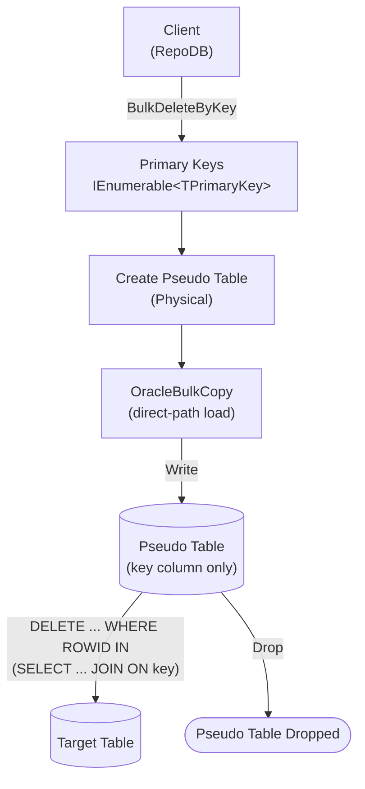

# BulkDeleteByKey

---

This method deletes rows from the database using a list of primary keys in bulk. It is supported only for [Oracle](https://www.nuget.org/packages/RepoDb.Oracle.BulkOperations).

## Call Flow Diagram

The diagram below shows the flow when calling this operation.



## Use Case

Use this method to delete rows by primary key at high speed. It leverages the native bulk operation from ODP.NET via the [OracleBulkCopy](https://docs.oracle.com/en/database/oracle/oracle-data-access-components/23.9/odpnt/OracleBulkCopyClass.html) class.

## Special Arguments

The `bulkCopyTimeout`, `batchSize` and `pseudoTableType` arguments are available for this operation.

`batchSize` overrides the number of rows sent to the server per batch. When not set, all items are sent at once.

`pseudoTableType` (via [OracleBulkImportPseudoTableType](/enumeration/oracle/oraclebulkimportpseudotabletype)) controls the kind of staging table used internally.

{: .important }
> Every `pseudoTableType` value currently resolves to `Physical` at runtime — see [Operations (Oracle)](/operation/oracle#pseudo-table-type) for details.

## Usability

Pass the target table name and the list of primary keys to the operation.

```csharp
using (var connection = new OracleConnection(connectionString))
{
    var primaryKeys = connection.Query<Person>(p => p.IsActive == false).Select(p => p.Id);
    var deletedRows = connection.BulkDeleteByKey("Person", primaryKeys);
}
```

{: .note }
> It returns the number of rows deleted from the underlying table.

To specify a batch size:

```csharp
using (var connection = new OracleConnection(connectionString))
{
    var primaryKeys = connection.Query<Person>(p => p.IsActive == false).Select(p => p.Id);
    var deletedRows = connection.BulkDeleteByKey("Person",
        primaryKeys,
        batchSize: 100);
}
```

## Async Method

An equivalent [BulkDeleteByKeyAsync](/operation/oracle/bulkdeletebykey) method is also available.

```csharp
using (var connection = new OracleConnection(connectionString))
{
    var primaryKeys = connection.Query<Person>(p => p.IsActive == false).Select(p => p.Id);
    var deletedRows = await connection.BulkDeleteByKeyAsync("Person", primaryKeys);
}
```
