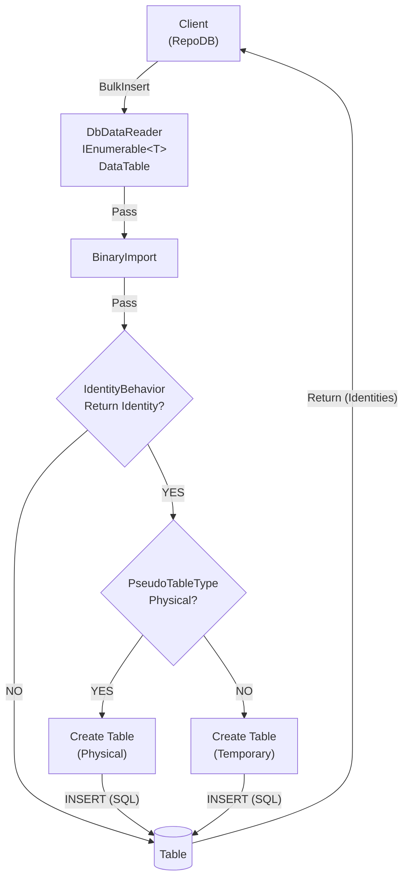

# BulkInsert

---

{: .warning }
> This method was previously named `BinaryBulkInsert`. That name is now deprecated in favor of `BulkInsert` and will be removed starting v1.16.0 of the `RepoDb.PostgreSql` and `RepoDb.PostgreSql.BulkOperations` packages.

This method inserts multiple rows into the database in bulk. It is supported only for [PostgreSQL](https://www.nuget.org/packages/RepoDb.PostgreSql.BulkOperations).

## Call Flow Diagram

The diagram below shows the flow when calling this operation.



## Use Case

Use this method to insert rows at high speed. It leverages the native bulk operation from the Npgsql library via the [NpgsqlBinaryImporter](https://www.npgsql.org/doc/api/Npgsql.NpgsqlBinaryImporter.html) class.

For inserting 1,000 or more rows, prefer this method over [InsertAll](/operation/insertall). The [BinaryImport](/operation/postgresql/binaryimport) operation is also available as an alternative.

## Special Arguments

The `identityBehavior` and `pseudoTableType` arguments are available for this operation.

`identityBehavior` controls whether the identity property of the entity/model is preserved, or whether newly generated identity values from the database are returned after the operation.

`pseudoTableType` controls whether a physical pseudo-table is created during the operation. Defaults to a temporary table.

{: .note }
> It is highly recommended to use the [PostgreSqlBulkImportPseudoTableType.Temporary](/enumeration/postgresql/postgresqlbulkimportpseudotabletype#temporary) value in the `pseudoTableType` argument when working with parallelism.

## Enum Types

Npgsql supports the following .NET enum mappings:

- .NET Enum → PostgreSQL text-based types (e.g. `text`, `varchar`)
- .NET Enum → PostgreSQL integer types (e.g. `int4`, `int8`)
- .NET Enum → Native PostgreSQL enum type, when mapped via `NpgsqlDataSource.MapEnum()`

These mappings work correctly with standard fluent operations such as [Insert](https://repodb.net/operation/insert) and [InsertAll](https://repodb.net/operation/insertall). However, bulk operations such as [BulkInsert](https://repodb.net/operation/postgresql/bulkinsert) may fail with the following error when an enum property towards Native PostgreSQL enum type (item 3) is involved:

```
'RepoDb.PostgreSql.BulkOperations.IntegrationTests.Enumerations.Hands' is not supported for parameters having NpgsqlDbType 'Unknown'.
```

To resolve this, follow the steps below.

Use `NpgsqlDataSource.MapEnum()` to map the PostgreSQL enum type on the current data source. Use `NpgsqlDataSourceBuilder` and create the connection from this builder.

```csharp
var dataSource = new NpgsqlDataSourceBuilder(Database.ConnectionString)
	.MapEnum<Hands>("hand", new NpgsqlNullNameTranslator())
	.Build();
var connection = dataSource.CreateConnection();

// Do your bulk stuffs here
```

Then map the column to the correct data type, as shown with the `ColumnEnumHand` property below.

```csharp
var mappings = return new[]
{
    ...
    new NpgsqlBulkInsertMapItem(nameof(EnumTable.ColumnEnumInt), nameof(EnumTable.ColumnEnumInt), NpgsqlTypes.NpgsqlDbType.Integer),
    new NpgsqlBulkInsertMapItem(nameof(EnumTable.ColumnEnumHand), nameof(EnumTable.ColumnEnumHand), "hand")
}

// Pass to 'mappings' argument
var result = NpgsqlConnectionExtension.BulkInsert<EnumTable>(connection,
    tableName,
    entities: entities,
    mappings: Helper.GetEnumTableMappings());
```

## Usability

Pass the list of entities to the operation.

```csharp
using (var connection = new NpgsqlConnection(connectionString))
{
    var people = GetPeople(1000);
    var insertedRows = connection.BulkInsert<Person>(people);
}
```

{: .note }
> It returns the number of rows inserted into the underlying table.

To specify a batch size:

```csharp
using (var connection = new NpgsqlConnection(connectionString))
{
    var people = GetPeople(1000);
    var insertedRows = connection.BulkInsert<Person>(people, batchSize: 100);
}
```

{: .important }
> If `batchSize` is not set, all items in the collection are sent at once.

To target a specific table, pass the literal table name.

```csharp
using (var connection = new NpgsqlConnection(connectionString))
{
    var insertedRows = connection.BulkInsert("[dbo].[Person]", people);
}
```

#### DataTable

```csharp
using (var connection = new NpgsqlConnection(connectionString))
{
    var people = GetPeople(1000);
    var table = ConvertToDataTable(people);
    var insertedRows = connection.BulkInsert("[dbo].[Person]", table);
}
```

#### Dictionary/ExpandoObject

```csharp
var people = GetPeopleAsDictionary(1000);

using (var connection = new NpgsqlConnection(destinationConnectionString))
{
    var insertedRows = connection.BulkInsert("[dbo].[Person]", people);
}
```

#### DataReader

```csharp
using (var sourceConnection = new NpgsqlConnection(sourceConnectionString))
{
    using (var reader = sourceConnection.ExecuteReader("SELECT * FROM [dbo].[Person];"))
    {
        using (var destinationConnection = new NpgsqlConnection(destinationConnectionString))
        {
            var insertedRows = destinationConnection.BulkInsert("[dbo].[Person]", reader);
        }
    }
}
```

Or via [DataEntityDataReader](/class/dataentitydatareader).

```csharp
using (var connection = new NpgsqlConnection(connectionString))
{
    using (var reader = new DataEntityDataReader<Person>(people))
    {
        var insertedRows = connection.BulkInsert("[dbo].[Person]", reader);
    }
}
```

## Physical Temporary Table

To use a physical pseudo-temporary table, pass [PostgreSqlBulkImportPseudoTableType.Temporary](/enumeration/postgresql/postgresqlbulkimportpseudotabletype#physical) in the `pseudoTableType` argument.

```csharp
using (var connection = new NpgsqlConnection(connectionString))
{
    var insertedRows = connection.BulkInsert("[dbo].[Person]",
        people,
        pseudoTableType: PostgreSqlBulkImportPseudoTableType.Physical);
}
```

{: .note }
> A physical pseudo-temporary table improves performance over a standard temporary table, but is shared across all calls. Parallelism may fail in this scenario.

