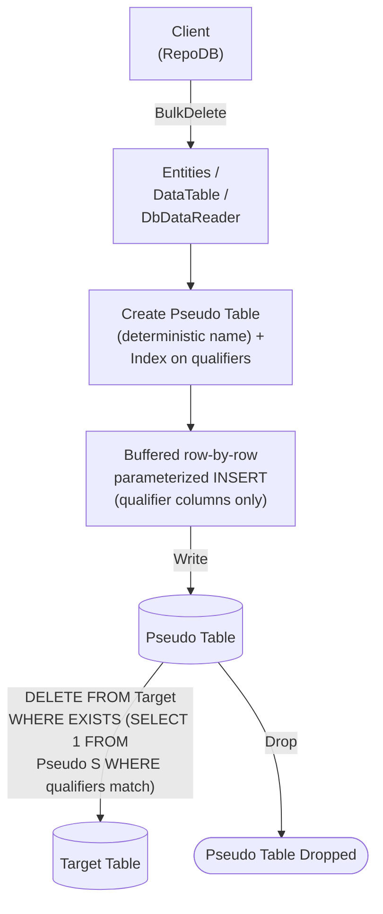

# BulkDelete

---

This method deletes rows from the database in bulk, matched by the defined qualifiers. It is supported for [SAP HANA](https://www.nuget.org/packages/RepoDb.SapHana.BulkOperations). SAP HANA also has a dedicated [BulkDeleteByKey](/operation/saphana/bulkdeletebykey) operation for deleting by primary key.

{: .note }
> This page documents the SAP HANA-specific arguments and examples. For the SQL Server implementation, see [BulkDelete (SQL Server)](/operation/sqlserver/bulkdelete).

## Call Flow Diagram

The diagram below shows the flow when calling this operation.



## Use Case

Use this method to delete rows against SAP HANA without hand-rolling the row-by-row loop yourself.

{: .important }
> SAP HANA has no native bulk-load API, so writing into the pseudo table is a client-buffered loop of single-row, parameterized `INSERT` statements — one round trip per row. The cascading `DELETE` against the real table, however, is a single native statement.

A pseudo (staging) table, containing only the qualifier columns and indexed on them, is created under a deterministic name for every call. The library writes to it row-by-row internally, then cascades the deletions to the target table via a correlated `EXISTS` subquery — see [Operations (SAP HANA)](/operation/saphana) for the underlying mechanics and its concurrency caveat.

## Special Arguments

The `qualifiers`, `bulkCopyTimeout`, `batchSize` and `pseudoTableType` arguments are available for this operation.

`qualifiers` defines the fields used to match existing rows, corresponding to the `EXISTS` correlation. Defaults to the primary or identity column if not specified.

`bulkCopyTimeout` overrides the command timeout, in seconds, applied to each row's `INSERT` while staging.

`batchSize` overrides how many rows are buffered client-side between flushes (default `500`) — it does not change the number of round trips.

`pseudoTableType` (via [SapHanaBulkImportPseudoTableType](/enumeration/saphana/saphanabulkimportpseudotabletype)) controls the kind of staging table used internally.

## Usability

The following example retrieves all inactive people, then bulk-deletes them from the `Person` table.

```csharp
using (var connection = new HanaConnection(connectionString))
{
    var people = connection.Query<Person>(e => e.IsActive == false);
    var deletedRows = connection.BulkDelete<Person>(people);
}
```

To specify a batch size:

```csharp
using (var connection = new HanaConnection(connectionString))
{
    var deletedRows = connection.BulkDelete<Person>(people, batchSize: 100);
}
```

{: .note }
> `batchSize` only controls the client-side buffer; each row is still its own round trip.

#### DataTable

```csharp
using (var connection = new HanaConnection(connectionString))
{
    var table = ConvertToDataTable(people);
    var deletedRows = connection.BulkDelete("\"Person\"", table);
}
```

#### Dictionary/ExpandoObject

```csharp
using (var sourceConnection = new HanaConnection(sourceConnectionString))
{
    var result = sourceConnection.QueryAll("\"Person\"");
    using (var destinationConnection = new HanaConnection(destinationConnectionString))
    {
        var deletedRows = destinationConnection.BulkDelete("\"Person\"", result);
    }
}
```

#### DataReader

```csharp
using (var sourceConnection = new HanaConnection(sourceConnectionString))
{
    using (var reader = sourceConnection.ExecuteReader("SELECT * FROM \"Person\""))
    {
        using (var destinationConnection = new HanaConnection(destinationConnectionString))
        {
            var rows = destinationConnection.BulkDelete("\"Person\"", reader);
        }
    }
}
```

## Targeting a Table

To target a specific table, pass the literal table name.

```csharp
using (var connection = new HanaConnection(connectionString))
{
    var deletedRows = connection.BulkDelete("\"Person\"", people);
}
```

## Field Qualifiers

By default, the primary or identity column is used as the qualifier. To override, pass a list of [Field](/class/field) objects in the `qualifiers` argument.

```csharp
using (var connection = new HanaConnection(connectionString))
{
    var deletedRows = connection.BulkDelete<Person>(people,
        qualifiers: e => new { e.Name });
}
```

{: .important }
> Use indexed columns from the target table as qualifiers to maximize performance.

## Async Method

An equivalent [BulkDeleteAsync](/operation/saphana/bulkdelete) method is also available.

```csharp
using (var connection = new HanaConnection(connectionString))
{
    var people = connection.Query<Person>(e => e.IsActive == false);
    var deletedRows = await connection.BulkDeleteAsync<Person>(people);
}
```
