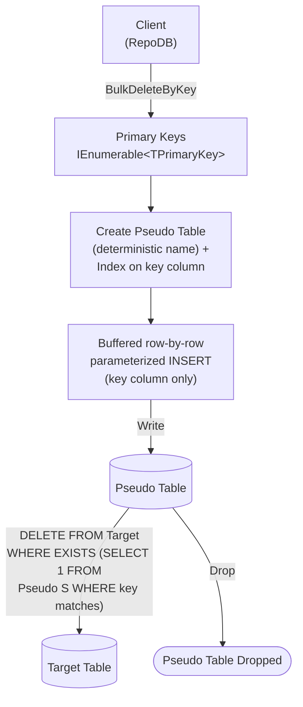

# BulkDeleteByKey

---

This method deletes rows from the database using a list of primary keys in bulk. It is supported for [SAP HANA](https://www.nuget.org/packages/RepoDb.SapHana.BulkOperations).

{: .note }
> Unlike [BulkDelete](/operation/saphana/bulkdelete), this operation takes the target table name directly (`BulkDeleteByKey<TPrimaryKey>(connection, tableName, primaryKeys, ...)`) rather than an entity type parameter — there is no `BulkDeleteByKey<TEntity, TPrimaryKey>` overload.

## Call Flow Diagram

The diagram below shows the flow when calling this operation.



## Use Case

Use this method to delete rows by primary key against SAP HANA without hand-rolling the row-by-row loop yourself.

{: .important }
> SAP HANA has no native bulk-load API, so writing the key values into the pseudo table is a client-buffered loop of single-row, parameterized `INSERT` statements — one round trip per row. The cascading `DELETE` against the real table, however, is a single native statement.

A pseudo (staging) table, containing only the key column and indexed on it, is created under a deterministic name for every call — see [Operations (SAP HANA)](/operation/saphana) for the underlying mechanics and its concurrency caveat.

## Special Arguments

The `bulkCopyTimeout`, `batchSize` and `pseudoTableType` arguments are available for this operation.

`bulkCopyTimeout` overrides the command timeout, in seconds, applied to each row's `INSERT` while staging.

`batchSize` overrides how many rows are buffered client-side between flushes (default `500`) — it does not change the number of round trips.

`pseudoTableType` (via [SapHanaBulkImportPseudoTableType](/enumeration/saphana/saphanabulkimportpseudotabletype)) controls the kind of staging table used internally.

## Usability

Pass the target table name and the list of primary keys to the operation.

```csharp
using (var connection = new HanaConnection(connectionString))
{
    var primaryKeys = connection.Query<Person>(p => p.IsActive == false).Select(p => p.Id);
    var deletedRows = connection.BulkDeleteByKey<long>("\"Person\"", primaryKeys);
}
```

{: .note }
> It returns the number of rows deleted from the underlying table.

To specify a batch size:

```csharp
using (var connection = new HanaConnection(connectionString))
{
    var primaryKeys = connection.Query<Person>(p => p.IsActive == false).Select(p => p.Id);
    var deletedRows = connection.BulkDeleteByKey<long>("\"Person\"", primaryKeys,
        batchSize: 100);
}
```

## Async Method

An equivalent [BulkDeleteByKeyAsync](/operation/saphana/bulkdeletebykey) method is also available.

```csharp
using (var connection = new HanaConnection(connectionString))
{
    var primaryKeys = connection.Query<Person>(p => p.IsActive == false).Select(p => p.Id);
    var deletedRows = await connection.BulkDeleteByKeyAsync<long>("\"Person\"", primaryKeys);
}
```
