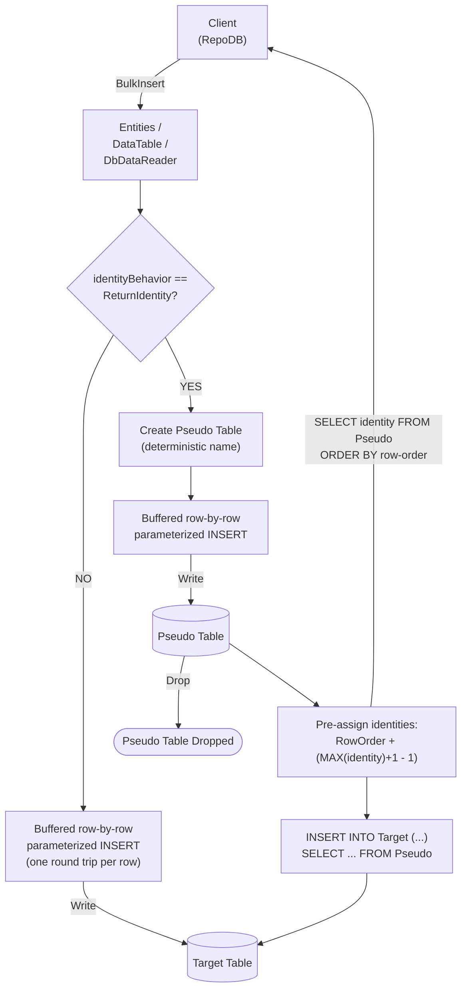

# BulkInsert

---

This method inserts all rows from the client application into the database in bulk. It is supported for [SAP HANA](https://www.nuget.org/packages/RepoDb.SapHana.BulkOperations).

{: .note }
> This page documents the SAP HANA-specific arguments and examples. For the SQL Server implementation, see [BulkInsert (SQL Server)](/operation/sqlserver/bulkinsert).

## Call Flow Diagram

The diagram below shows the flow when calling this operation.



## Use Case

Use this method to insert rows against SAP HANA without hand-rolling the row-by-row loop yourself.

{: .important }
> SAP HANA has no native bulk-load API and rejects a multi-row `INSERT ... VALUES (...), (...)` list, so this "bulk" operation is a client-buffered loop of single-row, parameterized `INSERT` statements — one round trip per row, same as calling [InsertAll](/operation/insertall) yourself. The value over [InsertAll](/operation/insertall) is mainly API consistency with the other providers (mappings, `identityBehavior`, tracing) rather than a genuine round-trip reduction.

Rows are written straight to the target table. A pseudo (staging) table is only used when `identityBehavior` is set to `ReturnIdentity` (see below) — see [Operations (SAP HANA)](/operation/saphana) for the underlying mechanics.

## Special Arguments

The `mappings`, `bulkCopyTimeout`, `batchSize`, `identityBehavior` and `pseudoTableType` arguments are available for this operation.

`mappings` (via `SapHanaBulkInsertMapItem`) defines explicit column mappings between the source properties and the destination columns, with an optional `HanaDbType` override per mapping. When omitted, columns are auto-mapped by name (case-insensitive). Mismatched source/destination CLR types throw an `InvalidTypeException` up front.

`bulkCopyTimeout` overrides the command timeout, in seconds, applied to each row's `INSERT`. Unlike Firebird/Vertica, this argument genuinely takes effect here.

`batchSize` overrides how many rows are buffered client-side between flushes (default `500`) — it does not change the number of round trips.

`identityBehavior` (via [SapHanaBulkImportIdentityBehavior](/enumeration/saphana/saphanabulkimportidentitybehavior)) controls whether newly generated identity values are set back on the data entities. Disabled (`KeepIdentity`) by default. Enabling this (`ReturnIdentity`) routes the operation through a pseudo table instead.

`pseudoTableType` (via [SapHanaBulkImportPseudoTableType](/enumeration/saphana/saphanabulkimportpseudotabletype)) controls the kind of staging table used when `identityBehavior` is `ReturnIdentity`.

{: .note }
> The `DbDataReader` overload has no `identityBehavior` argument — a forward-only, single-pass reader cannot be rewound to correlate generated identity values back onto a source row.

## Identity Setting Alignment

When `identityBehavior` is `ReturnIdentity`, the library first queries the target table for `MAX(identity) + 1` to determine the next value the real identity sequence would hand out, then updates every pseudo-table row's identity column to `RowOrder + (seed - 1)` — since the pseudo table's own row-order column is itself a gap-free identity starting at `1`, this assigns exactly `seed`, `seed + 1`, ... to the rows in their original load order, with no per-row round trip or procedural loop needed. The pre-assigned rows are then moved into the real table with a single `INSERT INTO ... SELECT ... FROM Pseudo`, and every value is read back afterward via a `SELECT` ordered by the same row-order column.

{: .important }
> This reads the live maximum off the table's own row data rather than a cached sequence counter, so it can never be stale — but it does leave a small race window against a concurrent writer to the same table between that read and the final `INSERT`. Verify this end-to-end, especially under concurrent writers, before relying on it in production.

## Usability

The following example defines a method that produces a list of `Person` objects, then bulk-inserts 10,000 rows into the `Person` table.

```csharp
private IEnumerable<Person> GetPeople(int count = 1000)
{
    for (var i = 0; i < count; i++)
    {
        yield return new Person
        {
            Name = $"Person-{i}",
            Age = 30,
            CreatedDateUtc = DateTime.UtcNow
        };
    }
}
```

```csharp
using (var connection = new HanaConnection(connectionString))
{
    var people = GetPeople(10000);
    var insertedRows = connection.BulkInsert(people);
}
```

To specify a batch size:

```csharp
using (var connection = new HanaConnection(connectionString))
{
    var people = GetPeople(10000);
    var insertedRows = connection.BulkInsert(people, batchSize: 100);
}
```

{: .note }
> `batchSize` only controls the client-side buffer; each row is still its own round trip.

To return the newly generated identity values:

```csharp
using (var connection = new HanaConnection(connectionString))
{
    var people = GetPeople(10000);
    var insertedRows = connection.BulkInsert(people,
        identityBehavior: SapHanaBulkImportIdentityBehavior.ReturnIdentity);
}
```

#### DataTable

```csharp
using (var connection = new HanaConnection(connectionString))
{
    var people = GetPeople(10000);
    var table = ConvertToDataTable(people);
    var insertedRows = connection.BulkInsert("\"Person\"", table);
}
```

#### Dictionary/ExpandoObject

```csharp
using (var sourceConnection = new HanaConnection(sourceConnectionString))
{
    var result = sourceConnection.QueryAll("\"Person\"");
    using (var destinationConnection = new HanaConnection(destinationConnectionString))
    {
        var insertedRows = destinationConnection.BulkInsert("\"Person\"", result);
    }
}
```

#### DataReader

```csharp
using (var sourceConnection = new HanaConnection(sourceConnectionString))
{
    using (var reader = sourceConnection.ExecuteReader("SELECT * FROM \"Person\""))
    {
        using (var destinationConnection = new HanaConnection(destinationConnectionString))
        {
            var rows = destinationConnection.BulkInsert("\"Person\"", reader);
        }
    }
}
```

To bulk-insert via [DataEntityDataReader](/class/dataentitydatareader):

```csharp
using (var connection = new HanaConnection(connectionString))
{
    var people = GetPeople(10000);
    using (var reader = new DataEntityDataReader<Person>(people))
    {
        var insertedRows = connection.BulkInsert("\"Person\"", reader);
    }
}
```

## Column Mappings

Add column mappings using the `SapHanaBulkInsertMapItem` class.

```csharp
var mappings = new List<SapHanaBulkInsertMapItem>();

// Add the mappings
mappings.Add(new SapHanaBulkInsertMapItem("SourceId", "DestinationId"));
mappings.Add(new SapHanaBulkInsertMapItem("SourceName", "DestinationName"));
mappings.Add(new SapHanaBulkInsertMapItem("SourceAge", "DestinationAge"));
mappings.Add(new SapHanaBulkInsertMapItem("SourceCreatedDateUtc", "DestinationCreatedDateUtc"));

// Execute
using (var connection = new HanaConnection(connectionString))
{
    var people = GetPeople(10000);
    var insertedRows = connection.BulkInsert(people,
        mappings: mappings);
}
```

## Targeting a Table

To target a specific table, pass the literal table name.

```csharp
using (var connection = new HanaConnection(connectionString))
{
    var people = GetPeople(10000);
    var insertedRows = connection.BulkInsert("\"Person\"", people);
}
```

## Async Method

An equivalent [BulkInsertAsync](/operation/saphana/bulkinsert) method is also available.

```csharp
using (var connection = new HanaConnection(connectionString))
{
    var people = GetPeople(10000);
    var insertedRows = await connection.BulkInsertAsync(people);
}
```
