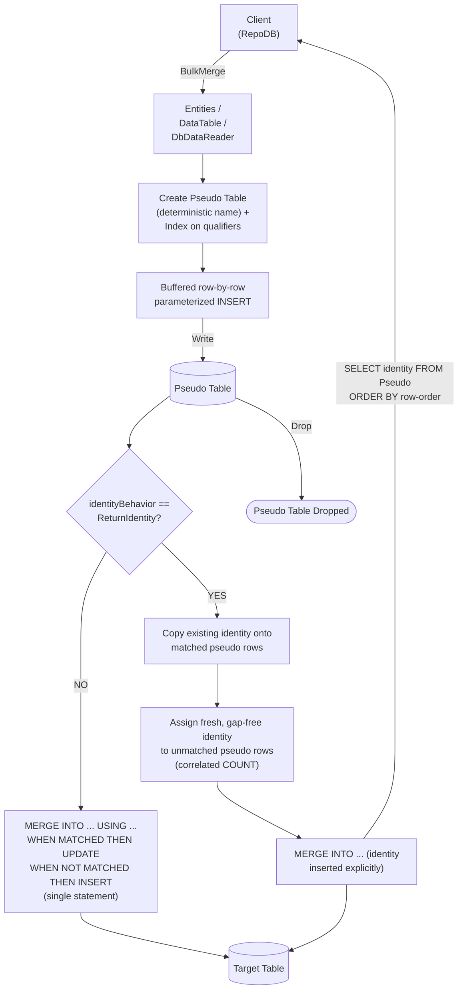

# BulkMerge

---

This method merges all rows from the client application into the database in bulk — inserting new rows and updating existing ones based on the defined qualifiers. It is supported for [SAP HANA](https://www.nuget.org/packages/RepoDb.SapHana.BulkOperations).

{: .note }
> This page documents the SAP HANA-specific arguments and examples. For the SQL Server implementation, see [BulkMerge (SQL Server)](/operation/sqlserver/bulkmerge).

## Call Flow Diagram

The diagram below shows the flow when calling this operation.



## Use Case

Use this method to merge rows against SAP HANA without hand-rolling the row-by-row loop yourself.

{: .important }
> SAP HANA has no native bulk-load API, so writing into the pseudo table is a client-buffered loop of single-row, parameterized `INSERT` statements — one round trip per row. The cascading `MERGE` against the real table, however, is a single native statement.

A pseudo (staging) table, indexed on the qualifier columns, is created under a deterministic name for every call. The library writes to it row-by-row internally, then cascades the changes to the target table — see [Operations (SAP HANA)](/operation/saphana) for the underlying mechanics and its concurrency caveat.

## Special Arguments

The `qualifiers`, `mappings`, `bulkCopyTimeout`, `batchSize`, `identityBehavior` and `pseudoTableType` arguments are available for this operation.

`qualifiers` defines the fields used to match existing rows, corresponding to the `ON` clause. Defaults to the primary or identity column if not specified.

`mappings` (via `SapHanaBulkInsertMapItem`) defines explicit column mappings between the source properties and the destination columns, with an optional `HanaDbType` override per mapping. When omitted, columns are auto-mapped by name (case-insensitive).

`bulkCopyTimeout` overrides the command timeout, in seconds, applied to each row's `INSERT` while staging.

`batchSize` overrides how many rows are buffered client-side between flushes (default `500`) — it does not change the number of round trips.

`identityBehavior` (via [SapHanaBulkImportIdentityBehavior](/enumeration/saphana/saphanabulkimportidentitybehavior)) controls whether newly generated identity values are set back on the data entities. Disabled (`KeepIdentity`) by default.

`pseudoTableType` (via [SapHanaBulkImportPseudoTableType](/enumeration/saphana/saphanabulkimportpseudotabletype)) controls the kind of staging table used internally.

{: .note }
> The `DbDataReader` overload has no `identityBehavior` argument, for the same reason as [BulkInsert](/operation/saphana/bulkinsert)'s reader overload.

## Identity Setting Alignment

When `identityBehavior` is `ReturnIdentity`, resolving every pseudo row's final identity value is a three-step sequence, run once every row has already been staged:

1. **Assign matched identities.** For every pseudo row that already has a match in the target table (by the qualifier columns), copy that row's existing identity value onto the pseudo row.
2. **Assign fresh identities to unmatched rows.** For every pseudo row with no match, assign `(seed - 1) + (its rank among the unmatched rows, by load order)` — computed via a correlated `COUNT(*)` rather than a window function, deliberately kept as plain, portable ANSI SQL.
3. **Merge.** Run the real `MERGE`, now inserting the identity column explicitly (with its pre-assigned value from steps 1–2) instead of leaving SAP HANA to auto-generate it.

Every row's identity is then read back via a `SELECT` ordered by the pseudo table's row-order column.

{: .important }
> Per the library's own source comments, step 2's correlated-`COUNT` rank computation is **the least-verified statement in the whole provider**. Verify this specifically — including its behavior under concurrent writers to the same table — before relying on `BulkMerge` with `ReturnIdentity` in production.

## Usability

Given a list of `Person` models containing both existing and new rows, the following example bulk-merges them into the `Person` table.

```csharp
using (var connection = new HanaConnection(connectionString))
{
    var mergedRows = connection.BulkMerge(people);
}
```

To specify a batch size:

```csharp
using (var connection = new HanaConnection(connectionString))
{
    var mergedRows = connection.BulkMerge(people, batchSize: 100);
}
```

#### DataTable

```csharp
using (var connection = new HanaConnection(connectionString))
{
    var table = ConvertToDataTable(people);
    var mergedRows = connection.BulkMerge("\"Person\"", table);
}
```

#### Dictionary/ExpandoObject

```csharp
using (var sourceConnection = new HanaConnection(sourceConnectionString))
{
    var result = sourceConnection.QueryAll("\"Person\"");
    using (var destinationConnection = new HanaConnection(destinationConnectionString))
    {
        var mergedRows = destinationConnection.BulkMerge("\"Person\"", result,
            qualifiers: Field.From("Name"));
    }
}
```

#### DataReader

```csharp
using (var sourceConnection = new HanaConnection(sourceConnectionString))
{
    using (var reader = sourceConnection.ExecuteReader("SELECT * FROM \"Person\" WHERE \"Age\" > 18"))
    {
        using (var destinationConnection = new HanaConnection(destinationConnectionString))
        {
            var rows = destinationConnection.BulkMerge("\"Person\"", reader);
        }
    }
}
```

To bulk-merge via [DataEntityDataReader](/class/dataentitydatareader):

```csharp
using (var connection = new HanaConnection(connectionString))
{
    var people = GetPeople(10000);
    using (var reader = new DataEntityDataReader<Person>(people))
    {
        var mergedRows = connection.BulkMerge("\"Person\"", reader);
    }
}
```

## Field Qualifiers

By default, the primary or identity column is used as the qualifier. To override, pass a list of [Field](/class/field) objects in the `qualifiers` argument.

```csharp
using (var connection = new HanaConnection(connectionString))
{
    var people = GetPeople(10000);
    var mergedRows = connection.BulkMerge<Person>(people,
        qualifiers: e => new { e.Name });
}
```

{: .important }
> Use indexed columns from the target table as qualifiers to maximize performance.

## Column Mappings

Add column mappings using the `SapHanaBulkInsertMapItem` class.

```csharp
var mappings = new List<SapHanaBulkInsertMapItem>();

// Add the mappings
mappings.Add(new SapHanaBulkInsertMapItem("SourceId", "DestinationId"));
mappings.Add(new SapHanaBulkInsertMapItem("SourceName", "DestinationName"));
mappings.Add(new SapHanaBulkInsertMapItem("SourceAge", "DestinationAge"));
mappings.Add(new SapHanaBulkInsertMapItem("SourceCreatedDateUtc", "DestinationCreatedDateUtc"));

// Execute
using (var connection = new HanaConnection(connectionString))
{
    var people = GetPeople(10000);
    var mergedRows = connection.BulkMerge(people,
        mappings: mappings);
}
```

## Targeting a Table

To target a specific table, pass the literal table name.

```csharp
using (var connection = new HanaConnection(connectionString))
{
    var people = GetPeople(10000);
    var mergedRows = connection.BulkMerge("\"Person\"", people);
}
```

## Async Method

An equivalent [BulkMergeAsync](/operation/saphana/bulkmerge) method is also available.

```csharp
using (var connection = new HanaConnection(connectionString))
{
    var mergedRows = await connection.BulkMergeAsync(people);
}
```
