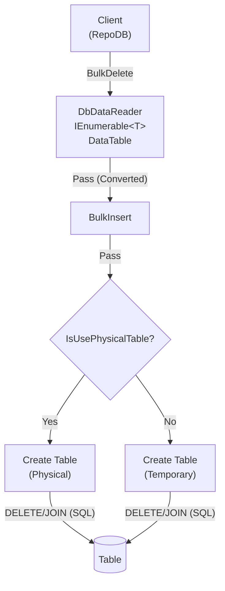

# BulkDelete

---

This method deletes rows from the database in bulk. It is supported for [SQL Server](https://www.nuget.org/packages/RepoDb.SqlServer.BulkOperations) and [Oracle](https://www.nuget.org/packages/RepoDb.Oracle.BulkOperations). Oracle also has a dedicated [BulkDeleteByKey](/operation/oracle/bulkdeletebykey) operation for deleting by primary key.

{: .note }
> The examples below target SQL Server. For the Oracle-specific arguments (`pseudoTableType`) and examples, see [BulkDelete (Oracle)](/operation/oracle/bulkdelete).

## Call Flow Diagram

The diagram below shows the flow when calling this operation.



## Use Case

Use this method to delete rows at high speed. It leverages the native bulk operation from ADO.NET via the [SqlBulkCopy](https://learn.microsoft.com/en-us/dotnet/api/system.data.sqlclient.sqlbulkcopy?view=dotnet-plat-ext-7.0) class.

For deleting 1,000 or more rows, prefer this method over [DeleteAll](/operation/deleteall).

## Special Arguments

The `qualifiers` and `usePhysicalPseudoTempTable` arguments are available for this operation.

`qualifiers` defines the qualifier fields used in the operation, corresponding to the WHERE clause. Defaults to the primary column if not specified.

`usePhysicalPseudoTempTable` controls whether a physical pseudo-table is created during the operation. Defaults to a temporary table (e.g., `#TableName`).

{: .important }
> Do not enable `usePhysicalPseudoTempTable` when using parallelism. Always use the session-based non-physical pseudo-temporary table in parallel scenarios.

## Caveats

RepoDB automatically sets `options` to `SqlBulkCopyOptions.KeepIdentity` when no qualifiers are provided and the table has an IDENTITY primary key column. The same applies when there is no primary key but an IDENTITY column is defined.

This operation creates a pseudo-temporary table internally. The database user must have permission to create tables, or a [SqlException](https://learn.microsoft.com/en-us/dotnet/api/system.data.sqlclient.sqlexception?view=dotnet-plat-ext-6.0) will be thrown.

## Usability

The following example retrieves all inactive people, then bulk-deletes them from the `[dbo].[Person]` table.

```csharp
using (var connection = new SqlConnection(connectionString))
{
    var people = connection.Query<Person>(e => e.IsActive == false);
}
```

```csharp
using (var connection = new SqlConnection(connectionString))
{
    var deletedRows = connection.BulkDelete<Person>(people);
}
```

To specify a batch size:

```csharp
using (var connection = new SqlConnection(connectionString))
{
    var deletedRows = connection.BulkDelete<Person>(people, batchSize: 100);
}
```

{: .note }
> By default, the batch size is 10, equal to the `Constant.DefaultBatchOperationSize` value.

#### DataTable

```csharp
using (var connection = new SqlConnection(connectionString))
{
    var table = ConvertToDataTable(people);
    var deletedRows = connection.BulkDelete<Person>(table);
}
```

#### Dictionary/ExpandoObject

```csharp
using (var sourceConnection = new SqlConnection(sourceConnectionString))
{
    var result = sourceConnection.QueryAll("Person");
    using (var destinationConnection = new SqlConnection(destinationConnectionString))
    {
        var mergedRows = destinationConnection.BulkDelete("Person", result);
    }
}
```

#### DataReader

```csharp
using (var sourceConnection = new SqlConnection(sourceConnectionString))
{
    using (var reader = sourceConnection.ExecuteReader("SELECT * FROM [dbo].[Person];"))
    {
        using (var destinationConnection = new SqlConnection(destinationConnectionString))
        {
            var rows = destinationConnection.BulkDelete<Person>(reader);
        }
    }
}
```

## Targeting a Table

To target a specific table, pass the literal table name.

```csharp
using (var connection = new SqlConnection(connectionString))
{
    var deletedRows = connection.BulkDelete("[dbo].[Person]", people);
}
```

## Field Qualifiers

By default, the primary column is used as the qualifier. To override, pass a list of [Field](/class/field) objects in the `qualifiers` argument.

```csharp
using (var connection = new SqlConnection(connectionString))
{
    var deletedRows = connection.BulkDelete<Person>(people,
        qualifiers: e => new { e.LastName, e.DateOfBirth });
}
```

{: .important }
> Use indexed columns from the target table as qualifiers to maximize performance.

## Table Hints

Pass a table hint via the `hints` argument.

```csharp
using (var connection = new SqlConnection(connectionString))
{
    var deletedRows = connection.BulkDelete("[dbo].[Person]",
        people,
        hints: "WITH (TABLOCK)");
}
```

Or use the [SqlServerTableHints](/class/sqlserver/sqlservertablehints) class.

```csharp
using (var connection = new SqlConnection(connectionString))
{
    var deletedRows = connection.BulkDelete("[dbo].[Person]",
        people,
        hints: SqlServerTableHints.TabLock);
}
```

## Physical Temporary Table

To use a physical pseudo-temporary table, pass `true` in the `usePhysicalPseudoTempTable` argument.

```csharp
using (var connection = new SqlConnection(connectionString))
{
    var deletedRows = connection.BulkDelete("[dbo].[Person]",
        people,
        usePhysicalPseudoTempTable: true);
}
```

{: .note }
> A physical pseudo-temporary table improves performance over a standard temporary table, but is shared across all calls. Parallelism may fail in this scenario.
