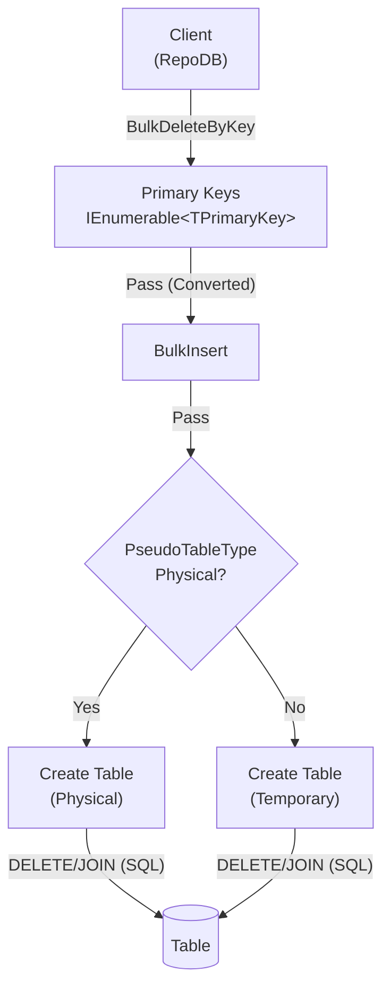

# BulkDeleteByKey

---

{: .warning }
> This is a new, dedicated method starting `v1.16.0` of the `RepoDb.SqlServer.BulkOperations` package. Previously, a list of primary keys was passed directly to [BulkDelete](/operation/sqlserver/bulkdelete); that overload has been removed in favor of this method.

This method deletes rows from the database using a list of primary keys in bulk. It is supported for [SQL Server](https://www.nuget.org/packages/RepoDb.SqlServer.BulkOperations), [PostgreSQL](https://www.nuget.org/packages/RepoDb.PostgreSql.BulkOperations) and [Oracle](https://www.nuget.org/packages/RepoDb.Oracle.BulkOperations).

{: .note }
> The examples below target SQL Server. For the Oracle-specific arguments (`pseudoTableType`) and examples, see [BulkDeleteByKey (Oracle)](/operation/oracle/bulkdeletebykey). For PostgreSQL, see [BulkDeleteByKey (PostgreSQL)](/operation/postgresql/bulkdeletebykey).

## Call Flow Diagram

The diagram below shows the flow when calling this operation.



## Use Case

Use this method to delete rows by primary key at high speed. It leverages the native bulk operation from ADO.NET via the [SqlBulkCopy](https://learn.microsoft.com/en-us/dotnet/api/system.data.sqlclient.sqlbulkcopy?view=dotnet-plat-ext-7.0) class.

Prefer this method over [BulkDelete](/operation/sqlserver/bulkdelete) when you only have the primary keys of the rows to delete (not the full entities).

## Special Arguments

The `batchSize` and `pseudoTableType` arguments are available for this operation.

`batchSize` overrides the number of rows sent to the server per batch. When not set, all items are sent at once.

`pseudoTableType` (via the `SqlServerBulkImportPseudoTableType` enumeration) controls whether a physical pseudo-table is created during the operation. Defaults to a temporary table (e.g., `#TableName`).

{: .important }
> Do not use a physical pseudo-table when using parallelism. Always use the session-based non-physical pseudo-temporary table in parallel scenarios.

## Caveats

This operation creates a pseudo-temporary table internally. The database user must have permission to create tables, or a [SqlException](https://learn.microsoft.com/en-us/dotnet/api/system.data.sqlclient.sqlexception?view=dotnet-plat-ext-6.0) will be thrown.

## Usability

Pass the target table (via the generic type or the literal table name) and the list of primary keys to the operation.

```csharp
using (var connection = new SqlConnection(connectionString))
{
    var primaryKeys = connection.Query<Person>(p => p.IsActive == false).Select(p => p.Id);
    var deletedRows = connection.BulkDeleteByKey<Person>(primaryKeys);
}
```

{: .note }
> It returns the number of rows deleted from the underlying table.

To specify a batch size:

```csharp
using (var connection = new SqlConnection(connectionString))
{
    var primaryKeys = connection.Query<Person>(p => p.IsActive == false).Select(p => p.Id);
    var deletedRows = connection.BulkDeleteByKey<Person>(primaryKeys,
        batchSize: 100);
}
```

{: .important }
> If `batchSize` is not set, all items in the collection are sent at once.

#### DataReader

```csharp
using (var sourceConnection = new SqlConnection(sourceConnectionString))
{
    using (var reader = sourceConnection.ExecuteReader("SELECT [Id] FROM [dbo].[Person] WHERE (IsActive = 0);"))
    {
        var primaryKeys = new List<int>();
        while (reader.Read())
        {
            primaryKeys.Add(reader.GetInt32(0));
        }
        using (var destinationConnection = new SqlConnection(destinationConnectionString))
        {
            var deletedRows = destinationConnection.BulkDeleteByKey<Person>(primaryKeys);
        }
    }
}
```

## Targeting a Table

To target a specific table, pass the literal table name.

```csharp
using (var connection = new SqlConnection(connectionString))
{
    var primaryKeys = connection.Query<Person>(p => p.IsActive == false).Select(p => p.Id);
    var deletedRows = connection.BulkDeleteByKey("[dbo].[Person]", primaryKeys);
}
```

## Physical Temporary Table

To use a physical pseudo-temporary table, pass `SqlServerBulkImportPseudoTableType.Physical` in the `pseudoTableType` argument.

```csharp
using (var connection = new SqlConnection(connectionString))
{
    var primaryKeys = connection.Query<Person>(p => p.IsActive == false).Select(p => p.Id);
    var deletedRows = connection.BulkDeleteByKey("[dbo].[Person]",
        primaryKeys,
        pseudoTableType: SqlServerBulkImportPseudoTableType.Physical);
}
```

{: .note }
> A physical pseudo-temporary table improves performance over a standard temporary table, but is shared across all calls. Parallelism may fail in this scenario.

## Async Method

An equivalent `BulkDeleteByKeyAsync` method is also available.

```csharp
using (var connection = new SqlConnection(connectionString))
{
    var primaryKeys = connection.Query<Person>(p => p.IsActive == false).Select(p => p.Id);
    var deletedRows = await connection.BulkDeleteByKeyAsync("[dbo].[Person]", primaryKeys);
}
```
