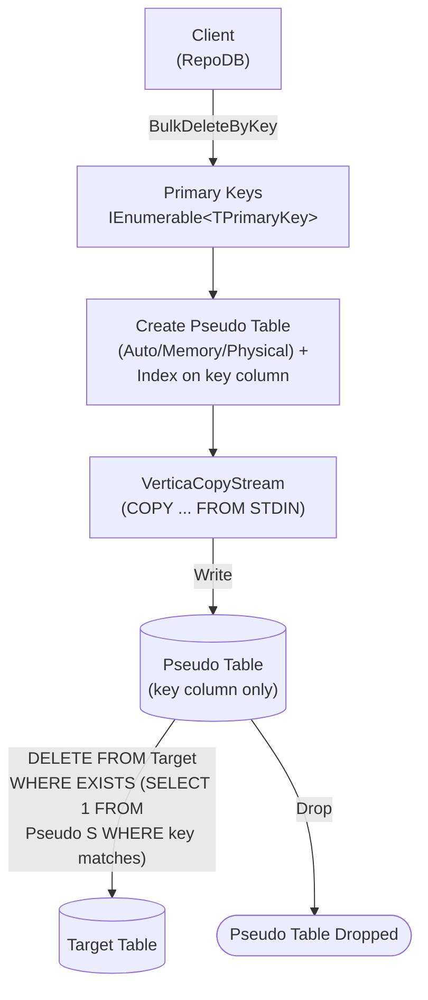

# BulkDeleteByKey

---

This method deletes rows from the database using a list of primary keys in bulk. It is supported for [Vertica](https://www.nuget.org/packages/RepoDb.Vertica.BulkOperations).

## Call Flow Diagram

The diagram below shows the flow when calling this operation.



## Use Case

Use this method to delete rows by primary key at high speed. It leverages `VerticaCopyStream`, `Vertica.Data`'s native `COPY ... FROM STDIN` streaming API.

## Special Arguments

The `bulkCopyTimeout`, `batchSize` and `pseudoTableType` arguments are available for this operation.

`bulkCopyTimeout` overrides the command timeout, in seconds.

`batchSize` overrides the number of rows sent to the server per batch. When not set, all items are sent at once.

`pseudoTableType` (via [VerticaBulkImportPseudoTableType](/enumeration/vertica/verticabulkimportpseudotabletype)) controls the kind of staging table used internally.

## Caveats

This operation creates a pseudo (staging) table for every call — a per-call, uniquely-named `TABLE` or `GLOBAL TEMPORARY TABLE`, per `pseudoTableType`. The database user must have permission to create tables, or a `VerticaException` will be thrown.

## Usability

Pass the target table name and the list of primary keys to the operation.

```csharp
using (var connection = new VerticaConnection(connectionString))
{
    var primaryKeys = connection.Query<Person>(p => p.IsActive == false).Select(p => p.Id);
    var deletedRows = connection.BulkDeleteByKey<Person, long>(primaryKeys);
}
```

{: .note }
> It returns the number of rows deleted from the underlying table.

To specify a batch size:

```csharp
using (var connection = new VerticaConnection(connectionString))
{
    var primaryKeys = connection.Query<Person>(p => p.IsActive == false).Select(p => p.Id);
    var deletedRows = connection.BulkDeleteByKey<Person, long>(primaryKeys,
        batchSize: 100);
}
```

## Async Method

An equivalent [BulkDeleteByKeyAsync](/operation/vertica/bulkdeletebykey) method is also available.

```csharp
using (var connection = new VerticaConnection(connectionString))
{
    var primaryKeys = connection.Query<Person>(p => p.IsActive == false).Select(p => p.Id);
    var deletedRows = await connection.BulkDeleteByKeyAsync<Person, long>(primaryKeys);
}
```
