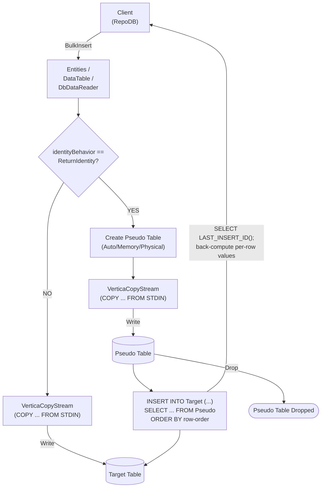

# BulkInsert

---

This method inserts all rows from the client application into the database in bulk. It is supported for [Vertica](https://www.nuget.org/packages/RepoDb.Vertica.BulkOperations).

{: .note }
> This page documents the Vertica-specific arguments and examples. For the SQL Server implementation, see [BulkInsert (SQL Server)](/operation/sqlserver/bulkinsert).

## Call Flow Diagram

The diagram below shows the flow when calling this operation.



## Use Case

Use this method to insert rows at high speed. It leverages `VerticaCopyStream`, `Vertica.Data`'s native `COPY ... FROM STDIN` streaming API.

For inserting 1,000 or more rows, prefer this method over [InsertAll](/operation/insertall).

Rows are written straight to the target table. A pseudo (staging) table is only used when `identityBehavior` is set to `ReturnIdentity` (see below) — see [Operations (Vertica)](/operation/vertica) for the underlying mechanics.

## Special Arguments

The `mappings`, `bulkCopyTimeout`, `batchSize`, `identityBehavior` and `pseudoTableType` arguments are available for this operation.

`mappings` (via `VerticaBulkInsertMapItem`) defines explicit column mappings between the source properties and the destination columns. When omitted, columns are auto-mapped by name (case-insensitive).

`bulkCopyTimeout` overrides the command timeout, in seconds.

`batchSize` overrides the number of rows sent to the server per batch. When not set, all items are sent at once.

`identityBehavior` (via [VerticaBulkImportIdentityBehavior](/enumeration/vertica/verticabulkimportidentitybehavior)) controls whether newly generated identity values are set back on the data entities. Disabled (`KeepIdentity`) by default. Enabling this (`ReturnIdentity`) routes the operation through a pseudo table instead.

`pseudoTableType` (via [VerticaBulkImportPseudoTableType](/enumeration/vertica/verticabulkimportpseudotabletype)) controls the kind of staging table used when `identityBehavior` is `ReturnIdentity`.

{: .note }
> The `DbDataReader` overload has no `identityBehavior` argument — a forward-only, single-pass reader cannot be rewound to correlate generated identity values back onto a source row, so `ReturnIdentity` is not supported for that overload.

## Identity Setting Alignment

When `identityBehavior` is `ReturnIdentity`, the pseudo-table rows are inserted into the real table via a single `INSERT INTO ... SELECT ... FROM Pseudo ORDER BY __RepoDbBulkRowOrder__` statement, then `SELECT LAST_INSERT_ID()` is read once. Because Vertica assigns `IDENTITY`/`AUTO_INCREMENT` values contiguously in insertion order (and the `INSERT`'s own `SELECT` is itself ordered by the pseudo table's row-order column), every row's actual identity is reconstructed by subtracting a descending offset from that single last-identity value, rather than requiring one round trip per row.

{: .important }
> This technique — and `GetScopeIdentity`'s underlying `SELECT LAST_INSERT_ID()` query — has not been verified against a live Vertica instance. Verify it end-to-end, especially under concurrent writers to the same table, before relying on it in production.

## Usability

The following example defines a method that produces a list of `Person` objects, then bulk-inserts 10,000 rows into the `Person` table.

```csharp
private IEnumerable<Person> GetPeople(int count = 1000)
{
    for (var i = 0; i < count; i++)
    {
        yield return new Person
        {
            Name = $"Person-{i}",
            Age = 30,
            CreatedDateUtc = DateTime.UtcNow
        };
    }
}
```

```csharp
using (var connection = new VerticaConnection(connectionString))
{
    var people = GetPeople(10000);
    var insertedRows = connection.BulkInsert(people);
}
```

To specify a batch size:

```csharp
using (var connection = new VerticaConnection(connectionString))
{
    var people = GetPeople(10000);
    var insertedRows = connection.BulkInsert(people, batchSize: 100);
}
```

{: .note }
> When `batchSize` is not set, all rows are sent to the server in a single batch.

To return the newly generated identity values:

```csharp
using (var connection = new VerticaConnection(connectionString))
{
    var people = GetPeople(10000);
    var insertedRows = connection.BulkInsert(people,
        identityBehavior: VerticaBulkImportIdentityBehavior.ReturnIdentity);
}
```

#### DataTable

```csharp
using (var connection = new VerticaConnection(connectionString))
{
    var people = GetPeople(10000);
    var table = ConvertToDataTable(people);
    var insertedRows = connection.BulkInsert("\"Person\"", table);
}
```

#### Dictionary/ExpandoObject

```csharp
using (var sourceConnection = new VerticaConnection(sourceConnectionString))
{
    var result = sourceConnection.QueryAll("\"Person\"");
    using (var destinationConnection = new VerticaConnection(destinationConnectionString))
    {
        var insertedRows = destinationConnection.BulkInsert("\"Person\"", result);
    }
}
```

#### DataReader

```csharp
using (var sourceConnection = new VerticaConnection(sourceConnectionString))
{
    using (var reader = sourceConnection.ExecuteReader("SELECT * FROM \"Person\""))
    {
        using (var destinationConnection = new VerticaConnection(destinationConnectionString))
        {
            var rows = destinationConnection.BulkInsert("\"Person\"", reader);
        }
    }
}
```

To bulk-insert via [DataEntityDataReader](/class/dataentitydatareader):

```csharp
using (var connection = new VerticaConnection(connectionString))
{
    var people = GetPeople(10000);
    using (var reader = new DataEntityDataReader<Person>(people))
    {
        var insertedRows = connection.BulkInsert("\"Person\"", reader);
    }
}
```

## Column Mappings

Add column mappings using the `VerticaBulkInsertMapItem` class.

```csharp
var mappings = new List<VerticaBulkInsertMapItem>();

// Add the mappings
mappings.Add(new VerticaBulkInsertMapItem("SourceId", "DestinationId"));
mappings.Add(new VerticaBulkInsertMapItem("SourceName", "DestinationName"));
mappings.Add(new VerticaBulkInsertMapItem("SourceAge", "DestinationAge"));
mappings.Add(new VerticaBulkInsertMapItem("SourceCreatedDateUtc", "DestinationCreatedDateUtc"));

// Execute
using (var connection = new VerticaConnection(connectionString))
{
    var people = GetPeople(10000);
    var insertedRows = connection.BulkInsert(people,
        mappings: mappings);
}
```

## Targeting a Table

To target a specific table, pass the literal table name.

```csharp
using (var connection = new VerticaConnection(connectionString))
{
    var people = GetPeople(10000);
    var insertedRows = connection.BulkInsert("\"Person\"", people);
}
```

## Async Method

An equivalent [BulkInsertAsync](/operation/vertica/bulkinsert) method is also available.

```csharp
using (var connection = new VerticaConnection(connectionString))
{
    var people = GetPeople(10000);
    var insertedRows = await connection.BulkInsertAsync(people);
}
```

{: .note }
> `VerticaCopyStream` exposes no async API of its own, so the async overload offloads the synchronous `Start`/`AddStream`/`Execute`/`Finish` sequence to a background thread instead.
