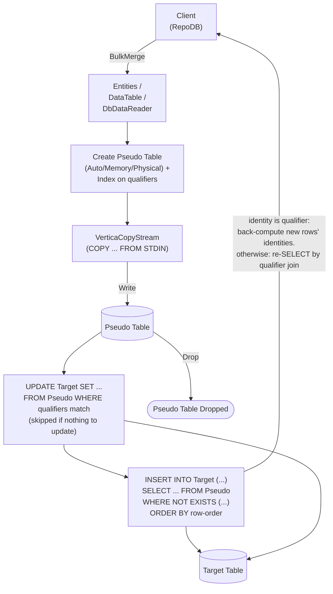

# BulkMerge

---

This method merges all rows from the client application into the database in bulk — inserting new rows and updating existing ones based on the defined qualifiers. It is supported for [Vertica](https://www.nuget.org/packages/RepoDb.Vertica.BulkOperations).

{: .note }
> This page documents the Vertica-specific arguments and examples. For the SQL Server implementation, see [BulkMerge (SQL Server)](/operation/sqlserver/bulkmerge).

## Call Flow Diagram

The diagram below shows the flow when calling this operation.



## Use Case

Use this method to merge rows at high speed. It leverages `VerticaCopyStream`, `Vertica.Data`'s native `COPY ... FROM STDIN` streaming API.

For merging 1,000 or more rows, prefer this method over [MergeAll](/operation/mergeall) — Vertica's `IsMultiStatementExecutable` setting is `false`, so [MergeAll](/operation/mergeall) issues one round trip per row.

A pseudo (staging) table, indexed on the qualifier columns, is created for every call. The library streams into it via a `COPY` load internally, then cascades the changes to the target table — see [Operations (Vertica)](/operation/vertica) for the underlying mechanics.

## Special Arguments

The `qualifiers`, `mappings`, `bulkCopyTimeout`, `batchSize`, `identityBehavior` and `pseudoTableType` arguments are available for this operation.

`qualifiers` defines the fields used to match existing rows. Defaults to the primary or identity column if not specified.

`mappings` (via `VerticaBulkInsertMapItem`) defines explicit column mappings between the source properties and the destination columns. When omitted, columns are auto-mapped by name (case-insensitive).

`bulkCopyTimeout` overrides the command timeout, in seconds.

`batchSize` overrides the number of rows sent to the server per batch. When not set, all items are sent at once.

`identityBehavior` (via [VerticaBulkImportIdentityBehavior](/enumeration/vertica/verticabulkimportidentitybehavior)) controls whether newly generated identity values are set back on the data entities. Disabled (`KeepIdentity`) by default.

`pseudoTableType` (via [VerticaBulkImportPseudoTableType](/enumeration/vertica/verticabulkimportpseudotabletype)) controls the kind of staging table used internally.

{: .note }
> The `DbDataReader` overload has no `identityBehavior` argument, for the same reason as [BulkInsert](/operation/vertica/bulkinsert)'s reader overload.

## Operation SQL Statements

Vertica flatly refuses to run a `MERGE` statement at all against a table that has an `IDENTITY`/`AUTO_INCREMENT` column ("Sequence or IDENTITY/AUTO_INCREMENT column in merge query is not supported"), and has no procedural fallback equivalent to Firebird's `EXECUTE BLOCK`. A bulk merge is instead always two separate statements:

1. `UPDATE Target SET ... FROM Pseudo S WHERE qualifiers match` — skipped entirely if there are no non-qualifier, non-identity fields to update.
2. `INSERT INTO Target (...) SELECT ... FROM Pseudo S WHERE NOT EXISTS (SELECT 1 FROM Target WHERE qualifiers match) ORDER BY S.__RepoDbBulkRowOrder__` — the identity column, if any, is always excluded, and the explicit `ORDER BY` keeps the newly-inserted rows in source order (without it, Vertica is free to insert unmatched rows in whatever order its projections yield them).

When `identityBehavior` is `ReturnIdentity`:

- If the identity column is itself a qualifier, a row's original identity value doubles as caller intent: a real, already-known value means "update this existing row," and an unset `0`/`null` sentinel means "insert a new row, generate its identity." New rows' identities are back-computed from a single `SELECT LAST_INSERT_ID()` the same way [BulkInsert](/operation/vertica/bulkinsert) does, since Vertica assigns them contiguously in the `INSERT`'s own row order.
- Otherwise, every row's identity (whether pre-existing or newly generated) is read back afterward via a join between the pseudo table and the target table on the qualifier columns, ordered by the row-order column.

{: .note }
> Unlike the plain (non-bulk) [Merge](/operation/merge) operation, these two statements are executed as two separate round trips — not joined into one compound command text — so `IsMultiStatementExecutable` being `false` does not affect this path.

## Usability

Given a list of `Person` models containing both existing and new rows, the following example bulk-merges them into the `Person` table.

```csharp
using (var connection = new VerticaConnection(connectionString))
{
    var mergedRows = connection.BulkMerge(people);
}
```

To specify a batch size:

```csharp
using (var connection = new VerticaConnection(connectionString))
{
    var mergedRows = connection.BulkMerge(people, batchSize: 100);
}
```

{: .note }
> When `batchSize` is not set, all rows are sent to the server in a single batch.

#### DataTable

```csharp
using (var connection = new VerticaConnection(connectionString))
{
    var table = ConvertToDataTable(people);
    var mergedRows = connection.BulkMerge("\"Person\"", table);
}
```

#### Dictionary/ExpandoObject

```csharp
using (var sourceConnection = new VerticaConnection(sourceConnectionString))
{
    var result = sourceConnection.QueryAll("\"Person\"");
    using (var destinationConnection = new VerticaConnection(destinationConnectionString))
    {
        var mergedRows = destinationConnection.BulkMerge("\"Person\"", result,
            qualifiers: Field.From("Name"));
    }
}
```

#### DataReader

```csharp
using (var sourceConnection = new VerticaConnection(sourceConnectionString))
{
    using (var reader = sourceConnection.ExecuteReader("SELECT * FROM \"Person\" WHERE \"Age\" > 18"))
    {
        using (var destinationConnection = new VerticaConnection(destinationConnectionString))
        {
            var rows = destinationConnection.BulkMerge("\"Person\"", reader);
        }
    }
}
```

To bulk-merge via [DataEntityDataReader](/class/dataentitydatareader):

```csharp
using (var connection = new VerticaConnection(connectionString))
{
    var people = GetPeople(10000);
    using (var reader = new DataEntityDataReader<Person>(people))
    {
        var mergedRows = connection.BulkMerge("\"Person\"", reader);
    }
}
```

## Field Qualifiers

By default, the primary or identity column is used as the qualifier. To override, pass a list of [Field](/class/field) objects in the `qualifiers` argument.

```csharp
using (var connection = new VerticaConnection(connectionString))
{
    var people = GetPeople(10000);
    var mergedRows = connection.BulkMerge<Person>(people,
        qualifiers: e => new { e.Name });
}
```

{: .important }
> Use indexed columns from the target table as qualifiers to maximize performance.

## Column Mappings

Add column mappings using the `VerticaBulkInsertMapItem` class.

```csharp
var mappings = new List<VerticaBulkInsertMapItem>();

// Add the mappings
mappings.Add(new VerticaBulkInsertMapItem("SourceId", "DestinationId"));
mappings.Add(new VerticaBulkInsertMapItem("SourceName", "DestinationName"));
mappings.Add(new VerticaBulkInsertMapItem("SourceAge", "DestinationAge"));
mappings.Add(new VerticaBulkInsertMapItem("SourceCreatedDateUtc", "DestinationCreatedDateUtc"));

// Execute
using (var connection = new VerticaConnection(connectionString))
{
    var people = GetPeople(10000);
    var mergedRows = connection.BulkMerge(people,
        mappings: mappings);
}
```

## Targeting a Table

To target a specific table, pass the literal table name.

```csharp
using (var connection = new VerticaConnection(connectionString))
{
    var people = GetPeople(10000);
    var mergedRows = connection.BulkMerge("\"Person\"", people);
}
```

## Async Method

An equivalent [BulkMergeAsync](/operation/vertica/bulkmerge) method is also available.

```csharp
using (var connection = new VerticaConnection(connectionString))
{
    var mergedRows = await connection.BulkMergeAsync(people);
}
```
